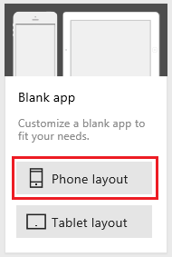

# Добавление подключения к данным в PowerApps
В PowerApps можно добавить подключение к данным в существующем приложении или в приложении, создаваемом с нуля. В этой статье рассматривается программный продукт PowerApps Studio, но те же самые действия можно выполнить и на сайте [powerapps.com](https://web.powerapps.com) (см. статью [Управление подключениями в PowerApps](add-manage-connections.md)).

Подключение к данным в приложении обеспечивает взаимодействие со службами SharePoint, Salesforce, OneDrive и [множеством других источников данных](connections-list.md).

Выполнив действия, описанные в этой статье, приступайте к [следующему шагу](#next-steps) — отображению и администрированию данных из источника в приложении, как в следующих примерах:

* подключение к OneDrive и управление данными в книге Excel в приложении;
* подключение к Twilio и отправка SMS-сообщений из приложения;
* подключение к серверу SQL Server и обновление таблицы из приложения.

## Технические условия
[Зарегистрируйтесь](signup-for-powerapps.md) в службе PowerApps, [установите](http://aka.ms/powerappsinstall) и откройте ее, а затем войдите с помощью учетных данных, использованных при регистрации.

## Основные сведения о подключениях к данным
Большинство приложений PowerApps используют внешние сведения (**источники данных**), хранящиеся в облачных службах. Типичный пример — это таблица в файле Excel, который хранится в службе OneDrive для бизнеса. Приложения получают доступ к источникам данных с помощью **соединителей**.

Самые распространенные источники данных — это таблицы, которые можно использовать для получения и хранения информации. Соединители источников можно использовать для чтения и записи данных в книгах Microsoft Excel, списках SharePoint, таблицах SQL и во многих ресурсах других форматов, которые могут храниться в таких облачных службах, как OneDrive для бизнеса, DropBox, SQL Server и пр.

К другим источникам данных относятся электронная почта, календари, Twitter и уведомления.

С помощью элементов управления **[Коллекция](controls/control-gallery.md)**, **[Форма отображения](controls/control-form-detail.md)** и **[Форма изменения](controls/control-form-detail.md)** очень просто создать приложение, которое считывает и записывает данные из источника данных. Чтобы начать работу, ознакомьтесь со статьей о [формах данных](working-with-forms.md).

## Добавление подключения
1. Выберите **Создать** в меню **Файл** в левой части экрана.

    

2. На плитке **Пустое приложение** щелкните или нажмите **Макет для телефона**.

    

3. В центральной области щелкните **Подключиться к данным**.

4. Если нужное вам подключение есть на панели **Данные** щелкните его, чтобы добавить в приложение. Или переходите к следующему шагу.

    

5. Щелкните или нажмите **Создать подключение**, чтобы отобразить список соединителей.

    

6. Прокрутите список соединителей, чтобы найти подключение нужного типа (например, **Office 365 Outlook**), и выберите его.

    

7. Нажмите кнопку **Создать**, чтобы создать подключение и добавить его в приложение.

    Для некоторых соединителей, таких как **Microsoft Translator**, дополнительные действия не требуются. Данные из них можно отобразить сразу же. Другие соединители могут предложить вам учетные данные, указать определенный набор данных или выполнить другие действия. Например, для соединителей [SharePoint](connections/connection-sharepoint-online.md) и [SQL Server](connections/connection-azure-sqldatabase.md) потребуется указать дополнительную информацию, прежде чем вы сможете их использовать.

## Просмотр или изменение источника данных
Если вы обновляете приложение, может потребоваться определить или изменить источник данных, который отображается в коллекции, форме или другом элементе управления со свойством **Item**. Например, вы можете работать в приложении, которое создал другой пользователь, или можете воспользоваться источником данных, который вы давно настроили.

1. Выберите элемент управления, для которого нужно определить источник данных.

    Например, выберите коллекцию (не элемент управления в коллекции) в иерархическом списке экранов и элементов управления у левого края.

    Имя источника данных отображается на вкладке **Свойства** справа.

    

2. Чтобы отобразить дополнительные сведения об источнике данных или изменить его, выберите панель **Данные** справа.

    

3. Чтобы изменить источник данных, нажмите стрелку вниз рядом с источником данных, а затем выберите или создайте другой источник.

## Дальнейшие действия
* Для отображения и обновления данных в таких источниках, как Excel, SharePoint и SQL Server, следует добавить [коллекцию](add-gallery.md) или [форму](add-form.md).
* Для работы с данными в других источниках используйте специальные функции для таких соединителей, как [Office 365 Outlook](connections/connection-office365-outlook.md), [Twitter](connections/connection-twitter.md) и [Microsoft Translator](connections/connection-microsoft-translator.md).
