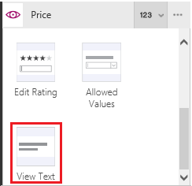
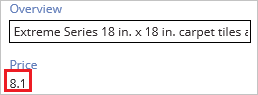

# Отображение, редактирование и добавление записи из таблицы в PowerApps
Чтобы отобразить все поля записи, добавьте и настройте элемент управления **[Форма отображения](controls/control-form-detail.md)**. Чтобы изменить поле в записи (или добавить запись), а затем сохранить изменения в источнике данных, добавьте и настройте элемент управления **[Форма редактирования](controls/control-form-detail.md)**.

## Технические условия

* Узнайте, как [добавить и настроить элемент управления](add-configure-controls.md) в PowerApps.
* Скачайте [этот файл Excel](https://az787822.vo.msecnd.net/documentation/get-started-from-data/FlooringEstimates.xlsx), содержащий образец данных для этого руководства.
* Отправьте файл Excel в [учетную запись облачного хранилища](connections/cloud-storage-blob-connections.md), например OneDrive для бизнеса.
* В новом или существующем приложении [добавьте подключение](add-data-connection.md) в таблицу **FlooringEstimates** из файла Excel.
* Если вы используете существующее приложение, [добавьте в него экран](add-screen-context-variables.md).

## Добавление формы и отображение данных
1. Добавьте элемент управления **[Раскрывающийся список](controls/control-drop-down.md)**, переименуйте его в **ChooseProduct** и задайте для свойства **[Items](controls/properties-core.md)** следующее значение:

    **FlooringEstimates.Name**

    > [!NOTE]
> Если вы не знаете, как добавить и переименовать элемент управления или установить для него свойство, см. статью о [добавлении и настройке элементов управления](add-configure-controls.md).

    В списке отображаются названия товаров из категории напольных покрытий, полученные из источника данных.

2. Добавьте элемент управления **Форма редактирования**, переместите его под список **ChooseProduct** и растяните форму на основную часть экрана.

    

    > [!NOTE]
> В этой статье описан элемент управления **Форма редактирования**, но принципы работы с элементом **Форма отображения** те же.

3. Установите для свойства **[DataSource](controls/control-form-detail.md)** формы значения **FlooringEstimates**, а для свойства **[Item](controls/control-form-detail.md)** — следующую формулу:

   **First(Filter(FlooringEstimates, Name=ChooseProduct.Selected.Value))**

   Формула настроена таким образом, что после завершения настройки формы в ней будет отображаться запись, выбранная пользователем в списке **ChooseProduct**.

4. На панели **Данные** установите флажок для каждого поля, которое нужно отобразить.

    > [!NOTE]
> Если панель **Данные** закрыта, откройте ее, выбрав форму на панели слева, а затем выберите панель **Данные** справа.

    

5. На панели **Данные** перетащите поле **Имя** в начало списка полей.

    

    Ваши изменения отразятся в **форме редактирования**.

    

## Выбор типа карточки для поля
1. Выбрав форму, щелкните или нажмите на селектор карточки для поля **Цена** на панели **Данные**.

    

2. Прокрутите список вниз и выберите вариант **Просмотр текста**, чтобы сделать поле доступным только для чтения.

    

    Ваши изменения отразятся в форме.

      

## Только для формы редактирования: сохранение изменений
1. На панели слева выберите форму и нажмите кнопку с многоточием (...).

   

2. Выберите **Переименовать**, а затем переименуйте форму **EditForm**.

3. Добавьте элемент управления **[Кнопка](controls/control-button.md)** и установите для его свойства **[Text](controls/properties-core.md)** значение **Сохранить**.

      

4. Установите для свойства **[OnSelect](controls/properties-core.md)** кнопки **Сохранить** следующую формулу:

   **SubmitForm(EditForm)**

5. Откройте режим предварительного просмотра, нажав кнопку воспроизведения в правом верхнем углу (или нажав клавишу F5).

    

6. Измените название товара, а затем нажмите кнопку **Сохранить**, которую вы создали.

    Функция **[SubmitForm](functions/function-form.md)** сохранит ваши изменения в источнике данных, настроенном для формы.

7. Необязательно: выберите значок закрытия, чтобы закрыть режим предварительного просмотра (или нажмите кнопку ESC).

    

## Дальнейшие действия
Узнайте больше о работе с [формами](working-with-forms.md) и [формулами](working-with-formulas.md).
