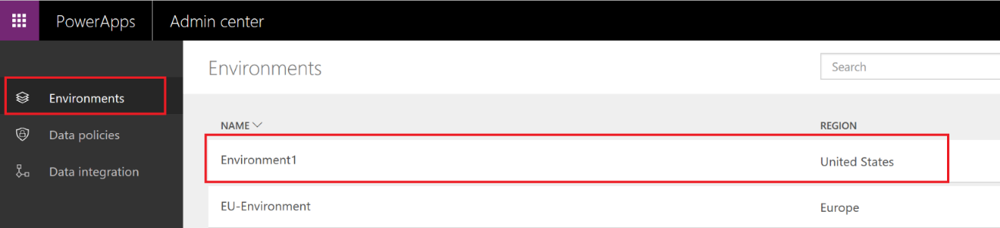

# Просмотр приложений PowerApps, созданных в вашей организации
Администратор среды может скачать список приложений, создаваемых в среде, из [центра администрирования PowerApps][1]. Если вы являетесь глобальным администратором Office 365 или администратором клиента Azure Active Directory, вы можете загрузить список приложений для всех сред в своей организации. Список содержит имя приложения, создателя приложения, все соединители, которые приложение использует для подключения к источникам данных, и другие сведения.

### Скачивание списка пользователей
1. В центре администрирования PowerApps щелкните **Среды** возле левого края страницы и выберите среду, для которой требуется просмотреть список приложений:
   
    
2. Зайдите на страницу **Ресурсы** из горизонтальной панели навигации и выберите **Приложения**. Скачайте список приложений, нажав кнопку **Download the list of apps** (Скачать список приложений), как показано ниже:
   
    
3. Подождите несколько минут, пока скачается CSV-файл, и откройте его в Excel.
   
   
   <!--Reference links in article-->

[1]:https://admin.powerapps.com
