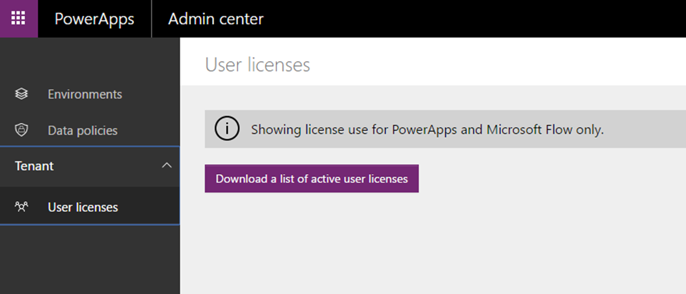
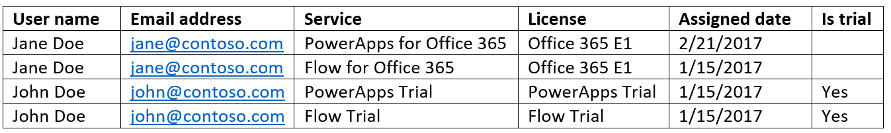

# Определение пользователей PowerApps в организации
Глобальный администратор Office 365 или администратор клиента Azure Active Directory может скачать список пользователей в организации, которым назначены лицензии на использование PowerApps, Microsoft Flow (или обе службы) и которые помимо лицензий также имеют доступ к этим продуктам. Список содержит имя каждого пользователя, адрес электронной почты, тип лицензии и другие сведения. Например, пользователю могут быть назначены такие лицензии и права доступа:

* пробная лицензия PowerApps или Microsoft Flow;
* доступ к PowerApps и Microsoft Flow через лицензию Office 365;
* доступ к PowerApps и Microsoft Flow через лицензию Dynamics 365;
* доступ к планам PowerApps и Microsoft Flow.

## Скачивание списка пользователей
1. В центре администрирования PowerApps выберите слева пункт **Лицензии пользователей**.
   
    **Важно!** Этот параметр доступен только глобальным администраторам Office 365 и администраторам клиента Azure Active Directory.
   
    
2. Выберите действие **Скачать список активных лицензий пользователей**.
   
    
   
    Скачивание файла может занять несколько минут. Подождите несколько минут, пока скачается CSV-файл, и откройте его в Excel.
   
    **Примечание.** Если закрыть окно до завершения скачивания файла, может потребоваться перезапустить процесс.

В этом примере показаны два пользователя, которым разными способами назначены лицензии PowerApps и Microsoft Flow. Елене Петровой назначен доступ через подписку Office 365. А у Ивана Петрова есть пробная лицензия каждого продукта.

Этот список не содержит пользователей, у которых есть лицензия PowerApps и Microsoft Flow и которые никогда не обращались к этим службам. Все лицензии пользователей можно просмотреть в [центре администрирования Office 365][1].

Если пользователь покинул организацию, в столбцах **Имя пользователя** и **Адрес электронной почты** списка будет отображаться значение **Неизвестно**. Если в списке отображается значение **Неизвестно**, но никто не покидал организацию, подождите несколько минут и еще раз скачайте список.

Чтобы добавить лицензии пользователей, откройте [центр администрирования Office 365][1].

<!--Reference links in article-->
[1]:https://support.office.com/article/Assign-or-remove-licenses-for-Office-365-for-business-997596b5-4173-4627-b915-36abac6786dc
