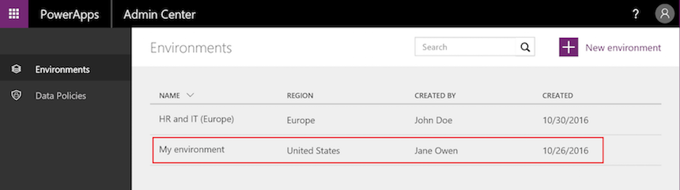

# Настройка безопасности среды
Служба Common Data Service (CDS) для приложений использует модель безопасности на основе ролей для обеспечения безопасного доступа к базе данных. В этой статье вы узнаете, как создавать артефакты безопасности, которые необходимы для защиты приложения. Роли пользователя позволяют контролировать доступ к данным во время выполнения. Они отделены от ролей среды, регулируемых разработчиками среды и ее администраторами. Общие сведения о средах см. в [этой статье](environments-overview.md).

## Назначение ролей безопасности пользователям
Роли безопасности управляют доступом пользователей к данным посредством набора уровней доступа и разрешений. Сочетание уровней доступа и разрешений, включенных в определенную роль безопасности, ограничивает возможности пользователя по просмотру данных и взаимодействию с ними.

Чтобы назначить роль в среде пользователю или группе безопасности, в [центре администрирования PowerApps][1] выполните приведенные ниже действия (только для администраторов среды).

1. Выберите среду в таблице сред.

    

2. Откройте вкладку **Безопасность**.

3. Чтобы узнать, имеется ли определенный пользователь в среде, щелкните **показать список пользователей в среде**.
    
    

4. Если пользователя нет, его можно добавить в центре администрирования PowerApps. Чтобы добавить пользователя, укажите его адрес электронной почты в организации и нажмите **Добавить пользователя**.

    

    Подождите несколько минут и проверьте, появился ли пользователь в списке пользователей среды.
  
5. Выберите пользователя в списке пользователей в среде.

    

6. Назначьте роль пользователю.

    

    > [!NOTE]
    > Сейчас роли можно назначать только пользователям. Назначение роли группе безопасности запланировано, но пока не реализовано.

7. Нажмите кнопку **ОК**, чтобы обновить назначения для роли среды.

## Предварительно определенные роли безопасности
В среде PowerApps есть предварительно определенные роли безопасности, соответствующие распространенным задачам пользователей. Уровни доступа этих ролей соответствуют рекомендациям и обеспечивают доступ к минимальным объему бизнес-данных, необходимому для работы с приложением.

|Роль безопасности  |* Привилегии базы данных  |Описание |
|---------|---------|---------|
|Системный администратор     |  Создание, чтение, запись, удаление, настройки, роли безопасности       | Имеет полный набор разрешений на настройку и администрирование среды, включая создание, изменение и назначение ролей безопасности. Может просматривать все данные в среде. Дополнительные сведения см. в статье [Привилегии, необходимые для настройки](https://docs.microsoft.com/dynamics365/customer-engagement/customize/privileges-required-customization).        |
|Настройщик системы     | Создание (собственные записи), чтение (собственные записи), запись (собственные записи), удаление (собственные записи), настройки         | Имеет полный набор разрешений на настройку среды. Однако может просматривать только те записи, которые связаны с созданными им самим сущностями среды. Дополнительные сведения см. в статье [Привилегии, необходимые для настройки](https://docs.microsoft.com/dynamics365/customer-engagement/customize/privileges-required-customization).        |
|Создатель среды     |  Нет       | Может создавать ресурсы, связанные со средой, включая приложения, подключения, пользовательские интерфейсы API, шлюзы и последовательности с использованием Microsoft Flow. Однако не имеет привилегий на доступ к данным в среде. Дополнительные сведения см. в [обзоре сред](https://powerapps.microsoft.com/blog/powerapps-environments/).        |
|Пользователь Common Data Service     |  Чтение (собственные записи), создание (собственные записи), запись (собственные записи), удаление (собственные записи)       | Может запускать приложение в среде и выполнять стандартные задачи с собственными записями.        |
|Делегат     | Действие от имени другого пользователя        | Позволяет выполнять код от имени другого пользователя или производить олицетворение.  Как правило, используется с другой ролью безопасности для обеспечения доступа к записям. Дополнительные сведения см. в статье [Олицетворение другого пользователя](https://docs.microsoft.com/dynamics365/customer-engagement/developer/org-service/impersonate-another-user).        |

* Привилегии имеют глобальную область действия, если не указано иное.

- Роль создателя среды могут не только создавать ресурсы внутри среды, но и распространять приложения, созданные ими в среде, другим пользователям в организации. Они могут предоставлять приложения отдельным пользователям для общего доступа. Дополнительные сведения см. в статье о [предоставлении совместного доступа к приложениям в PowerApps](../maker/canvas-apps/share-app.md).

- Для пользователей, которые создают приложения, подключающиеся к базе данных, и которым требуется создавать или изменять сущности и роли безопасности, следует вместе с ролью создателя среды назначить роль настройщика системы, так как у роли создателя среды нет привилегий для базы данных.

## Создание или настройка пользовательской роли безопасности
Если ваше приложение основано на пользовательской сущности, чтобы пользователи могли работать с ним, привилегии должны быть заданы явным образом. Это можно сделать одним из следующих способов:
- расширьте существующую предварительно определенную роль безопасности так, чтобы она включала привилегии для записей, основанных на пользовательской сущности;
- создайте пользовательскую роль безопасности с целью управления привилегиями для пользователей приложения.

Среда может хранить записи, которые могут использоваться несколькими приложениями, а для доступа к данным с разными привилегиями может потребоваться несколько ролей безопасности. Например:
- Некоторым пользователям (тип А) нужно только считывать, обновлять и добавлять записи, поэтому их роль безопасности будет иметь привилегии на чтение, запись и добавление.
- Другим пользователям требуются все привилегии, которые есть у пользователей типа А, в также возможность создавать, удалять записи, добавлять к ним данные и предоставлять общий доступ к ним, поэтому их роль безопасности будет иметь привилегии на создание, чтение, запись, добавление, удаление, назначение, добавление к записи и общий доступ.

Дополнительные сведения о привилегиях доступа и области действия см. в разделе [Роли безопасности](https://docs.microsoft.com/dynamics365/customer-engagement/admin/security-roles-privileges#security-roles).

1. В [центре администрирования PowerApps][1] выберите среду, в которой вы хотите обновить роль безопасности.

    

2. Щелкните ссылку на вкладке **Сведения**, чтобы управлять средой в центре администрирования Dynamics 365.

3. Выберите экземпляр (с тем же именем среды) и нажмите кнопку "Открыть".

    

4. В заголовке щелкните элемент **Параметры** и выберите пункт **Безопасность**.

    

5. Выберите **Роли безопасности**.

    

6. Нажмите кнопку **Создать**.

7. В конструкторе ролей безопасности выберите действия, например чтение, запись или удаление, и область выполнения этих действий.

8. Откройте вкладку и найдите требуемую сущность, например, вкладку **Настраиваемые сущности**, чтобы настроить разрешения для настраиваемой сущности.

9. Выберите привилегии на **чтение, запись, добавление**

10. Нажмите **Сохранить и закрыть**.

<!--Reference links in article-->
[1]: https://admin.powerapps.com
