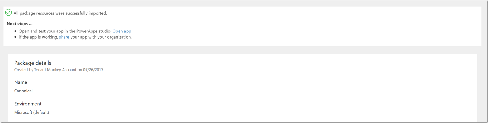

# Перенос приложения между средами и клиентами с использованием упаковки
Узнайте, как перенести ресурсы из одной среды в другую, используя упаковку. Эти среды могут находиться в одном клиенте или в разных клиентах.

## Сценарий
Одним из распространенных сценариев, в котором требуется переносить ресурсы, является ситуация, когда имеются среды для тестирования и разработки и рабочая среда. Разработчики и тест-инженеры имеют расширенный доступ к приложениям в своих средах. Но когда приходит время переносить новое приложение в рабочую среду, оказывается, что в ней установлен строгий контроль над разрешениями на обновление и изменение.

Еще один сценарий: каждый клиент использует собственную рабочую среду и данные. При добавлении нового клиента для него создается новая среда, в которую и будут переноситься приложения.

## Какие ресурсы можно перенести с использованием упаковки?
При экспорте приложения вместе с ним в пакете экспортируются и зависимые ресурсы.  Изначально поддерживаются только некоторые из возможных типов ресурсов, как показано в следующей таблице.

| Тип ресурса | Поддерживается | Способы импорта |
| --- | --- | --- |
| Приложение |Да |Импортировать приложение в среду можно двумя способами: <ol><li><b>Создать</b> — создается новое приложение в среде, в которую импортируется пакет.</li> <li><b>Обновить</b> — приложение уже существует в среде и обновится при импорте этого пакета.</li></ol> |
| Последовательность |Да |Импортировать последовательность в среду можно двумя способами: <ol><li><b>Создать</b> — создается новая последовательность в среде, в которую импортируется пакет.</li> <li><b>Обновить</b> — последовательность уже существует в среде и обновится при импорте этого пакета.</li></ol> <b>Примечание.</b> Все ресурсы, от которых зависит последовательность, также будут включены в экспортируемый пакет приложения. Кроме того, их необходимо настроить после импорта пакета. |
| Настраиваемые соединители |Нет |Приложение может зависеть от настраиваемого соединителя. Но сейчас экспорт соединителя в составе пакета <b>не</b> поддерживается. 

 Если приложение зависит от настраиваемого соединителя, единственное решение — вручную создать такой же или обновить этот соединитель в целевой среде и выбрать его после импорта пакета. |
| Соединения |Нет |Приложение может содержать зависимое соединение (например, соединение SQL с учетными данными). Но сейчас экспорт соединения или учетных данных в составе пакета не поддерживается. 

 Если приложение содержит зависимое соединение (например, SQL), единственное решение — вручную создать такое же соединение с соответствующими учетными данными в целевой среде и выбрать его после импорта пакета. |
| Настройки CDS |Нет |Экспорт настроек CDS больше не поддерживается в рамках упаковки. Теперь эта функция поддерживается посредством экспорта и импорта решения по умолчанию для среды, как описано ниже. |
| Шлюзы |Нет |Шлюзы поддерживаются только в средах по умолчанию и средах {имя_клиента} (из предварительной версии), поэтому их экспорт или перенос не поддерживается. |

## Как получить доступ к функции упаковки своего приложения?
Экспортировать приложения могут все пользователи, у которых есть разрешение на редактирование приложения.

Импортировать приложения могут все пользователи, которым назначена роль создателя среды в целевой среде.

Чтобы пользователь мог выполнить экспорт или импорт любого приложения, у него должна быть лицензия PowerApps (план 2) или пробная лицензия PowerApps (план 2).

> [!NOTE]
> Так как функция упаковки доступна в предварительной версии, все пользователи с действующей лицензией PowerApps могут опробовать ее для своих приложений и окружений.

## Экспорт приложения
1. На сайте http://web.powerapps.com выберите **Приложения**, щелкните значок многоточия для приложения, которое требуется перенести, и выберите пункт **Экспорт (предварительная версия)**.

    
2. Когда откроется страница экспорта пакета, введите имя и описание пакета.

    
3. При необходимости в разделе "Проверка содержимого пакета" для каждого ресурса можно добавить комментарии и примечания, а также изменить параметр способа импорта в целевую среду при импорте пакета.

    

4. Когда все будет готово, щелкните **Экспорт** и через несколько секунд начнется загрузка файла пакета.

## Импорт приложения
1. На сайте http://web.powerapps.com щелкните **Приложения** и выберите **Импортировать пакет (предварительная версия)**.

    
2. Нажмите кнопку **Отправить** и выберите файл пакета приложения, который требуется импортировать.

    
3. После отправки пакета потребуется просмотреть его содержимое и предоставить дополнительные входные данные для каждого элемента с красным значком. Для этого щелкните значок гаечного ключа рядом с каждым элементом и введите необходимые сведения.

    
4. Предоставив все необходимые сведения, нажмите кнопку **Импорт**.

    
5. По завершении импорта вы автоматически перейдете на страницу (как на изображении ниже), где указано, успешно ли завершилась операция импорта.

    

> [!NOTE]
>  Если при импорте вы решили **обновить** существующее приложение, новые изменения сохранятся в виде черновиков приложений.  Вам потребуется [опубликовать](http://powerapps.microsoft.com/tutorials/save-publish-app/#publish-an-app) эти изменения, чтобы они стали доступны всем пользователям приложений.
>
>

## Экспорт настроек CDS и приложений на основе модели
Экспорт настроек любой сущности или набора параметров либо любых приложений на основе модели, созданных в https://web.powerapps.com, поддерживается посредством экспорта решения среды по умолчанию следующим образом:
> [!NOTE]
>  Если вы хотите подробнее узнать о решениях в PowerApps, см. раздел [Общие сведения о решениях](../developer/common-data-service/introduction-solutions.md).
>
>

1. На сайте http://web.powerapps.com выберите в своей среде режим конструктора **Model-driven (preview)** (На основе модели (предварительная версия)).

    

2. Выберите элемент **Дополнительно** на левой панели навигации, чтобы запустить обозреватель решений для решения по умолчанию для этой среды.

    

3. Выберите элемент **Экспортировать решение** и выполнить необходимые действия.  Скачивание файла пакета решения начнется через несколько секунд.

    

## Импорт настроек CDS и приложений на основе модели
К сожалению, для импорта пакета решения CDS требуется ручное вмешательство в процесс, которое мы активно стремимся устранить:

1. На сайте http://web.powerapps.com выберите в своей среде режим конструктора **Model-driven (preview)** (На основе модели (предварительная версия)).

    

2. Выберите элемент **Дополнительно** на левой панели навигации, чтобы запустить обозреватель решений для решения по умолчанию для этой среды.

    

3. Скопируйте URL-адрес из браузера, внесите следующие изменения, а затем перейдите по новому URL-адресу в браузере:

    * Структура текущего URL-адреса: https://{уникальное_имя_организации}.crm.dynamics.com/tools/solution/edit.aspx?id={имя_решения}

        

    * Структура нового URL-адреса: https://{уникальное_имя_организации}.crm.dynamics.com/tools/solution/SolutionImportWizard.aspx

        

4. Выберите файл пакета решения CDS, который требуется импортировать, и завершите работу с мастером.

5. Если импорт прошел успешно, вы увидите указанное ниже диалоговое окно подтверждения. Чтобы изменения решения были доступны другим настройщикам в среде, выберите элемент **Опубликовать все настройки**

    
