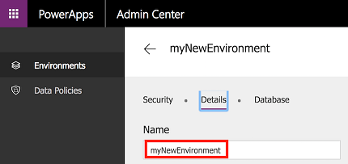
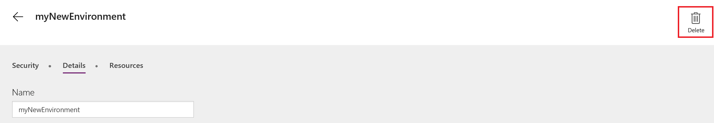

# Администрирование сред в PowerApps
В [центре администрирования PowerApps][1] можно управлять созданными средами, а также средами, в которых вам назначена роль администратора среды или системного администратора. В центре администрирования можно выполнять следующие действия:

* Создавать среды.
* Изменять имена сред.
* Добавлять и удалять пользователей или группы из ролей администратора среды или разработчика среды.
* Подготавливать для среды базы данных Common Data Service.
* Задавать политики защиты от потери данных.
* Задавать политики безопасности для базы данных (открытые или с ограничением по ролям в базе данных).
* Члены роли глобального администратора для клиента Azure AD (включая глобальных администраторов Office 365) могут также управлять всеми средами, созданными в соответствующем клиенте, и задавать политики для клиента.

## Доступ к центру администрирования PowerApps
Чтобы получить доступ к центру администрирования PowerApps, сделайте следующее:

* Перейдите непосредственно на сайт [admin.powerapps.com][1].

* Или перейдите на сайт [powerapps.com][2], а затем щелкните значок с шестеренкой вверху панели навигации.

    

Чтобы управлять средой в центре администрирования PowerApps, вам потребуется одна из этих ролей:

* роль администратора среды или системного администратора для этой среды;

* или роль глобального администратора клиента Azure AD или клиента Office 365.

Кроме того, для доступа к центру администрирования вам также потребуется план 2 службы PowerApps или план 2 службы Flow. Дополнительные сведения см. на [странице с ценами на PowerApps][3].

> [!IMPORTANT]
> Все изменения, внесенные в центре администрирования PowerApps, применяются в [центре администрирования Flow][4] и наоборот.

## Создание среды
Инструкции по созданию среды см. в разделе [Краткое руководство по созданию среды](create-environment.md).

## Просмотр сред
При открытии центра администрирования вкладка "Среды" отображается по умолчанию. На этой вкладке содержится список всех сред, в которых вы являетесь администратором, как показано ниже.

Если вы являетесь членом роли глобального администратора для клиента Azure AD или Office 365, на этой вкладке отображаются все среды, созданные пользователями в клиенте, так как вам автоматически присваивается роль администратора всех этих сред.

## Изменение имени среды
1. Откройте [центр администрирования PowerApps][1], найдите в списке среду, имя которой нужно изменить, и щелкните ее.

    
 
2. Щелкните **Сведения**.

    
3. В текстовом поле **Имя** введите новое имя, а затем щелкните **Сохранить**.

    

    Если вы создали в среде базу данных, этот параметр будет отсутствовать. Вы можете переименовать среду в центре администрирования Dynamics 365, щелкнув ссылку на вкладке **Сведения**.

    

## Удаление среды
1. В [центре администрирования PowerApps][1] выберите среду, которую необходимо удалить.

    
2. Щелкните **Сведения**.

    
3. Чтобы удалить среду, нажмите кнопку **Удалить среду**.

    

## Создание базы данных Common Data Service в среде
Если в среде еще нет базы данных, администратор среды может создать ее в [центре администрирования PowerApps][1], выполнив приведенные ниже указания. Только пользователи с лицензией на службу PowerApps (план 2) могут создавать базы данных Common Data Service.

1. Выберите среду в таблице сред.

    
2. Откройте вкладку **Сведения**.
3. Нажмите кнопку **Создать базу данных**.

    

Создав базу данных, выберите модель безопасности. Дополнительные сведения см. в статье [Configure database security](database-security.md) (Настройка безопасности базы данных).

## Управление безопасностью среды

### Разрешения среды
Все пользователи в клиенте Azure AD также являются пользователями этой среды. Но чтобы расширить права этих пользователей, их необходимо включить в роль определенной среды. Каждая среда имеет две встроенные роли, которые предоставляют доступ к разрешениям в этой среде.

* Роль **администратора среды** (или **системного администратора**) позволяет выполнять все административные действия в среде, в том числе:
    * добавлять пользователей в роль администратора или создателя среды или удалять их из нее;

    * Подготавливать для среды базы данных Common Data Service.

    * просматривать любые ресурсы, созданные в окружении, и управлять ими;

    * задавать политики защиты от потери данных. Дополнительные сведения см. в статье [Data loss prevention policies](prevent-data-loss.md) (Политики защиты от потери данных).

  > [!NOTE]
  > Если среда имеет базу данных, нужно назначить пользователей роли **системного администратора** вместо роли **администратора среды**.

* Роль **разработчика среды** позволяет создавать в этой среде ресурсы, включая приложения, подключения, настраиваемые соединители, шлюзы и последовательности с использованием Microsoft Flow. Разработчики среды также могут предоставлять приложения, созданные в среде, другим пользователям в организации. Они могут предоставлять доступ к приложению отдельным пользователям, группам безопасности или всем пользователям в организации. Дополнительные сведения см. в статье о [предоставлении совместного доступа к приложениям в PowerApps](../maker/canvas-apps/share-app.md).

Чтобы назначить роль в среде пользователю или группе безопасности, в [центре администрирования PowerApps][1] выполните приведенные ниже действия (только для администраторов среды).

1. Выберите среду в таблице сред.

    
2. Откройте вкладку **Безопасность**.
3. Если база данных в среде не создана:

    а) Выберите либо роль **администратора**, либо **разработчика среды**.

    

    б) Укажите имена одного или нескольких пользователей или групп безопасности в Azure Active Directory либо добавьте всех пользователей организации.

    

    в) Щелкните **Сохранить**, чтобы обновить назначения роли в среде.

4. Если в среде создана база данных:

    а) Щелкните ссылку для управления ролями среды в Dynamics 365.

    

    б) Выберите пользователя в списке пользователей в среде или экземпляре.

    

    в) Назначьте роль пользователю.

    

    г) Нажмите кнопку **ОК**, чтобы обновить назначения для роли среды.

> [!NOTE]
> Пользователи или группы, которым назначены эти роли среды, не получают автоматический доступ к базе данных среды (если такая существует). Такой доступ предоставляется отдельно владельцем базы данных. Дополнительные сведения см. в статье [Configure database security](database-security.md) (Настройка безопасности базы данных).  
>
>

### Безопасность базы данных
Возможность создавать и изменять схему базы данных, а также подключаться к данным, хранящимся в подготовленной в вашей среде базе данных, контролируется ролями пользователей и наборами разрешений в базе данных. Вы можете управлять ролями пользователей и наборами разрешений для базы данных среды в разделе **Роли пользователей** и **Наборы разрешений** на вкладке **Безопасность**. Дополнительные сведения см. в статье [Configure database security](database-security.md) (Настройка безопасности базы данных).

## Политики данных
Данные организации должны быть защищены, поэтому доступ к ним не предоставляется посторонним пользователям. Чтобы защитить эти данные, вы можете создать и применить политики, определяющие, к каким пользовательским службам и бизнес-данным для конкретного соединителя можно предоставлять общий доступ. Политики, которые задают правила совместного использования данных, известны как политики защиты от потери данных. Этими политиками среды можно управлять в разделе **Политики данных** [центра администрирование PowerApps][1].  Дополнительные сведения см. в статье [Data loss prevention policies](prevent-data-loss.md) (Политики защиты от потери данных).

## Часто задаваемые вопросы
### Сколько сред можно создать?
В зависимости от используемой лицензии каждый пользователь может создать до двух пробных и двух рабочих сред.

### Сколько баз данных можно подготовить?
В зависимости от используемой лицензии каждый пользователь может подготовить базы данных в двух пробных и двух рабочих средах. Пользователь должен быть **администратором среды** в данной среде.

### Можно ли изменить имя среды?
Да, эта возможность доступна в центре администрирования PowerApps. Дополнительные сведения см. в статье об [администрировании сред](environments-administration.md#rename-your-environment).

### Можно ли удалить среду?
Да, эта возможность доступна в центре администрирования PowerApps. Дополнительные сведения см. в статье об [администрировании сред](environments-administration.md#delete-your-environment).

### Может ли администратор просматривать все ресурсы среды (приложения, последовательности, API-интерфейсы и т. д.)?
Да, возможность просмотра приложений и последовательностей среды доступна в центре администрирования PowerApps. Дополнительные сведения см. в статье о [просмотре приложений](admin-view-apps.md).

### Пользователи с какой лицензией могут создавать базу данных Common Data Service?
Пользователи с лицензией на службу PowerApps (план 2).  Сведения о всех планах, включающих в себя эту лицензию, см. на [странице цен на PowerApps][3].

<!--Reference links in article-->
[1]: https://admin.powerapps.com
[2]: https://web.powerapps.com
[3]: https://powerapps.microsoft.com/pricing/
[4]: https://admin.flow.microsoft.com
