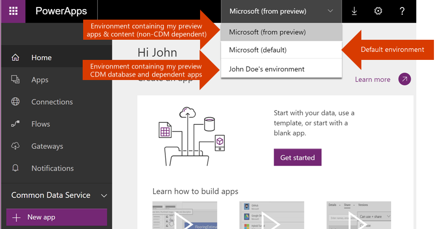

# Обзор сред
Среда — это пространство для хранения и совместного использования бизнес-данных, приложений и последовательностей вашей организации, а также управления ими. Они также служат контейнерами для разделения приложений, связанных с разными ролями, требованиями к безопасности и целевыми аудиториями. Возможности использования сред зависят от особенностей организации, а также характеристик приложений, которые вы создаете. Пример.

* Вы можете просто создавать все приложения в одной среде.
* Вы можете создавать отдельные среды, чтобы разделять тестовые и рабочие версии приложений.
* Вы можете создавать отдельные среды для определенных групп или отделов компании, при этом каждая среда будет содержать данные и приложения, используемые соответствующей аудиторией.
* Также вы можете создавать отдельные среды для разных глобальных подразделений компании.  

## Область действия среды
Каждая среда создается в пределах определенного клиента Azure AD, и доступ к ресурсам среды получают только пользователи этого клиента. Также среда привязывается к географическому расположению (например, к региону США). Когда в среде создается приложение, оно становится доступным только для центров обработки данных в этом географическом расположении. Все элементы, создаваемые в этой среде (подключения, шлюзы, последовательности с использованием Microsoft Flow и многое другое), также привязаны к расположению среды.

Каждая среда может включать только одну базу данных Common Data Service в качестве хранилища для приложений. Возможность создания базы данных для вашей среды зависит от того, какие лицензии вы приобрели для PowerApps и какие права у вас есть в этой среде. Дополнительную информацию см. на странице [сведений о ценах](pricing-billing-skus.md).

Когда в среде создается приложение, оно получает права подключения только к тем источникам данных, которые будут развернуты в этой среде (сюда относятся подключения, шлюзы, последовательности и базы данных Common Data Service).  Для примера давайте рассмотрим сценарий с двумя средами (Test и Dev), в каждой из которых создана база данных Common Data Service. Если вы создадите приложение в среде Test, оно получит доступ только к базе данных Test, но не сможет подключиться к базе данных Dev.

Вы можете перемещать ресурсы между средами. Дополнительные сведения см. в статье о [миграции ресурсов](environment-and-tenant-migration.md).

## Разрешения среды
Каждая среда имеет две встроенные роли, которые предоставляют доступ к разрешениям в этой среде.

* Роль администратора среды позволяет выполнять все административные действия в среде, в том числе:

    * добавлять и удалять пользователей или группы из ролей администратора или разработчика окружения;

    * подготавливать для окружения базы данных Common Data Service;

    * просматривать любые ресурсы, созданные в окружении, и управлять ими;

    * задавать политики защиты от потери данных. Подробнее см. статью [Data loss prevention policies](prevent-data-loss.md) (Политики защиты от потери данных).

    После создания базы данных в среде вы можете использовать вместо роли администратора среды роль системного администратора.

* Роль разработчика среды позволяет создавать в этой среде ресурсы, включая приложения, подключения, настраиваемые соединители, шлюзы и последовательности с использованием Microsoft Flow.

Разработчики среды также могут распространять созданные ими приложения для использования другими корпоративными пользователями. Для этого можно предоставить совместный доступ к приложению отдельному пользователю, группе безопасности или всем пользователям в организации. Дополнительные сведения см. в статье о [предоставлении совместного доступа к приложениям в PowerApps](../maker/canvas-apps/share-app.md).

Пользователи или группы, которым назначены эти роли среды, не получают автоматический доступ к базе данных среды (если такая существует). Такой доступ предоставляется отдельно владельцем базы данных. Дополнительные сведения см. в статье [Configure database security](database-security.md) (Настройка безопасности базы данных).

Пользователю или группе безопасности любую из этих двух ролей может назначить администратор среды с помощью [Центра администрирования PowerApps][1]. Дополнительные сведения см. в разделе [Администрирование сред в PowerApps](environments-administration.md).

## Среда по умолчанию
PowerApps автоматически создает одну среду по умолчанию для каждого клиента. Доступ к ней получают все пользователи этого клиента. Каждый зарегистрированный в PowerApps пользователю автоматически назначается роль разработчика в пределах среды по умолчанию. Среда по умолчанию создается в ближайшем регионе к региону по умолчанию клиента AAD.

> [!NOTE]
> Роли администратора среды по умолчанию автоматически пользователям не назначаются. Дополнительные сведения см. в разделе [Администрирование сред в PowerApps](environments-administration.md).
>
>

Среда по умолчанию получает имя в формате: "{имя клиента Azure AD} (по умолчанию)".

## Рабочая и пробная среды
Вы можете создавать среды для разных целей. Пробная среда предназначена для ознакомления со средой и базой данных, поддерживающими Common Data Service. Она имеет ограниченный срок действия. Дополнительные сведения см. в разделе [Администрирование сред в PowerApps](environments-administration.md).

## Выбор среды
По мере реализации концепции сред на портале [https://web.powerapps.com](https://web.powerapps.com) будут представлены новые возможности.  Отображаемые на сайте приложения, подключения и другие элементы теперь можно отфильтровать по выбранной среде.  Текущая среда определяется в средстве выбора, расположенном справа от заголовка. Чтобы выбрать другую среду, щелкните это средство. Вы увидите список всех доступных сред. Выберите в списке нужную среду.

В средстве выбора отображаются среды, которые соответствуют одному из следующих условий.

* Вы являетесь членом роли администратора этой среды.
* Вы являетесь членом роли разработчика этой среды.
* У вас нет прав администратора среды или разработчика этой среды, но есть право доступа участника хотя бы к одному приложению в среде. Дополнительные сведения см. в статье о [предоставлении совместного доступа к приложениям](../maker/canvas-apps/share-app.md). В этом случае вы не сможете создавать приложения в этом окружении. Вы сможете только изменять существующие приложения, к которым вам предоставлен доступ.

## Создание среды
### Кто может создавать среды?
Право создавать среды определяется условиями лицензии.

| Лицензия | Допускает создание среды |
| --- | --- |
| PowerApps P2 |√ |
| Пробная версия PowerApps P2 |√ |
| PowerApps P1 |x |
| Пробная версия PowerApps P1 |x |
| Планы Dynamics 365 |x |
| Планы Office 365 |x |
| Планы приложений и команд Dynamics 365 |x |

Каждый пользователь может создать до двух пробных сред. PowerApps P2 также позволяет создать до двух рабочих сред.

### Как можно создать среду?
Новые среды можно создавать на сайте [PowerApps.com][2] и в [Центре администрирования PowerApps][1]. Создавая среду, вы автоматически получаете для нее роль администратора. Не существует ограничений на число сред, в которых вы можете быть участником роли администратора среды или создателя среды. Дополнительные сведения о средах см. в разделе [Администрирование сред в PowerApps](environments-administration.md). Инструкции по созданию среды см. в разделе [Создание среды](create-environment.md).

## Что изменится для пользователей предварительной версии PowerApps?
Все, кто использовали предварительную версию PowerApps, увидят ряд изменений, связанных с появлением сред.  В следующей таблице перечислены изменения, которые увидят пользователи в США и других регионах.

| Пользователь | Что изменилось |
| --- | --- |
| Пользователи предварительной версии, создавшие базу данных Common Data Service |Вы увидите среду с именем "{ваше имя} среда", в которую входит ваша база данных Common Data Service и все приложения, созданные на ее основе.  Вам будет назначена роль разработчика и администратора среды, а также роль владельца базы данных. Когда будет выпущена общедоступная версия PowerApps, мы обновим метаданные Common Data Service. Это изменение означает, что вы по-прежнему можете использовать сущности и приложения, которые создали ранее на основе предварительной версии базы данных Common Data Service. Но вы не сможете создавать поля или сущности в этой базе данных. Мы скоро опубликуем руководство по созданию среды с базой данных, которая содержит обновленные метаданные, и переносу приложений в эту среду.   Если какие-либо приложения, созданные на основе предварительной версии базы данных Common Data Service, используют в качестве дополнительного источника данных настраиваемый соединитель, они временно будут неработоспособны в соответствующем окружении, так как все настраиваемые соединители будут перенесены в окружение по умолчанию. Вам нужно будет заново создать настраиваемый соединитель в этой среде, чтобы восстановить работоспособность таких приложений. |
| Пользователи предварительной версии в США. |В среде вашего клиента по умолчанию будут доступны следующие ресурсы, которые вы создали в период использования предварительной версии PowerApps. Все созданные приложения (за исключением тех, которые подключены к базе данных предварительной версии Common Data Service). Все созданные подключения и настраиваемые соединители. Все установленные локальные шлюзы локальных данных. |
| Пользователи предварительной версии за пределами США |Кроме среды по умолчанию, вы увидите среду с именем в формате "{клиент Azure AD} (из предварительной версии preview)", которая содержит следующие ресурсы, созданные в период использования предварительной версии PowerApps. Все созданные приложения (за исключением тех, которые подключены к базе данных предварительной версии Common Data Service). Все созданные подключения и настраиваемые соединители. — Все установленные локальные шлюзы данных. Вы будете включены в роль разработчика среды для этой среды. |

*Пользователь предварительной версии* - это человек, который использовал Microsoft PowerApps до выхода общедоступного выпуска.

Через две недели после выхода общедоступной версии PowerApps все среды, содержащие элементы из предварительной версии (кроме среды по умолчанию), получат статус "только для чтения". Все существующие приложения и последовательности в таких средах будут продолжать работать, но вы не сможете создавать новые последовательности или приложения. Мы настоятельно рекомендуем всем пользователям таких сред перенести их содержимое в среду по умолчанию или в другую пользовательскую среду. Дополнительные сведения о процессе миграции будут на этой неделе опубликованы в блоге с [объявлениями о выпуске компонентов Common Data Service][3].

### Примеры сред для пользователя предварительной версии в США

### Примеры сред для пользователя предварительной версии за пределами США

## Управление средами в организации
В центре администрирования PowerApps вы можете управлять всеми созданными средами, а также средами, в которых вам назначена роль администратора среды. Центр администрирования позволяет выполнять все административные действия для среды:

* Добавлять и удалять пользователей или группы из ролей администратора среды или разработчика среды.  Дополнительные сведения см. в разделе [Администрирование сред в PowerApps](environments-administration.md).
* Подготавливать для среды базы данных Common Data Service. Дополнительные сведения см. в разделе [Create a Common Data Service database](create-database.md) (Создание базы данных Common Data Service).
* Задавать политики защиты от потери данных. Дополнительные сведения см. в статье [Data loss prevention policies](prevent-data-loss.md) (Политики защиты от потери данных).
* Задавать политики безопасности для базы данных (открытые или с ограничением по ролям в базе данных). Дополнительные сведения см. в статье [Configure database security](database-security.md) (Настройка безопасности базы данных).
* Члены роли глобального администратора для клиента Azure AD (включая глобальных администраторов Office 365) с помощью центра администрирования PowerApps смогут управлять всеми средами, которые созданы в соответствующем клиенте, и задавать политики для клиента.

<!--Reference links in article-->
[1]: https://admin.powerapps.com
[2]: https://web.powerapps.com
[3]: https://aka.ms/cdspreviewtoga
