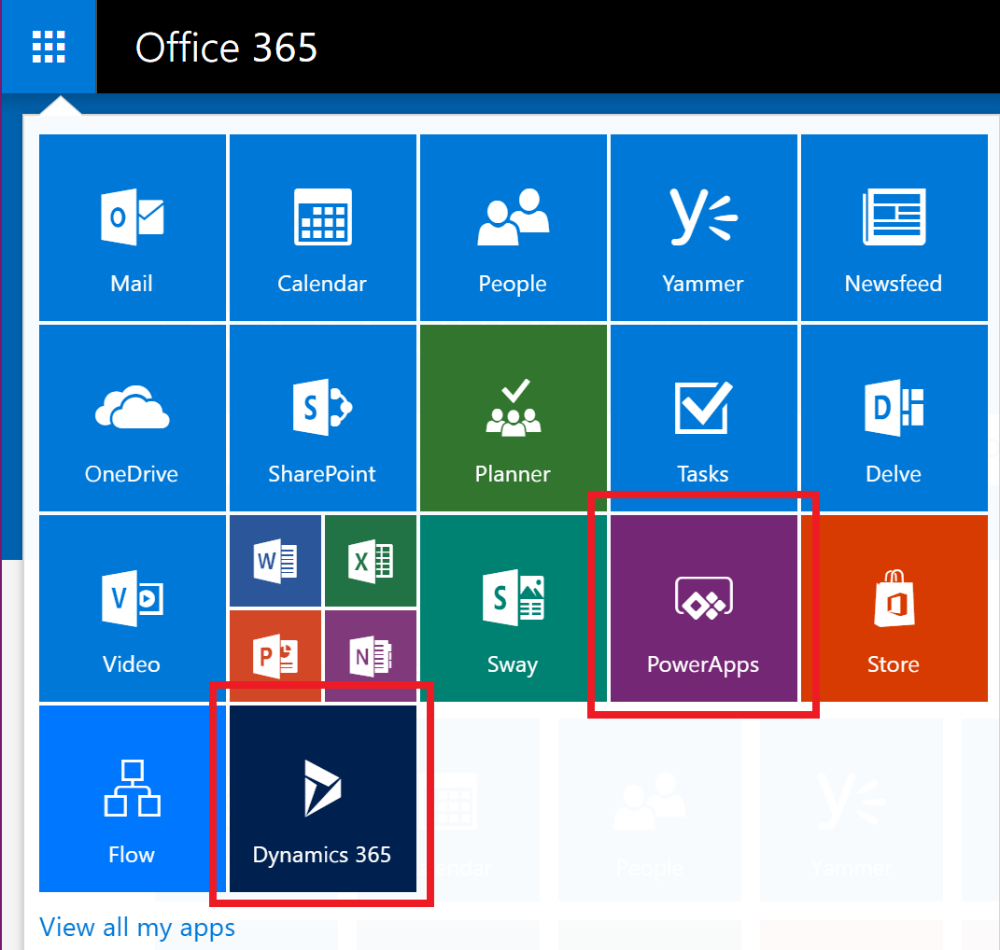

# Управление лицензиями PowerApps в организации
Из этой статьи вы узнаете, как пользователи в вашей организации могут получить доступ к службе PowerApps и как вы можете управлять доступом к ней.

## Регистрация в PowerApps
### Что такое PowerApps?
Microsoft PowerApps позволяет пользователям создавать приложения для мобильных устройств с Windows, iOS и Android. С помощью этих приложений можно создавать подключения к общим службам SaaS, включая Twitter, Office 365, Dropbox и Excel.

### Как пользователи регистрируются в PowerApps?
Единственная возможность регистрации отдельных пользователей в организации — пробная версия PowerApps (план 2), на получение которой можно зарегистрироваться через веб-сайт PowerApps:

##### Вариант 1
Чтобы зарегистрироваться, пользователю нужно перейти на сайт [powerapps.microsoft.com](https://powerapps.microsoft.com), выбрать **Бесплатная регистрация**, а затем выполнить регистрацию в PowerApps на сайте [portal.office.com](https://portal.office.com/Start?sku=powerapps).

##### Вариант 2
Чтобы зарегистрироваться, пользователю нужно перейти на сайт [powerapps.microsoft.com](https://powerapps.microsoft.com), выбрать **Вход**, войти с использованием рабочей или учебной учетной записи и зарегистрироваться для получения пробной версии PowerApps (план 2), приняв условия использования PowerApps.    

При регистрации в PowerApps пользователю в организации автоматически назначается лицензия PowerApps.

> [!NOTE]
> Пользователи, зарегистрировавшиеся для получения пробной лицензии из PowerApps, не отображаются на портале администрирования Office 365 как пользователи пробной версии PowerApps (план 2), если только у них нет другой лицензии на Office 365, Dynamics 365 или PowerApps.

Дополнительные сведения см. в статье [Самостоятельная регистрация в PowerApps](../maker/signup-for-powerapps.md).

### Как пользователи в организации могут получить доступ к PowerApps?
Пользователи в организации могут получить доступ к PowerApps тремя разными способами:

* Они могут по отдельности зарегистрироваться на получение пробной версии PowerApps (план 2), как описано в разделе [Как пользователи регистрируются в PowerApps?](#how-do-users-sign-up-for-powerapps).
* Пользователям можно назначить лицензию PowerApps на портале администрирования Office 365.
* Пользователю назначаются планы Office 365 и Dynamics 365, предусматривающие доступ к службе PowerApps. Список планов Office 365 и Dynamics 365, в которых предусмотрена возможность использовать функции PowerApps, см. на [странице цен на PowerApps](https://powerapps.microsoft.com/pricing).

### Можно ли заблокировать регистрацию пользователей в PowerApps в моей организации?
Каждый пользователь может бесплатно использовать функции Microsoft PowerApps (план 2) в течение 30 дней, как описано в разделе [Как пользователи регистрируются в PowerApps](#how-do-users-sign-up-for-powerapps).  Эта возможность доступна каждому пользователю в клиенте. Администратор не может ее отключить.  По истечении срока действия пробной версии пользователь теряет доступ к возможностям PowerApps (план 2).  

Если пользователь регистрируется на получение 30-дневной пробной версии Microsoft PowerApps (план 2) и вы решаете не предоставлять ему поддержку в организации, ваша компания не понесет никаких убытков. Когда пользователь регистрируется в Microsoft PowerApps, устанавливается связь между ним и корпорацией Майкрософт напрямую, как и при использовании любой другой общедоступной облачной службы корпорации Майкрософт, такой как Bing, Wunderlist, OneDrive или Outlook.com. Это никоим образом не означает, что службу предоставляет ваша организация.

Если необходимо ограничить использование корпоративных данных в Microsoft PowerApps, можно применить политики защиты от потери данных (DLP). Дополнительные сведения см. в статье [Data loss prevention (DLP) policies](prevent-data-loss.md) (Политики защиты от потери данных (DLP)).

## Администрирование PowerApps
### Почему в средстве запуска приложений Office 365 появился значок PowerApps?
Платформа Microsoft PowerApps является основной частью пакета Office 365 и включена в качестве службы в существующем SKU Office 365. Теперь пользователи со всего мира могут использовать службу Microsoft PowerApps: она отображается в разделе "Все приложения" в средстве запуска приложений. Дополнительные сведения о том, в каких номерах SKU Office 365 присутствует PowerApps, см. в статье [Licensing overview](pricing-billing-skus.md) (Общие сведения о лицензировании).

В следующем разделе представлены сведения о том, как удалить плитку PowerApps из списка "Все приложения" по умолчанию.

### Как удалить PowerApps у существующих пользователей?
Если пользователю была назначена лицензия PowerApps (план 1 или план 2), выполните следующие действия, чтобы удалить ее для этого пользователя:

1. Перейдите на [портал администрирования Office 365](https://portal.microsoftonline.com/).

2. В области навигации слева выберите **Пользователи**, а затем — **Активные пользователи**.

3. Найдите пользователя, лицензию которого нужно удалить, и выберите его имя.

4. В области сведений о пользователе в разделе **Product licenses** (Лицензии на продукты) выберите **Изменить**.

5. Найдите лицензию **Microsoft PowerApps (план 1)** или **Microsoft PowerApps (план 2)**, установите переключатель в положение **Выкл.**, а затем выберите **Сохранить**.

    

Если пользователь может получить доступ к PowerApps по лицензии плана Office 365 и плана Dynamics 365, доступ к службе PowerApps можно отключить, сделав следующее:

1. Перейдите на [портал администрирования Office 365](https://portal.microsoftonline.com/).

2. В области навигации слева выберите **Пользователи**, а затем — **Активные пользователи**.

3. Найдите пользователя, доступ которого нужно удалить, и выберите его имя.

4. В области сведений о пользователе в разделе **Product licenses** (Лицензии на продукты) выберите **Изменить**.

5. Разверните узел лицензии пользователя Office 365 или Dynamics 365, отключите доступ к службе **PowerApps для Office 365** или **PowerApps для Dynamics 365**, а затем выберите **Сохранить**.

    

Массовое удаление лицензий также можно выполнить с помощью PowerShell. Подробный пример см. в статье [Лицензирование Office 365 и Windows PowerShell: удаление лицензии](https://technet.microsoft.com/library/dn771774.aspx).   Дополнительные рекомендации по массовому удалению служб в лицензии см. в статье [Отключение доступа к службам с помощью Office 365 PowerShell](https://technet.microsoft.com/library/dn771769.aspx).

При удалении лицензии или службы PowerApps для пользователя в организации также удаляются значки PowerApps и Dynamics 365 из следующих расположений:

* [Office.com](https://office.com).

    
* Значок в средстве запуска приложений Office 365.

    

### Как можно ограничить возможность доступа пользователей к бизнес-данным моей организации с помощью PowerApps?
PowerApps позволяет создавать зоны данных для бизнес-данных и данных другого типа, как показано ниже.  После внедрения политик защиты от потери данных пользователи не смогут выполнять разработку в PowerApps или работать в этой службе с использованием бизнес-данных и других данных. Дополнительные сведения см. в статье [Data loss prevention (DLP) policies](prevent-data-loss.md) (Политики защиты от потери данных (DLP)).

### Почему в моем клиенте Office 365 отображается 10 000 лицензий для Microsoft PowerApps?
В соответствующих организациях пользователи имеют право использовать Microsoft PowerApps (план 2) в течение 30 дней. Эти пробные лицензии представляют собой свободное место, которое можно выделить для новых пользователей PowerApps в клиенте. Лицензии предоставляются бесплатно. В частности, существует два возможных объяснения тому, что на портале администрирования Office 365 отображается значение 10 000 (пробных) лицензий в PowerApps:

* Если хотя бы один пользователь в клиенте использовал общедоступную предварительную версию PowerApps, действовавшую с апреля по октябрь 2016 г., вы увидите значение 10 000 лицензий, помеченное как Microsoft PowerApps and Logic flows (Microsoft PowerApps и логические потоки)

    
* Если хотя бы один пользователь в клиенте зарегистрировался на получение пробной версии PowerApps (план 2), использовав **Способ 1**, описанный в разделе [Как пользователи регистрируются в PowerApps?](#how-do-users-sign-up-for-powerapps), вы увидите значение 10 000 лицензий, помеченное как Microsoft Power Apps & Flow (Microsoft PowerApps и Flow).

    

Вы можете назначить дополнительные лицензии пользователям самостоятельно через портал администрирования Office 365. Обратите внимание, что есть пробные лицензии для Microsoft PowerApps (план 2), срок действия которых истекает через 30 дней после назначения пользователю.

### Лицензии предоставляются бесплатно? За них будет взиматься какая-либо плата?
Это бесплатные пробные лицензии на Microsoft PowerApps (план 2), действующие в течение 30 дней.

### Как изменится подход к управлению удостоверениями пользователей в моей организации?
Если в вашей организации уже развернута среда Office 365, а у всех пользователей в организации есть учетные записи Office 365, управление удостоверениями не изменится.

Если же среда Office 365 развернута, но учетные записи Office 365 есть лишь у некоторых пользователей, мы создаем пользователя в клиенте и назначаем лицензии с учетом адреса его рабочей или учебной электронной почты. Это означает, что количество управляемых пользователей в любой конкретный момент времени будет увеличиваться по мере регистрации пользователей вашей организации в службе.

Если в вашей организации нет среды Office 365, подключенной к домену электронной почты, управление удостоверениями не изменится. Пользователи будут добавляться в полностью облачный новый каталог пользователя, а вы сможете управлять ими в качестве администратора клиента.

### Каким образом осуществляется управление клиентом, созданным корпорацией Майкрософт для пользователей?
Если клиент создали в корпорации Майкрософт, его можно запросить, а также управлять им, сделав следующее:

1. Присоединитесь к клиенту. Для этого зарегистрируйтесь в PowerApps, используя домен адреса электронной почты, совпадающий с доменом клиента, которым требуется управлять. Например, если корпорация Майкрософт создала клиент contoso.com, присоединитесь к клиенту с адресом электронной почты, заканчивающимся на @contoso.com.
2. Запросите возможность административного управления, подтвердив право владения доменом. После входа в клиент вы можете самостоятельно повысить свои привилегии до роли администратора, подтвердив право владения доменом. Для этого сделайте следующее:
3. Перейдите по адресу [https://portal.office.com](https://portal.office.com/Start?sku=powerapps).
4. В верхнем левом углу щелкните значок средства запуска приложений и выберите администратора.
5. Ознакомьтесь с инструкциями на странице **Become the admin** (Стать администратором), а затем выберите **Yes, I want to be the admin** (Да, я хочу стать администратором).  

> [!NOTE]
> Если этот параметр не отображается, администратор Office 365 уже существует.

### Можно ли управлять клиентом Office 365, в который добавляются пользователи, при наличии нескольких доменов?
Если не предпринимать никаких действий, клиент создается для каждого домена и поддомена электронной почты пользователя.

Если нужно, чтобы все пользователи находились в одном клиенте независимо от расширений адреса электронной почты, сделайте следующее:  

* Заранее создайте целевой клиент или используйте имеющийся. Добавьте все имеющиеся домены и поддомены, которые следует объединить в пределах этого клиента. После этого все пользователи, адреса электронной почты которых заканчиваются этими доменами и поддоменами, после регистрации автоматически добавляются к целевому клиенту.

> [!IMPORTANT]
> Механизм автоматического перемещения пользователей между созданными клиентами не предусмотрен. Дополнительные сведения о добавлении доменов к одному клиенту Office 365 см. в статье [Добавление пользователей и домена с помощью мастера настройки](https://support.office.com/article/Add-your-users-and-domain-to-Office-365-ffdb2216-330d-4d73-832b-3e31bcb5b2a7).
