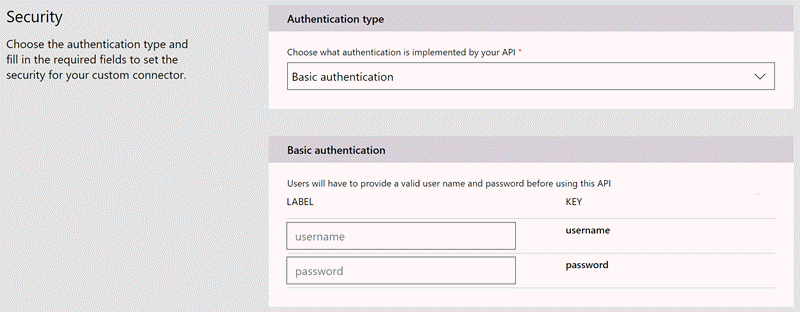

# Разработка соединителя API (PowerApps)
Создание соединителя включает несколько шагов. Чтобы приступить к работе в [PowerApps](https://web.powerapps.com/), нажмите кнопку **Параметры** (значок с шестеренкой) в правом верхнем углу страницы. Затем выберите **Custom Connectors** (Настраиваемые соединители).

## Описание API
Соединители API описываются с помощью [стандарта OpenAPI](https://swagger.io/) для определения интерфейса API HTTP. Вы можете использовать имеющийся файл OpenAPI или импортировать коллекцию [Postman Collection](https://www.getpostman.com/docs/collections), который автоматически создает файл OpenAPI. 

При использовании любого из этих типов описания API поля метаданных в мастере заполняются автоматически. Эти описания можно изменить в любое время.  

## Обеспечение безопасности
Выберите тип проверки подлинности, поддерживаемый службой, и укажите дополнительные сведения для выполнения надлежащей идентификации между службой и клиентами. 

Дополнительные сведения о безопасности соединителя см. [здесь](register-custom-api.md).

## Создание триггеров и действий
1. Чтобы создать триггеры и действия для соединителя, перейдите на вкладку **Определение**. 
   
    
2. С помощью мастера можно добавить новые операции или изменить схему и ответ для уже имеющихся операций. **Общие** свойства каждой операции позволяют управлять интерфейсом пользователя для соединителя. Узнайте больше о различных типах операций с помощью приведенных ниже ссылок.
   
   * [Триггеры](https://flow.microsoft.com/documentation/customapi-webhooks) (не отображаются в PowerApps)
   * [Действия](register-custom-api.md)
     
     Чтобы реализовать расширенные функциональные возможности в Microsoft Flow, ознакомьтесь со статьей [Настройка определения Swagger для Microsoft Flow](https://flow.microsoft.com/documentation/customapi-how-to-swagger/). 
3. И наконец, выберите **Create connector** (Создать соединитель) для регистрации соединителя API.

Чтобы использовать дополнительные возможности, недоступные в мастере, обратитесь по адресу [condevhelp@microsoft.com](mailto:condevhelp@microsoft.com).

## Тестирование соединителя
Перед отправкой протестируйте свой соединитель API одним или несколькими из следующих способов: 

* С помощью [мастера тестирования](https://flow.microsoft.com/blog/new-updates-custom-api/) соединителя API можно вызвать любую операцию, чтобы проверить ее функциональные возможности и схему ответа.
* В конструкторе Microsoft Flow можно визуально создавать потоки с помощью соединителя API. Этот метод тестирования позволяет получить представление о возможностях и функциях пользовательского интерфейса соединителя.
* В PowerApps Studio можно вызвать любую операцию с помощью строки формул и привязать ответ к элементам управления на экране.

В этой статье представлены общие сведения. Дополнительные сведения см. в статье [Регистрация настраиваемых интерфейсов API в PowerApps](register-custom-api.md).

