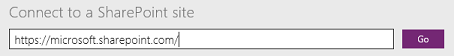

# Создание приложения для управления данными в списке SharePoint

С помощью PowerApps можно автоматически создать приложение с тремя экранами для управления данными в списке SharePoint вне зависимости от того, где размещен сайт — в локальной среде или в облаке.

По умолчанию каждое созданное приложение содержит экран для обзора записей, экран для отображения сведений о записи и экран для создания или обновления записей. Исходный макет и содержание для каждого экрана определяются автоматически, но вам, скорее всего, потребуется настроить приложение в соответствии со своими потребностями.

Если вы еще не работали с PowerApps, см. статью [Знакомство с PowerApps](getting-started.md).

На момент написания этой статьи служба PowerApps поддерживает пользовательские списки, но не поддерживает библиотеки. Кроме того, данные можно отображать в столбцах некоторых типов, например **Choice** (Выбор) и **Picture** (Изображение), но обновить эти данные невозможно. Дополнительные сведения см. в разделе с описанием [известных проблем](connections/connection-sharepoint-online.md#known-issues).

> [!NOTE]
> Если имя какого-либо столбца содержит пробел, PowerApps отобразит его как **"\_x0020\_"**. Например, **Имя столбца** будет отображаться как **Имя_x0020_столбца**.

## Указание приложения SharePoint
1. Если [подключение к SharePoint](connect-to-sharepoint.md) еще не создано, необходимо его создать.
2. Откройте PowerApps *любым* из следующих способов.
   
   * [Установите приложение PowerApps Studio для Windows](http://aka.ms/powerappsinstall), откройте его и войдите, используя учетные данные, указанные при регистрации. У левого края экрана выберите **New** (Создать).
     
       
   * [Откройте PowerApps Studio для Интернета](https://create.powerapps.com/api/start) в браузере.
     
       Список поддерживаемых браузеров, а также список ограничений в предварительной версии программы PowerApps Studio для Интернета, см. в статье [Create or edit apps in a browser](create-app-browser.md) (Создание или изменение приложений в браузере).
3. В разделе **Start with your data** (Создать на основе своих данных) щелкните или нажмите **Phone layout** (Макет для телефона) на плитке SharePoint.
   
    

## Указание сайта и списка
1. В меню **Connect to a SharePoint site** (Подключение к сайту SharePoint) введите или вставьте URL-адрес сайта, содержащего список, который вы хотите использовать, а затем нажмите кнопку **Go** (Перейти).
   
    > [!NOTE]
> Не следует включать в URL-адрес название требуемого списка.
   
    
2. В меню **Choose a list** (Выбор списка) выберите имя списка, который вы хотите использовать.
   
    Чтобы сортировать имена по алфавиту, нажмите кнопку сортировки.
   
    
   
    Кроме того, в поле поиска можно ввести или вставить как минимум одну букву, чтобы отобразить только те имена списков, которые содержат указанный текст.
   
    
   
    По умолчанию отображаются не все типы списков. Если имя списка, который вы хотите использовать, отсутствует, прокрутите окно вниз, а затем введите имя списка в поле, содержащее текст **Введите название пользовательского списка**.
   
    
3. Чтобы создать приложение, нажмите кнопку **Connect** (Подключиться).
   
    
4. Если появится приглашение ознакомиться с кратким обзором основных областей интерфейса PowerApps, выберите **Next** (Далее) или **Skip** (Пропустить).
   
    
   
    Просмотреть обзор можно в любой момент. Для этого щелкните значок вопросительного знака в правом верхнем углу экрана, а затем выберите **Take the intro tour** (Ознакомиться с кратким обзором).

## Дальнейшие действия
* Чтобы сохранить только что созданное приложение, нажмите клавиши CTRL+S.
* Чтобы настроить экран обзора (который отображается по умолчанию), см. статью о [настройке макета](customize-layout-sharepoint.md).
* Чтобы настроить сведения или экраны редактирования, см. статью о [настройке формы](customize-forms-sharepoint.md).

