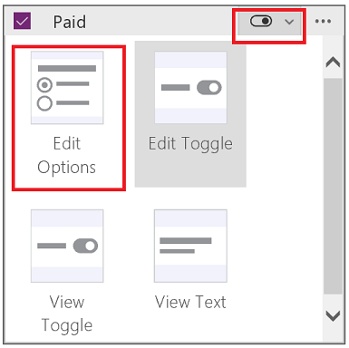
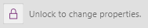

# Настройка карточки в Microsoft PowerApps
Выполните основную настройку (без разблокировки карточки), например измените элемент управления. Выполните дополнительную настройку, разблокировав карточку и, например, добавив элемент управления, недоступный по умолчанию для этой карточки.

Общие сведения см. в статье [Общие сведения о карточках данных](working-with-cards.md).

## Технические условия

* Узнайте, как [добавлять и настраивать элементы управления](add-configure-controls.md).
* В этом разделе описаны только общие принципы. Подробные пошаговые инструкции можно найти в следующих статьях:

  1. [Создание приложения с помощью SharePoint](app-from-sharepoint.md).
  2. [Настройка макета](customize-layout-sharepoint.md).
  3. [Настройка формы](customize-forms-sharepoint.md).

## Настройка заблокированной карточки
В этой процедуре элемент управления **[Toggle](controls/control-toggle.md)** (Двухпозиционный переключатель) заменяется элементом управления **[Radio](controls/control-radio.md)** (Переключатель) без разблокирования карточки.

1. На экране **EditScreen1** щелкните или нажмите на карточку **Paid**, чтобы выбрать ее.

    

2. В правой области щелкните (коснитесь) селектор карточки **Paid**, а затем выберите **Изменить параметры**.

    

    Изменения отразятся на экране.

    
   
    Информацию о том, какие типы столбцов SharePoint поддерживают конкретные типы карточек, см. в разделе с описанием [известных проблем](connections/connection-sharepoint-online.md#known-issues).

## Разблокировка и настройка карточки
В этой процедуре карточка разблокируется, а затем элемент управления **[Text input](controls/control-text-input.md)** (Текстовое поле ввода) заменяется элементом управления **[Slider](controls/control-slider.md)** (Ползунок).

1. На экране **EditScreen1** щелкните или нажмите на карточку **Quantity**.

2. На панели справа щелкните или нажмите на значок многоточия для этой карточки, а затем выберите **Advanced options** (Дополнительные параметры).

    
3. В верхней части панели справа коснитесь значка разблокировки карточки.

    
4. В карточке удалите элемент управления **Input text** (Текстовое поле ввода) и добавьте элемент управления **Slider** (Ползунок). Назовите новый элемент управления **QtySlider**.

5. На панели справа установите для свойства **Update** (Обновление) карточки **Quantity** следующую формулу: 
   **QtySlider.Value**

   > [!NOTE]
> Если свойство **Update** не отображается, щелкните или нажмите **Другие параметры** в разделе **Данные**.

6. Щелкните или нажмите на ползунок, чтобы выбрать его, и откройте список элементов управления в верхней части правой панели.

7. Щелкните или нажмите **ErrorMessage4** и установите для свойства **Height** (Высота) следующую формулу: 
   **QtySlider.Y + QtySlider.Height**
