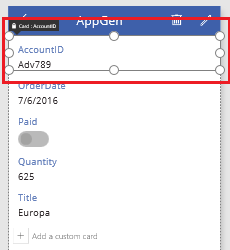
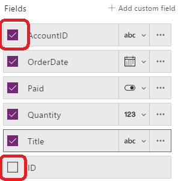
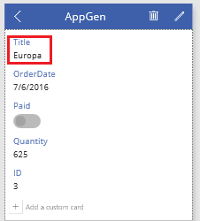

# Настройка форм в PowerApps
Настройте элемент управления **Display form** (Форма просмотра) и элемент управления **Edit form** (Форма редактирования) таким образом, чтобы наиболее важные данные отображались в интуитивно понятном порядке в них, а также в элементах управления, обеспечивающих легкое восприятие и возможность обновления данных.

Каждая форма содержит одну или несколько карточек, в которых отображаются данные из определенного столбца в источнике данных. Следуя инструкциям в этой статье, вы научитесь указывать, какие карточки должны отображаться в форме, перемещать карточки вверх и вниз в пределах формы, а также настраивать способ отображения данных из каждого отдельного столбца в карточке.

Если вы еще не работали с PowerApps, см. статью [Знакомство с PowerApps](getting-started.md).

## Технические условия
В этом руководстве вы можете ознакомиться с общими понятиями для работы с формами. Если вы хотите в точности выполнить все инструкции, необходимо сначала сделать следующее.

1. [Создайте подключение](connect-to-sharepoint.md) из PowerApps к SharePoint.
2. Создайте список SharePoint, как описано в инструкции по [настройке макета](customize-layout-sharepoint.md).
3. [Автоматически создайте приложение](app-from-sharepoint.md) на основе этого списка.
4. На панели навигации слева щелкните (коснитесь) значок, расположенный в правом верхнем углу, чтобы переключиться на представление эскиза.
   
    

## Отображение и скрытие карточек
1. На панели навигации слева выберите средний эскиз, чтобы перейти к экрану **DetailsScreen1**.
   
    
2. Нажмите любую карточку, чтобы выбрать и отобразить параметры настройки формы на панели справа.
   
    
3. В правой области щелкните (коснитесь) флажок для карточки **AccountID**, чтобы скрыть ее. Щелкните (коснитесь) флажок для столбца **ID**, чтобы отобразить его.
   
    

## Изменение порядка карточек
* Выберите карточку **Title**, а затем потяните ее карточку за строку заголовка вверх и отпустите, когда карточка **OrderDate** будет выделена.
  
    
  
    Когда вы отпустите кнопку мыши, перемещаемая карточка появится прямо над выделенной карточкой.
  
    

## Запуск приложения
1. На панели навигации слева выберите верхний эскиз, чтобы перейти к экрану **BrowseScreen1**.
   
    
2. Откройте режим предварительного просмотра, нажав клавишу F5 (или выбрав значок **предварительного просмотра** в правом верхнем углу).  
   
    
3. В правом верхнем углу нажмите значок плюса, чтобы добавить запись на экран **EditScreen1**.
   
    
4. Добавьте любые данные, а затем нажмите значок флажка в правом верхнем углу. Новая запись в списке SharePoint будет сохранена, а вы вернетесь к экрану **BrowseScreen1**.
   
    
5. Нажмите стрелку возле только что созданного элемента, чтобы отобразить сведения об этом элементе на экране **DetailScreen1**.  
   
    
6. В правом верхнем углу нажмите значок редактирования, чтобы обновить запись на экране **EditScreen1**.
   
    
7. Измените сведения в одном или нескольких полях, а затем выберите значок флажка в правом верхнем углу, чтобы сохранить изменения в списке SharePoint и вернуться к экрану **DetailScreen1**.  
   
    
8. Щелкните или нажмите на значок корзины в правом верхнем углу, чтобы удалить только что обновленную запись и вернуться к экрану **BrowseScreen1**.
   
    
9. Закройте режим предварительного просмотра, нажав клавишу ESC (либо с помощью значка закрытия в правом верхнем углу *под* строкой заголовка PowerApps).
   
    

## Дальнейшие действия
* Нажмите клавиши CTRL+S, чтобы сохранить приложение. После этого его можно будет запускать с других устройств.
* [Поделитесь приложением](share-app.md), чтобы другие пользователи могли с ним работать.

