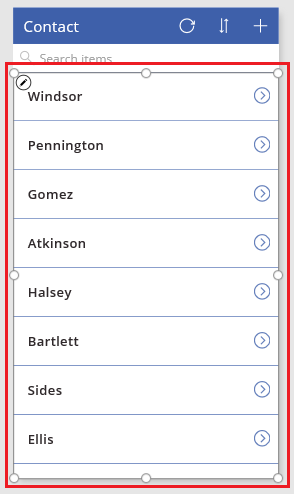

# Создание приложения с помощью базы данных Common Data Service
Вы можете создать приложение для управления данными, хранимыми в Common Data Service, автоматически. Вы также можете управлять данными в одной из нескольких стандартных сущностей, встроенных в модель, или в пользовательской сущности, созданной вами или кем-то другим в вашей организации.

Если вы не знакомы с Common Data Service, см. статью [Understand entities](data-platform-intro.md) (Общие сведения о сущностях).

Здесь описано, как автоматически создавать приложения на основе одной указанной сущности. Сведения о том, как создать приложение на основе нескольких сущностей, см. в статье [Build an app from scratch](data-platform-create-app-scratch.md) (Создание приложения с нуля).

По умолчанию в каждом приложении, созданном с помощью PowerApps, есть три экрана:

* На экране обзора отображается подмножество полей (одно или несколько полей), панель поиска и кнопка сортировки, упрощающая поиск конкретной записи.
* На экране сведений отображаются несколько полей или все поля для определенной записи.
* На экране редактирования представлены элементы пользовательского интерфейса, с помощью которых пользователи могут создавать или обновлять записи, а также сохранять изменения.

> [!NOTE]
> При создании приложения в Common Data Service не требуется создавать подключение из PowerApps, как в случае с источниками данных, например SharePoint, Dynamics 365 и Salesforce. Требуется только указать сущность, которую необходимо отобразить или которой необходимо управлять в приложении, либо и то, и другое.

## Создание приложения
1. Создайте базу данных Common Data Service. Дополнительные сведения см. в разделе [Create a Common Data Service database](create-database.md) (Создание базы данных Common Data Service).

2. В PowerApps Studio для Windows в меню **Файл** (у левого края экрана) выберите **Создать**.

3. На плитке **Common Data Service** в разделе **Начать с данных** выберите **Макет для телефона**.

4. В разделе **Choose an entity** (Выбор сущности) выберите сущность **Контакт**.

5. Нажмите кнопку **Подключиться**, чтобы автоматически создать приложение.

    На этом этапе вам может быть предложено ознакомиться с обзором. Чтобы просмотреть обзор, щелкните вопросительный знак или коснитесь его в правом верхнем углу экрана, а затем выберите **Take the intro tour** (Ознакомиться с кратким обзором).

6. На панели навигации слева щелкните (коснитесь) значок, расположенный в правом верхнем углу, чтобы переключиться на представление эскиза.

    

## Настройка экрана обзора
1. В области справа выберите макет, который отображает только заголовок.

    

2. Под полем поиска выберите элемент управления **Метка**.

    

3. В области справа в раскрывающемся списке выберите **Surname of Given name** (Фамилия для заданного имени).

    В выбранном элементе управления **Метка** появятся данные из этого поля.

4. На экране обзора выберите коллекцию, выбрав любое имя, кроме первого.

    Вокруг коллекции появится рамка выделения.

    

5. Скопируйте следующую формулу, выделив ее и нажав CTRL+C.

    **SortByColumns(Search(Contact, TextSearchBox1.Text, "имя_фамилия"), "имя_фамилия", If(SortDescending1, Descending, Ascending))**

6. Убедитесь, что возле левого верхнего угла в списке свойств отображается **Items**.

7. В строке формул выберите формулу по умолчанию.

    

8. Нажмите клавишу Delete, чтобы удалить формулу по умолчанию, а затем вставьте скопированную формулу. В коллекции имена сортируются по алфавиту.

## Тестирование экрана обзора
1. Откройте режим предварительного просмотра, нажав клавишу F5 (или нажав кнопку **воспроизведения** в правом верхнем углу).

2. Просмотрите все записи путем прокрутки на сенсорном экране, используя колесико мыши или наведя курсор мыши на коллекцию, чтобы появилась полоса прокрутки.

3. Возле правого верхнего угла нажмите кнопку сортировки один или несколько раз, чтобы изменить порядок перечисления имен.

    

4. В поле поиска введите букву, чтобы отображались только имена с этой буквой.

5. Удалите весь текст из поля поиска, а затем выберите стрелку справа от первого имени в списке.

    Откроется экран с дополнительными сведениями о выбранном контакте.

6. Вернитесь в рабочую область конструирования, нажав клавишу ESC (либо нажав кнопку **закрытия** в правом верхнем углу под строкой заголовка).

## Настройка других экранов
1. Если экран **DetailScreen** не отображается, выбери те средний эскиз на панели навигации слева.

2. В верхней части **DetailScreen** выберите **Полное имя**, чтобы отобразить параметры настройки формы на экране.

3. В области справа нажмите кнопку со значком глаза для **Name_MiddleName**, чтобы скрыть это поле.

4. В области справа нажмите кнопку со значком глаза для **Name_Surname**, чтобы отобразить это поле.

5. В области справа перетащите поле **Name_Surname** вверх и поместите его под **Name_GivenName**.

    Изменения отразятся на экране **DetailScreen**.

6. На панели навигации слева выберите нижний эскиз, чтобы отобразить **EditScreen**, а затем повторите предыдущие шаги в этой процедуре, чтобы содержимое экрана **EditScreen** соответствовало содержимому экрана **DetailScreen**.

## Тестирование приложения
1. На панели навигации слева выберите верхний эскиз, чтобы открыть экран обзора.

2. Откройте режим предварительного просмотра, нажав клавишу F5 (или нажав кнопку **воспроизведения** в правом верхнем углу).

3. В правом верхнем углу экрана обзора нажмите кнопку со значком плюса (**+**), чтобы создать запись.

4. Добавьте текст в полях **Имя** и **Фамилия**, а затем нажмите кнопку с флажком, чтобы сохранить новую запись и вернуться к экрану обзора.

5. Найдите только что созданную запись и нажмите стрелку справа от нее, чтобы отобразить запись на экране сведений.

6. В правом верхнем углу нажмите кнопку со значком карандаша, чтобы отобразить запись на экране редактирования.

7. Измените данные в поле **Имя**, а затем нажмите кнопку с флажком, чтобы сохранить изменения.

8. Возле правого верхнего угла нажмите кнопку со значком корзины, чтобы удалить созданную и обновленную запись.

## Дальнейшие действия
[Create an app from scratch using a Common Data Service database](data-platform-create-app-scratch.md) (Создание приложения "с нуля" с помощью базы данных Common Data Service)
