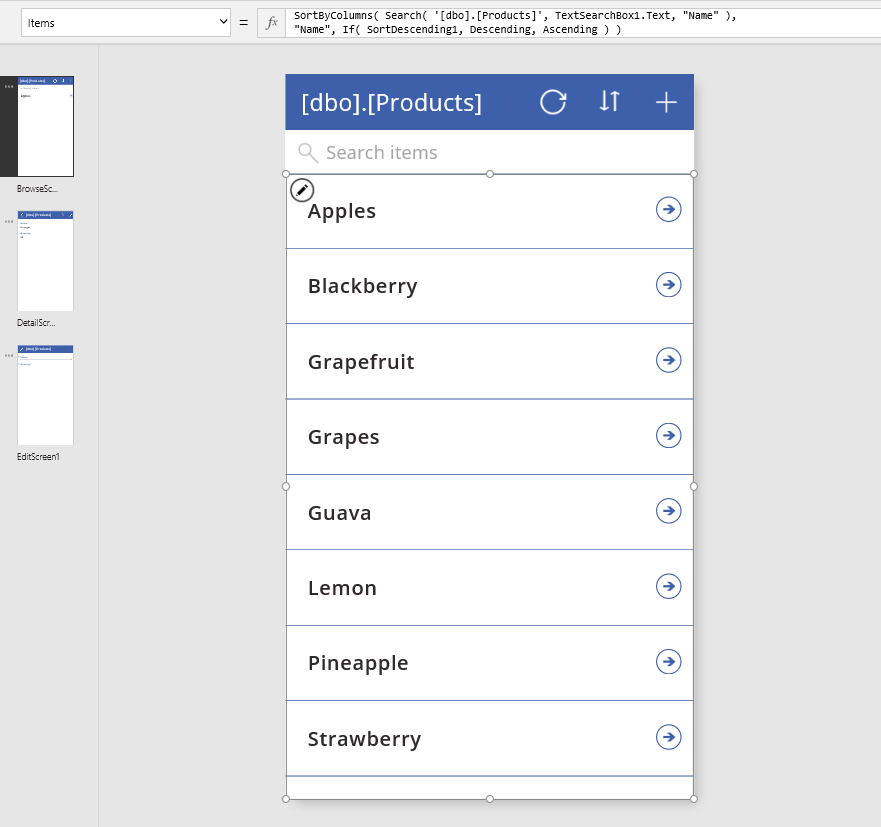
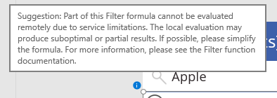

# Общие сведения о делегировании
PowerApps поддерживает целый ряд эффективных и полезных функций для фильтрации, сортировки и форматирования таблиц с данными, такие как **[Filter](functions/function-filter-lookup.md)**, **[Sort](functions/function-sort.md)**, **[AddColumns](functions/function-table-shaping.md)** и многие другие.  Эти функции помогают обеспечить пользователям доступ именно к той информации, которая им необходима.  Для тех, у кого есть опыт работы с базами данных, использование этих функций можно сравнить с составлением запросов к базе.  

Залогом создания эффективных приложений является минимизация объема данных, которые необходимо загружать на устройства.  Иногда необходимы лишь несколько из миллионов записей или одно обобщенное (статистическое) значение, которое характеризует тысячи элементов в базе.  Кроме того, возможно, достаточно будет извлечь лишь первый набор записей, а остальные можно загружать по требованию пользователя.  Учитывая эти моменты, можно существенно сократить потребность в процессорной мощности, памяти и полосе пропускания, необходимых приложению, что, в свою очередь, ускорит его реагирование на действия пользователей, причем даже на телефонах, подключенных к Интернету через сотовый канал связи.  

*Делегирование* позволяет минимизировать объемы данных, передаваемые через сеть, не жертвуя при этом функциональными возможностями формул PowerApps.  Вкратце делегирование означает передачу службой PowerApps обязанностей по обработке данных источнику вместо переноса данных в приложение для локальной обработки.  

Такая возможность существует не всегда, и, как объясняется в этой статье, не все функции и возможности формул PowerApps можно делегировать каждому источнику данных.  Язык PowerApps аналогичен языку формул Excel и предполагает полный и мгновенный доступ ко всему содержимому книги в памяти, включая широкий набор функций для работы с числами и текстом.  Благодаря этому возможности языка PowerApps намного шире, чем те, что поддерживаются большинством источников данных, включая такие мощные и функциональные СУБД, как SQL Server.

**Для работы с большими наборами данных необходимо использовать источники и формулы, которые можно делегировать.**  Только так можно сохранить работоспособность приложения на высоком уровне и обеспечить пользователям доступ ко всей необходимой им информации. Обращайте внимание на [обозначенные синей точкой рекомендации](delegation-overview.md#blue-dot-suggestions), которые появляются в ситуации, когда делегирование невозможно.  Если вы работаете с небольшими наборами данных (до 500 записей), можно использовать любые источники данных и формулы, так как обработку можно выполнять локально даже в том случае, если формулу нельзя делегировать.  

## Делегируемые источники данных
Полный список источников данных, поддерживающих делегирование (с описанием возможных ограничений), см. в [этом списке](delegation-list.md).

Мы постоянно расширяем поддержку делегирования для существующих источников, а также добавляем новые.

Импортированные книги Excel (для которых используется источник Add static data to your app — добавление статических данных в приложение), коллекции и таблицы, хранимые в переменных контекста, не требуют делегирования. Все эти данные уже находятся в памяти и поддерживают все функциональные возможности языка PowerApps.

## Делегируемые функции
Следующий этап заключается в использовании только тех формул, которые можно делегировать. Здесь указаны элементы формул, поддерживающие делегирование.  Тем не менее следует помнить, что источники данных различаются, и не все они поддерживают приведенные здесь элементы. Обращайте внимание на отмеченные синими точками рекомендации непосредственно в формулах.

Этот список со временем будет меняться. Мы расширяем поддержку делегирования и на другие функции и операторы.

### Функции фильтрации
Функции **[Filter](functions/function-filter-lookup.md)**, **[Search](functions/function-filter-lookup.md)** и **[LookUp](functions/function-filter-lookup.md)** можно делегировать.  

В функциях **Filter** и **LookUp** для выбора соответствующих записей в столбцах таблицы можно использовать следующие операторы и функции:

* **[And](functions/function-logicals.md)** (включая **[&&](functions/operators.md)**), **[Or](functions/function-logicals.md)** (включая **[||](functions/operators.md)**), **[Not](functions/function-logicals.md)** (включая **[!](functions/operators.md)**)
* **[In](functions/operators.md)**
* **[=](functions/operators.md)**, **[<>](functions/operators.md)**, **[>=](functions/operators.md)**, **[<=](functions/operators.md)**, **[>](functions/operators.md)**, **[<](functions/operators.md)**
* **[+](functions/operators.md)**, **[-](functions/operators.md)**
* **[TrimEnds](functions/function-trim.md)**
* **[IsBlank](functions/function-isblank-isempty.md)**
* **[StartsWith](functions/function-startswith.md)**
* Постоянные значения, одинаковые для всех записей, такие как свойства элемента управления и [глобальные и контекстуальные переменные](working-with-variables.md).

Также можно использовать части формул, которые возвращают константные значения для всех записей.  Например, результат выполнения формулы **Left(Language(), 2)** не зависит от содержимого столбцов записи и возвращает одинаковое значение для всех записей.  По сути, это постоянное значение.  Значения переменных контекста, коллекций и сигналов могут не быть постоянными, что не позволяет делегировать функции **Filter** и **LookUp**.  

Вот несколько важных функций, которых нет в списке выше.

* **[If](functions/function-if.md)**
* **[*](functions/operators.md)**, **[/](functions/operators.md)**, **[Mod](functions/function-mod.md)**
* **[Concatenate](functions/function-concatenate.md)** (включая **[&](functions/operators.md)**)
* **[ExactIn](functions/operators.md)**
* Функции для работы со строками: **[Lower](functions/function-lower-upper-proper.md)**, **[Upper](functions/function-lower-upper-proper.md)**, **[Left](functions/function-left-mid-right.md)**, **[Mid](functions/function-left-mid-right.md)**, **[Len](functions/function-left-mid-right.md)**, ...
* Сигналы: **[Location](functions/signals.md)**, **[Acceleration](functions/signals.md)**, **[Compass](functions/signals.md)**, ...
* Меняющиеся значения: **[Now](functions/function-now-today-istoday.md)**, **[Today](functions/function-now-today-istoday.md)**, **[Rand](functions/function-rand.md)**, ...
* [Коллекции](working-with-variables.md)

### Функции сортировки
Функции **[Sort](functions/function-sort.md)** и **[SortByColumns](functions/function-sort.md)** можно делегировать.  

В функции **Sort** формулой может быть только имя одного столбца, и она не может содержать другие операторы или функции.

### Агрегатные функции
**[Sum](functions/function-aggregates.md)**, **[Average](functions/function-aggregates.md)**, **[Min](functions/function-aggregates.md)** и **[Max](functions/function-aggregates.md)** можно делегировать.  Сейчас делегирование поддерживает ограниченное число источников данных. Дополнительные сведения см. в статье [Делегируемые источники данных](delegation-list.md).

Функции подсчета, такие как **[CountRows](functions/function-table-counts.md)**, **[CountA](functions/function-table-counts.md)** и **[Count](functions/function-table-counts.md)** невозможно делегировать.

Другие агрегатные функции, такие как **[StdevP](functions/function-aggregates.md)** и **[VarP](functions/function-aggregates.md)** также невозможно делегировать.

### Другие функции
Все остальные функции не поддерживают делегирование. Ниже перечислены некоторые из них.

* Форматирование таблиц: **[AddColumns](functions/function-table-shaping.md)**, **[DropColumns](functions/function-table-shaping.md)**, **[ShowColumns](functions/function-table-shaping.md)**, ...
* **[First](functions/function-first-last.md)**, **[FirstN](functions/function-first-last.md)**, **[Last](functions/function-first-last.md)**, **[LastN](functions/function-first-last.md)**
* **[Concat](functions/function-concatenate.md)**
* **[Collect](functions/function-clear-collect-clearcollect.md)**, **[ClearCollect](functions/function-clear-collect-clearcollect.md)**
* **[CountIf](functions/function-table-counts.md)**, **[RemoveIf](functions/function-remove-removeif.md)**, **[UpdateIf](functions/function-update-updateif.md)**
* **[GroupBy](functions/function-groupby.md)**, **[Ungroup](functions/function-groupby.md)**

Вы можете использовать функции **AddColumns** и **LookUp** для объединения данных из двух таблиц в одну (в контексте баз данных это называется операцией соединения).  Пример.

**AddColumns(Products, "Имя поставщика", LookUp(Suppliers, Suppliers.ID = Product.SupplierID).Name)**

В то время как источники данных **Products** и **Suppliers** могут поддерживать делегирование, а функция **LookUp** является делегируемой, функцию **AddColumns** делегировать нельзя.  Результаты выполнения всей формулы ограничены первой частью источника данных **Products**.  

Поскольку функция **LookUp** и ее источник данных являются делегируемыми, совпадение со значением **Suppliers** может быть найдено в любом месте источника данных (каким бы большим он ни был).  Потенциальным недостатком в этой ситуации является тот факт, что функция **LookUp** совершает отдельные обращения к источнику данных для каждой записи из первой части источника **Products**, что повышает нагрузку на сеть.  Если источник **Suppliers** достаточно мал и меняется не очень часто, вы можете кэшировать данные из него в приложении, вызывая функцию **Collect** при его запуске (с помощью события [**OnVisible**](controls/control-screen.md) на начальном экране), и обращаться с помощью функции **LookUp** к кэшированной информации.  

## Ограничения для неделегируемых функций
Формулы, которые нельзя делегировать, обрабатываются локально.  Это позволяет использовать все функциональные возможности формул PowerApps.  Однако есть и обратная сторона медали: все данные необходимо сначала загрузить на устройство, что может существенно увеличить сетевой трафик.  Это занимает некоторое время, создавая впечатление, что приложение работает медленно или даже перестало отвечать на запросы.

Чтобы избежать этого, в PowerApps установлено ограничение на объем данных, обрабатываемых локально: не более 500 записей.  Мы выбрали именно это число, чтобы обеспечить полный доступ к небольшим наборам данных и в то же время дать возможность оптимизировать обработку больших наборов на основе частичных результатов.

Очевидно, этот фактор необходимо учитывать, чтобы не вводить пользователей в заблуждение.  Представим ситуацию, в которой функция **Filter** используется в формуле выборки, которую нельзя делегировать, для фильтрации источника данных, содержащего более миллиона записей.  Поскольку фильтрация будет выполняться локально, проверены будут лишь первые 500 записей из миллиона.  Если нужная запись находится под номером 501 (или 500 001), она не будет обработана и функция **Filter** ее не вернет.

Еще одним потенциальным источником путаницы являются статистические функции.  Представим функцию **Average**, примененную к тому же самому источнику данных с миллионом записей.  Поскольку делегирование функции **Average** пока не поддерживается, усреднение будет выполнено только по первым 500 записям.  Этот фактор необходимо учитывать: в противном случае пользователь приложения ошибочно посчитает полным результат обработки лишь части набора.

## Рекомендации, отмеченные синими точками
Чтобы вам было проще понять, что можно и что нельзя делегировать, в интерфейсе создания формул появляются отмеченные синими точками рекомендации, когда формула содержит компоненты, не поддерживающие делегирование.

Такие синие точки отображаются только для формул, которые работают с делегируемыми источниками данных.  Если вы не видите подобной рекомендации и считаете, что формула не делегируется надлежащим образом, проверьте, есть ли ваш источник в списке <a href="#delegable-data-sources">делегируемых источников данных</a> выше.

## Примеры
В этом примере мы используем таблицу SQL Server, содержащую список товаров (названий фруктов): **[dbo].[Products]**.  На новом экране с помощью PowerApps можно создать простое приложение из трех экранов, подключенное к этому источнику данных:

Обратите внимание на формулу в свойстве **Items** (Элементы) коллекции.  В ней используются функции **SortByColumns** и **Search**, обе из которых являются делегируемыми.

Введем в текстовом поле слово **Apple** (Яблоко).  Внимательный пользователь заметит вверху экрана точки, которые появляются, когда начинается обработка нового поискового запроса.  Они указывают на то, что приложение устанавливает соединение с сервером SQL Server:

Поскольку все компоненты являются делегируемыми, то даже в том случае, если таблица **[dbo].[Products]** содержит миллионы записей, мы увидим все соответствия нашему запросу, прокручивая результаты в коллекции.

В списке найденных записей вы увидите как Apple, так и Pineapple (Ананас).  Функция **Search** ищет указанное слово во всем содержимом текстового столбца.  Предположим, нам нужно найти только те записи, в которых указанное слово встречается только в начале названия фрукта.  Для этого можно было бы использовать другую делегируемую функцию, **Filter**, с более сложным поисковым запросом (чтобы упростить его, мы уберем обращение к функции **SortByColumns**):

Мы получили нужный результат: в списке отображаются только яблоки (**Apple**), а ананасов (**Pineapple**) нет.  Однако мы видим синюю точку рядом с коллекцией и синюю волнистую линию, которой подчеркнута часть формулы.  Синяя точка есть даже на эскизе экрана.  Если навести указатель мыши на точку рядом с коллекцией, мы увидим такое сообщение:

Хотя мы используем функцию **Filter**, которая является делегируемой, и источник данных SQL Server, который также поддерживает делегирование, формулу, которой мы воспользовались в функции **Filter**, делегировать нельзя.  Функции **Mid** и **Len** не делегируются никаким источникам данных.

Но мы ведь получили нужные результаты?  В некотором смысле — да.  Именно поэтому мы увидели синюю точку вместо желтого значка предупреждения и красной волнистой линии, указывающей на ошибку.  Если таблица **[dbo].[Products]** содержит менее 500 записей, мы получили нужный результат.   Все эти записи были загружены на устройство, и функция **Filter** была применена локально.  

Если же, однако, таблица содержит более 500 записей, в коллекции будут отображены только фрукты, названия которых начинаются со слова **Apple**, *из числа первых 500 записей таблицы*.  Если, например, в таблице под номером 501 (или 500 001) если фрукт **Apple, Fuji**, мы его не увидим.
