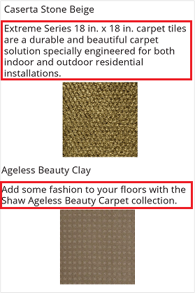
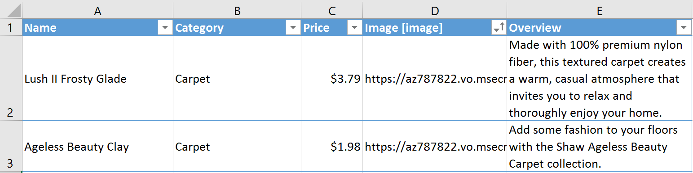
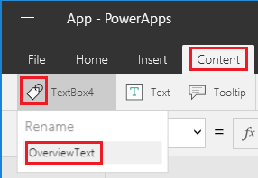

# Отображение элементов разной высоты в коллекции PowerApps
Если разные элементы в наборе данных содержат различные объемы данных в одном поле, можно полностью отобразить элементы с большим объемом данных, не добавляя пустое место после элементов с меньшим объемом данных. Добавление и настройка элемента управления коллекцией **Изменяющаяся высота** позволит делать следующее:

* Настраивать элементы управления **Метка**, изменяющие размер в зависимости от содержимого.
* Располагать каждый элемент управления таким образом, чтобы он автоматически отображался под элементом управления над ним.

В этом руководстве вы отобразите данные о напольном покрытии в элементе управления коллекции **Изменяющаяся высота**. Изображение каждого продукта отображается 5 пикселями ниже описания, независимо от того, сколько строк текста содержится в описании.

**Материалы к прочтению**

Если вы никогда не добавляли элементы управления в коллекции, перед началом работы выполните действия, описанные в статье [Show a list of items](add-gallery.md) (Отображение списка элементов).

## Добавление данных в пустое приложение
1. Скачайте [этот файл Excel](https://az787822.vo.msecnd.net/documentation/get-started-from-data/FlooringEstimates.xlsx), содержащий названия и описания напольного покрытия, а также ссылки на изображения с ним.

    

2. Отправьте файл Excel в облачную учетную запись хранения, например OneDrive Dropbox или Google Drive.

3. В PowerApps Studio в меню **Файл** выберите **Создать**.

4. На плитке **Blank app** (Пустое приложение) щелкните или нажмите **Phone layout** (Макет телефона).

    

5. Добавьте подключение в таблицу **FlooringEstimates** из файла Excel.

    Дополнительные сведения см. в статье [Add a data connection in PowerApps](add-data-connection.md) (Добавление подключения к данным в PowerApps).

## Добавление данных в коллекцию
1. На вкладке **Вставка** щелкните или коснитесь **Коллекция**, а затем выберите **Изменяющаяся высота**.

    
2. Измените размер коллекции, развернув ее на весь экран.

3. Задайте для свойства коллекции **[Items](controls/properties-core.md)** значение **FlooringEstimates**.

## Отображение наименований продуктов
1. Чтобы выбрать шаблон коллекции, щелкните значок карандаша в левом верхнем углу.

    

2. Добавьте к выбранному шаблону коллекции элемент управления **[Метка](controls/control-text-box.md)**.

3. Задайте для свойства **Text** элемента управления **Метка** следующее выражение. 
   **ThisItem.Name**

    

## Отображение описаний продуктов
1. Добавьте к выбранному шаблону коллекции еще один элемент управления **Метка** и переместите его под первый элемент управления **Метка**.  

2. Задайте для свойства **Text** второго элемента управления **Метка** следующее выражение.  **ThisItem.Overview**

3. Выбрав второй элемент управления **Метка**, щелкните значок тега во вкладке **Содержимое** или коснитесь его и переименуйте элемент управления на **OverviewText**.

    

4. Задайте для свойства **AutoHeight** текстового поля **OverviewText** значение **true**.

    Таким образом, поле будет масштабироваться в соответствии с размерами содержимого.

      

## Отображение изображений продуктов
1. Увеличьте высоту шаблона в два раза.

    По мере создания приложения элементы управления будет легче добавить, и это изменение не повлияет на внешний вид работающего приложения.

2. Добавьте к выбранному шаблону коллекции еще один элемент управления **[Изображение](controls/control-image.md)** и переместите его под текстовое поле **OverviewText**.

3. Убедитесь, что для свойства **Image** элемента управления **Изображение** задано следующее выражение: 
    **ThisItem.Image**

4. Задайте свойство **[Y](controls/properties-core.md)** элемента управления **Изображение** с учетом положения и размера текстового поля **OverviewText**, как в следующем примере:
    **OverviewText.Y + OverviewText.Height + 5**

    

Сделайте то же самое, если требуется добавить дополнительные элементы управления. Задайте свойство **Y** каждого элемента управления с учетом свойств **Y** и **Height** элемента управления над ним.

## Дальнейшие действия
Ознакомьтесь с дополнительными сведениями о работе с элементом управления [Коллекция](working-with-forms.md) и с [формулами](working-with-formulas.md).
