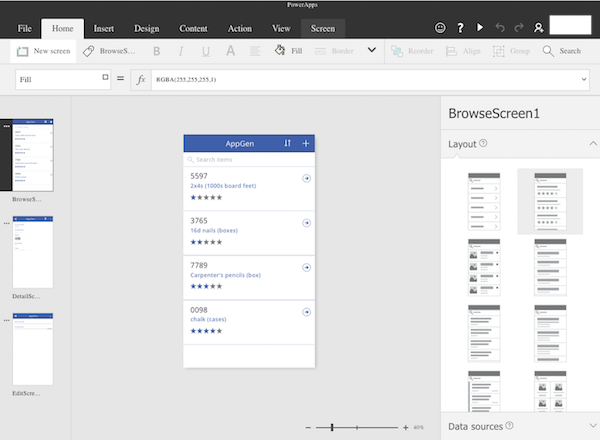

# Создание приложения из списка SharePoint с использованием PowerApps

В PowerApps вы можете автоматически создать приложение, в котором пользователи смогут управлять элементами в настраиваемом списке SharePoint Online. Это приложение будет состоять из трех экранов, позволяющих пользователям:

* просматривать все записи в списке (**BrowseScreen1**);
* просматривать все поля для определенной записи (**DetailsScreen1**);
* создавать или изменять записи (**EditScreen1**).

Если создать приложение настраиваемого списка с помощью панели команд SharePoint Online, такое приложение будет доступно как представление этого списка. Вы также сможете запускать это приложение как в веб-браузере, так и на устройствах Windows Phone, iOS и Android.

> [!IMPORTANT]
> PowerApps не поддерживает все типы данных SharePoint. Дополнительные сведения см. в разделе с описанием [известных проблем](connections/connection-sharepoint-online.md#known-issues).

## Создание приложения
1. Откройте настраиваемый список в SharePoint Online, щелкните или нажмите **PowerApps** на панели команд, а затем выберите **Create an app** (Создать приложение).
   
    
2. На появившейся панели введите название приложения, а затем щелкните или нажмите **Create** (Создать).
   
    
   
    В веб-браузере откроется новая вкладка с приложением, созданным автоматически на основе вашего списка SharePoint.
   
      
3. Щелкните или нажмите на вкладку со списком SharePoint и выберите **Open** (Открыть).
   
    > [!NOTE]
> Прежде чем приложение откроется, вам, возможно, потребуется обновить содержимое окна браузера (например, нажав клавишу F5).
   
    
   
    Приложение откроется на отдельной вкладке браузера.
   
    

## Управление приложением

* Если выбрать **Edit in PowerApps** (Изменить в PowerApps), приложение откроется на отдельной вкладке браузера и вы сможете внести изменения в его веб-версию в PowerApps Studio.
* Если выбрать **Make this view public** (Сделать это представление общедоступным), ваши сотрудники смогут просматривать приложение. По умолчанию создаваемые вами представления доступны только вам. Если вы хотите, чтобы другие пользователи могли вносить изменения в приложение, вам потребуется [предоставить им общий доступ](share-app.md) и разрешения **участника**.
* Если выбрать **Remove this view** (Удалить это представление), представление будет удалено из SharePoint, но приложение останется доступным в PowerApps, пока вы не [удалите его](delete-app.md).

## Дальнейшие действия
* Чтобы добавить или обновить элементы в списке, см. раздел "Управление списком с помощью приложения" статьи [Открытие приложения из списка SharePoint](open-app-embedded-in-sharepoint.md).
* Чтобы настроить экран обзора (который отображается по умолчанию), см. статью о [настройке макета](customize-layout-sharepoint.md).
* Чтобы настроить сведения или экраны редактирования, см. статью о [настройке формы](customize-forms-sharepoint.md).
* Чтобы удалить это приложение, удалите соответствующее представление из SharePoint, а затем [удалите приложение](delete-app.md) из PowerApps.

