# Создание приложения с нуля
Создайте собственное приложение с нуля с помощью одного из различных источников данных, которые в дальнейшем можно расширить. Укажите внешний вид и поведение каждого элемента пользовательского интерфейса, чтобы оптимизировать результат в соответствии с конкретными целями и рабочим процессом. Этот подход требует намного больше времени, чем [автоматическое создание приложения](get-started-create-from-data.md), однако позволяет опытному пользователю создать приложение, оптимальным образом отвечающее его потребностям.

> [!NOTE]
> Эта статья написана для PowerApps Studio для Windows, но если [открыть PowerApps в браузере](create-app-browser.md), действия будут схожими.

Следуя указаниям в этом руководстве, вы создадите приложение с двумя экранами. На одном экране пользователи смогут просматривать набор записей.

На другом экране пользователи могут создать запись, обновить одно или несколько полей в записи или удалить всю запись.

## Технические условия
В этом руководстве вы можете ознакомиться с общими понятиями для работы с формами. Если вы хотите в точности выполнить все инструкции, необходимо сначала сделать следующее.

1. Скопируйте эти данные и вставьте их в файл Excel.

   | День начала | Время начала | Доброволец 1 | Доброволец 2 |
   | --- | --- | --- | --- |
   | Суббота |10:00–12:00 |Васкес (Vasquez) |Кумаширо (Kumashiro) |
   | Суббота |12:00–14:00 |Айс (Ice) |Сингхал (Singhal) |
   | Суббота |14:00–16:00 |Мик (Myk) |Мюллер (Mueller) |
   | Воскресенье |10:00–12:00 |Ли (Li) |Адамс (Adams) |
   | Воскресенье |10:00–12:00 |Сингх (Singh) |Морган (Morgan) |
   | Воскресенье |10:00–12:00 |Батье (Batye) |Нгуен (Nguyen) |

2. Отформатируйте данные в виде таблицы под названием **Schedule**, чтобы приложение PowerApps могло проанализировать их.

    Дополнительные сведения см. в статье о [создании таблицы Excel на листе](https://support.office.com/en-us/article/Create-an-Excel-table-in-a-worksheet-E81AA349-B006-4F8A-9806-5AF9DF0AC664).

3. Сохраните файл под именем **eventsignup.xls**, а затем отправьте его в [облачное хранилище](connections/cloud-storage-blob-connections.md), например OneDrive.

4. Если вы впервые работаете с PowerApps, сделайте следующее:

   * узнайте, как [добавить элемент управления и задать его свойства](add-configure-controls.md), которые определяют внешний вид и поведение этого элемента;
   * узнайте, как [добавить и переименовать экран](add-screen-context-variables.md).

## Создание пустого приложения и подключение к данным
1. В PowerApps Studio выберите **New** (Создать) в меню **File** (Файл) (у левого края экрана).

    

2. На плитке **Blank app** (Пустое приложение) щелкните или нажмите **Phone layout** (Макет телефона).

    

3. Если появится запрос, ознакомьтесь с кратким обзором основных областей PowerApps (либо щелкните или коснитесь **Пропустить**).

    

    Просмотреть обзор можно в любой момент. Для этого щелкните значок вопросительного знака в правом верхнем углу экрана, а затем выберите **Take the intro tour** (Ознакомиться с кратким обзором).

4. На панели навигации слева щелкните (коснитесь) значок, расположенный в правом верхнем углу, чтобы переключиться на представление эскиза.

    

5. На панели справа щелкните или нажмите **Добавить источник данных**.

    

6. Выполните одно из следующих действий.

   * при наличии подключения к вашей учетной записи облачного хранилища выберите его;
   * при отсутствии подключения к вашей учетной записи облачного хранилища щелкните или коснитесь **Добавить подключение**, выберите тип учетной записи, щелкните или коснитесь **Подключиться**, а затем (при появлении соответствующего запроса) укажите свои учетные данные.

7. В разделе **Choose an Excel file** (Выбор файла Excel) перейдите к файлу **eventsignup.xlsx** и выберите его.

    

8. В разделе **Choose a table** (Выбор таблицы) установите флажок **Расписание**, а затем выберите **Подключиться**.

    

    На вкладке **Источники данных** на панели справа отображаются источники данных, добавленные в приложение.

    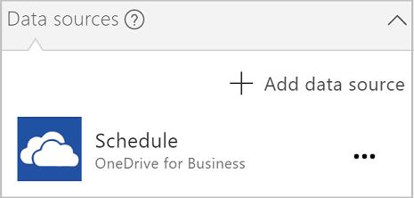

    В этом руководстве требуется только один источник данных, но можно добавить дополнительные источники данных позже.

## Отображение данных
1. На вкладке **Главная** выберите **Новый экран**, а затем — **Окно списка**.

    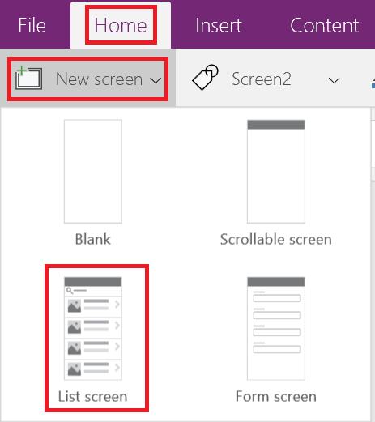

    Экран добавляется с несколькими элементами управления по умолчанию, в том числе с полем поиска и элементом управления **[Коллекция](controls/control-gallery.md)**. Коллекция занимает размер всего экрана под полем поиска.

2. Щелкните или нажмите в любом месте в коллекции, за исключением стрелки, например непосредственно под полем поиска.

    

3. В правой области откройте список **Макеты**, а затем щелкните (коснитесь) макет, который содержит заголовок, подзаголовок и текст.

    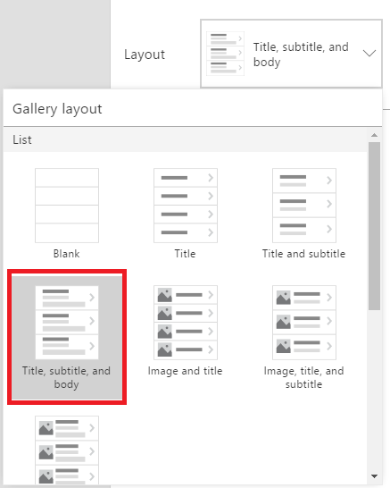

4. В списке свойств выберите **[Items](controls/properties-core.md)**, скопируйте эту формулу и вставьте ее в строку формул:

    **SortByColumns(Search(Schedule, TextSearchBox1.Text, "Volunteer_x0020_1"), "Volunteer_x0020_1", If(SortDescending1, SortOrder.Descending, SortOrder.Ascending))**

    Если вы не знаете, где находится список свойств, прочитайте раздел [Добавление и настройка элемента управления в PowerApps](add-configure-controls.md).

    > [!NOTE]
> Для источников данных Excel или SharePoint, содержащих имена столбцов с пробелами, PowerApps отображает пробелы как **"\_x0020\_"**. В этом примере столбец **Volunteer 1** отображается в формуле как **Volunteer_x0020_1**.

    В этой коллекции отображаются данные из таблицы **Расписание**.

    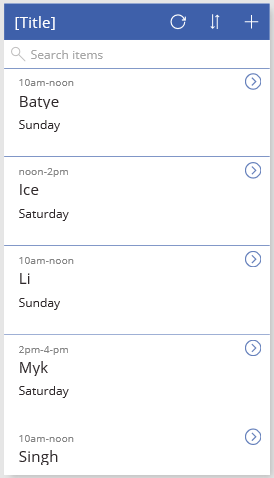

    С помощью поля поиска можно отфильтровать коллекцию по введенному пользователем тексту. Если пользователь вводит в поле поиска хотя бы одну букву, в коллекции отображаются только те записи, для которых поле **Доброволец 1** содержит эту букву.

    С помощью кнопки сортировки можно отсортировать записи на основе данных в столбце **Доброволец 1**. Если пользователь нажимает эту кнопку или касается ее, порядок сортировки переключается между сортировкой по возрастанию и по убыванию.

    Эта формула содержит функции **Sort**, **If**, **IsBlank**, **Filter** и **Text**. Дополнительные сведения об этих и других функциях приведены в [справочнике формул](formula-reference.md)

5. Введите **i** в поле поиска и нажмите кнопку сортировки один раз (или нечетное число раз).

    В коллекции отобразятся показанные ниже результаты.

    

    Узнайте больше о **[сортировке](functions/function-sort.md)**, **[фильтрах](functions/function-filter-lookup.md)** и [других функциях](formula-reference.md).

6. Выберите элемент управления **[Метка](controls/control-text-box.md)** в верхней части экрана, щелкнув или коснувшись его.

    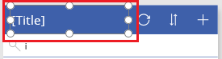

7. В списке свойств выберите **[Text](controls/properties-core.md)**, скопируйте этот текст и вставьте его в строку формул: 
   **"Просмотр записей"**

    

## Создание экрана ChangeScreen и соответствующего заголовка
1. Удалите **Screen1** и переименуйте **Screen2** во **ViewScreen**.

    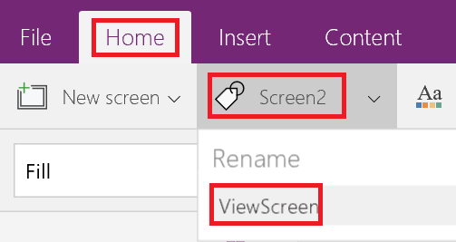

2. Добавьте экран и переименуйте его на **ChangeScreen**.

    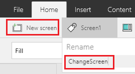

3. На вкладке **Вставка** щелкните или коснитесь **Текст**, а затем — **[Метка](controls/control-text-box.md)**.

4. Настройте только что добавленную **метку**.

   * Для свойства **Text** (Текст) задайте следующее значение:
      **"Изменить запись"**

   * Для свойства **Fill** (Заливка) задайте следующую формулу:
      **RGBA(62, 96, 170, 1)**.

   * Для свойства **Color** (Цвет) задайте следующую формулу:
      **RGBA(255, 255, 255, 1)**

   * Для свойства **Align** (Выравнивание) выберите вариант **Center** (По центру).
   * Для свойства **X** задайте значение **0**.

   * Для свойства **Width** (Ширина) задайте значение **640**.
     После этого в элементе управления **Метка** отобразятся изменения.

     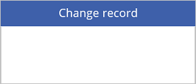

## Добавление и настройка формы
1. На вкладке **Insert** (Вставка) щелкните или нажмите **Forms** (Формы), а затем — **Edit** (Изменить).

2. Переместите форму и измените ее размер так, чтобы она занимала большую часть экрана.

    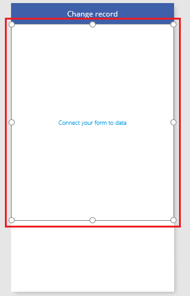

    Форма называется **Form1** по умолчанию, если вы еще не добавили и не удалили ее. В противном случае измените имя формы на **Form1**.

3. Установите для свойства **[DataSource](controls/control-form-detail.md)** (Источник данных) формы **Form1** значение **Schedule**.

4. Установите для свойства **Item** (Элемент) формы**Form1** следующее выражение:
    **BrowseGallery1.Selected**

5. В правой области щелкните (коснитесь) флажок для каждого поля, которое нужно отобразить.

    

6. В нижней части формы щелкните или нажмите **Add a custom card** (Добавить пользовательскую карточку).

    

7. Добавьте на новую карточку элемент управления **[Метка](controls/control-text-box.md)**.

8. Задайте для свойства **[AutoHeight](controls/control-text-box.md)** (Автоматический подбор высоты) нового элемента управления значение **true**, а для его свойства **[Text](controls/properties-core.md)** (Текст) — эту формулу:
    **Form1.Error**

    В метке отобразятся все ошибки в форме.

9. На панели навигации слева выберите эскиз экрана **ChangeScreen**, чтобы выбрать его.

10. На вкладке **Insert** (Вставка) щелкните или нажмите **Icons** (Значки), добавьте значок **стрелки назад**, а затем перетащите стрелку в левый нижний угол экрана.

11. Задайте для свойства **[OnSelect](controls/properties-core.md)** стрелки эту формулу:

     **ResetForm(Form1);Navigate(ViewScreen,ScreenTransition.None)**

      Когда пользователь щелкает стрелку или нажимает на нее, функция **[навигации](functions/function-navigate.md)** открывает экран **ViewScreen**.

12. Добавьте элемент управления **[Кнопка](controls/control-button.md)** под форму и задайте для свойства кнопки **[Text](controls/properties-core.md)** значение **"Сохранить"**.

     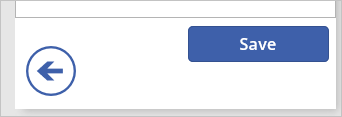

13. Задайте для свойства **[OnSelect](controls/properties-core.md)** кнопки эту формулу:

    **SubmitForm(Form1); If(Form1.ErrorKind = ErrorKind.None, Navigate(ViewScreen, ScreenTransition.None))**

    Когда пользователь нажимает кнопку или касается ее, функция **[SubmitForm](functions/function-form.md)** сохраняет все изменения в источнике данных и экран **ViewScreen** повторно отображается.

14. В нижней части экрана добавьте еще одну кнопку, задайте для ее свойства **[Text](controls/properties-core.md)** значение **"Удалить"**, а для ее свойства **[OnSelect](controls/properties-core.md)** задайте эту формулу:

    **Remove(Schedule,BrowseGallery1.Selected); If(IsEmpty(Errors(Schedule)),Navigate(ViewScreen,ScreenTransition.None))**

    Когда пользователь нажимает эту кнопку или касается ее, функция **[Remove](functions/function-remove-removeif.md)** удаляет запись и экран **ViewScreen** повторно отображается.

15. Задайте для свойства **[Visible](controls/properties-core.md)** кнопки **Удалить** эту формулу:
     **Form1.Mode=FormMode.Edit**

    После выполнения этого действия кнопка **Удалить** не будет отображаться во время создания записи пользователем.

    Экран **ChangeScreen** соответствует этому примеру:

    

## Установка навигации из экрана ViewScreen
1. На панели навигации слева выберите эскиз экрана **ViewScreen**.

    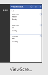

2. Выберите **стрелку следующей записи** для первой записи в коллекции.

    

3. Задайте для свойства **[OnSelect](controls/properties-core.md)** стрелки эту формулу:

    **Navigate(ChangeScreen,ScreenTransition.None)**

4. В правом верхнем углу экрана щелкните или нажмите на значок плюса.

    

5. Задайте для свойства **[OnSelect](controls/properties-core.md)** выбранного значка эту формулу:

    **NewForm(Form1);Navigate(ChangeScreen,ScreenTransition.None)**`

     Когда пользователь щелкает этот значок или касается его, экран **ChangeScreen** отображается с пустыми полями, чтобы пользователю было проще создать запись.

## Запуск приложения
После настройки приложения проверьте изменения, запустив его в режиме предварительного просмотра, как описано в этом разделе.

1. На панели навигации слева щелкните или нажмите на верхний эскиз, чтобы выбрать экран **ViewScreen**.

    

2. Откройте режим предварительного просмотра, нажав клавишу F5 (либо щелкнув значок **Предварительный просмотр** или коснувшись его в правом верхнем углу).

    

3. Щелкните стрелку далее или коснитесь ее для записи, чтобы отобразить сведения об этой записи.

4. На экране **ChangeScreen** измените сведения в одном или нескольких полях, а затем сохраните изменения с помощью кнопки **Save** (Сохранить) либо удалите эту запись с помощью кнопки **Remove** (Удалить).

5. Закройте режим предварительного просмотра, нажав клавишу ESC (либо щелкните значок закрытия или коснитесь его в строке заголовка).

    

## Дальнейшие действия
* Нажмите клавиши CTRL+S, чтобы сохранить приложение в облаке. После этого его можно будет запускать с других устройств.
* [Поделитесь приложением](share-app.md), чтобы другие пользователи могли с ним работать.
* Узнайте больше о [коллекциях](add-gallery.md), [формах](add-form.md) и [формулах](working-with-formulas.md).
