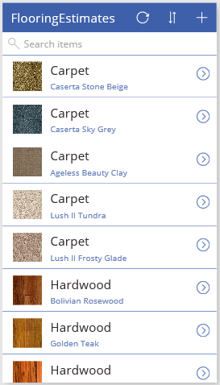
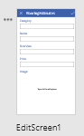
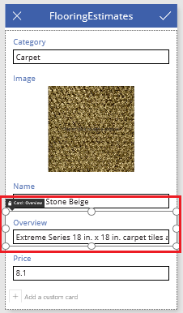
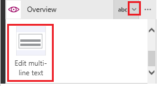

# Создание приложения на основе данных Excel
Автоматически создайте приложение на основе данных в файле Excel, загруженном в учетную запись облачного хранилища (например, OneDrive). Создав приложение, вы можете настроить его в соответствии с вашими потребностями, а затем запустить. Так вы убедитесь в том, что оно выполняется надлежащим образом.

По умолчанию у созданного приложения есть три экрана:

* На экране **BrowseScreen1** отображается подмножество полей (одно или несколько полей), панель поиска и кнопка сортировки, которая упрощает поиск определенной записи.
* На экране **DetailsScreen1** отображается несколько полей или все поля для определенной записи.
* На экране **EditScreen1** представлены элементы пользовательского интерфейса, с помощью которых пользователи могут создавать или обновлять записи, а также сохранять изменения.

**Примечание**. Приложение также можно создать на основе [пользовательского списка SharePoint](app-from-sharepoint.md).

## Технические условия
* [Зарегистрируйтесь для использования PowerApps](signup-for-powerapps.md), а затем выполните одно из следующих действий:
  * Установите [PowerApps Studio для Windows](http://aka.ms/powerappsinstall) на компьютере под управлением Windows 8, Windows 8.1 или Windows 10.
  * Откройте [PowerApps Studio для Web](create-app-browser.md) (предварительная версия) в браузере.
* Войдите в PowerApps, используя те же учетные данные, что и при регистрации.
* Чтобы точно следовать инструкциям из этого руководства, скачайте этот [файл Excel](https://az787822.vo.msecnd.net/documentation/get-started-from-data/FlooringEstimates.xlsx).
  
    **Важно**. Вы можете использовать свой файл Excel, если данные в нем отформатированы в виде таблицы. Дополнительные сведения см. в статье о [создании таблицы Excel на листе](https://support.office.com/en-us/article/Create-an-Excel-table-in-a-worksheet-E81AA349-B006-4F8A-9806-5AF9DF0AC664).
* Отправьте файл Excel в [учетную запись облачного хранилища](connections/cloud-storage-blob-connections.md), например OneDrive.

## Создание приложения
1. В PowerApps Studio в меню **Файл** (у левого края экрана) выберите **Создать**.
   
    
2. Выполните одно из перечисленных ниже действий.
   
   * Если учетная запись облачного хранилища отображается в разделе **Start with your data** (Создать на основе своих данных), выберите **Phone layout** (Макет для телефона).
     
     
   * Если учетная запись облачного хранилища не отображается в разделе **Start with your data** (Создать на основе своих данных), щелкните стрелку в конце ряда плиток. Если ваша учетная запись отображается в списке подключений, выберите ее.
   * Если ваша учетная запись облачного хранилища не отображается ни в разделе **Start with your data** (Создать на основе своих данных), ни в списке подключений, выберите **New connection** (Создать соединение), а затем — свою учетную запись. Выберите **Connect** (Подключиться) и следуйте инструкциям на экране для настройки подключения.
     
     
3. В разделе **Choose an Excel file** (Выбор файла Excel) найдите файл **FlooringEstimates.xlsx** и выберите его.
   
      
4. В разделе **Choose a table** (Выбор таблицы) выберите **FlooringEstimates**.  
   
    
5. Чтобы создать приложение, нажмите кнопку **Connect** (Подключиться).
6. Если вам будет предложено ознакомиться с основными областями пользовательского интерфейса PowerApps, выберите **Next** (Далее) или **Skip** (Пропустить).
   
    
   
    **Примечание.** Просмотреть обзор можно в любой момент. Для этого щелкните значок вопросительного знака в правом верхнем углу экрана, а затем выберите **Take the intro tour** (Ознакомиться с кратким обзором).

## Изменение макета коллекции
Когда приложение создается, его макет по умолчанию основывается на ваших данных. Но вы можете настроить макет коллекции в соответствии с вашими потребностями.

1. На панели навигации слева щелкните (коснитесь) значок, расположенный в правом верхнем углу, чтобы переключиться на представление эскиза.
   
    
2. Щелкните (коснитесь) верхний эскиз, чтобы выбрать экран обзора (**BrowseScreen1**).
3. Выберите любой элемент в коллекции, например первое изображение.
   
    
4. На панели справа откройте список **Макет**, а затем выберите макет, который содержит изображение, заголовок и подзаголовок.
   
    
   
    Макет приложения меняется в соответствии с выбором.
   
    

## Изменение отображаемых данных
1. В разделе **Элементы для поиска** выберите **Carpet** (Ковер), а затем — элемент управления **Метка**.
   
   На панели справа будет выделен связанный список.
   
   
2. На панели справа откройте выделенный список и щелкните или нажмите **Name** (Имя).
   
    
3. Откройте список внизу, а затем щелкните или нажмите **Category** (Категория).
   
    
   
    Экран **BrowseScreen1** изменится, отображая имя и категорию для каждой записи.
   
    
   
    **Примечание**. По умолчанию вы можете просмотреть список (который называется коллекцией), используя колесико мыши или прокручивая сенсорный экран вверх и вниз. Если у вас сенсорная панель или мышь без колесика, выберите коллекцию, щелкните или нажмите **ShowScrollbar** в списке свойств и замените значение **false** значением **true** в строке формул.

## Изменение порядка полей в форме
1. На панели навигации слева выберите средний эскиз, чтобы перейти к экрану сведений (**DetailsScreen1**).
   
    
2. Выберите изображение, чтобы показать параметры, доступные для настройки формы.
   
    
3. На панели справа перетащите поле **Name** (Имя) в начало списка.
   
    
   
    Экран будет обновлен, чтобы отразить внесенные изменения.
   
    

## Изменение элемента управления
1. На панели навигации слева выберите нижний эскиз, чтобы выбрать экран редактирования (**EditScreen1**).
   
    
2. Выберите **Overview** (Обзор).
   
    Так вы выберете карточку обзора. Каждая карточка содержит текст, который описывает ее назначение. На карточке также можно настроить элементы управления. Дополнительные сведения см. в статье [Элемент управления "Карточка" в PowerApps](controls/control-card.md).
   
    
3. На панели справа выберите стрелку вниз для карточки, прокрутите вниз, а затем выберите **Edit multi-line text** (Изменить многострочный текст).
   
    Так вы выведете обзорные сведения о каждом из продуктов в элемент управления, который будет достаточно велик для отображения текста.
   
    

## Запуск приложения
Настроив приложение, вы можете проверить изменения, запустив приложение в режиме предварительного просмотра.

1. На панели навигации слева выберите верхний эскиз, чтобы открыть экран обзора (**BrowseScreen1**).
2. Откройте режим предварительного просмотра, нажав клавишу F5 или нажав кнопку **Play** (Воспроизвести) в правом верхнем углу.
   
    
3. На экране **BrowseScreen1** нажмите кнопку со стрелкой справа от записи, чтобы отобразить запись на экране сведений (**DetailsScreen1**).
   
    
4. На экране **DetailsScreen1** в правом верхнем углу щелкните значок карандаша, чтобы отобразить запись на экране редактирования (**EditScreen1**).
   
    
5. На экране **EditScreen1** измените сведения в одном или нескольких полях, а затем щелкните или коснитесь значка галочки в правом верхнем углу, чтобы сохранить изменения.
   
    
6. Закройте режим предварительного просмотра, нажав клавишу ESC (либо с помощью значка закрытия под строкой заголовка).
   
    

## Известные ограничения
[Просмотрите эти ограничения](connections/cloud-storage-blob-connections.md#sharing-excel-tables) для совместного использовании данных Excel в организации.

## Дальнейшие действия
* Нажмите клавиши CTRL+S, чтобы сохранить приложение. После этого его можно будет запускать с других устройств.
* Теперь, когда вы научились создавать приложения на основе данных, вы можете [создать приложение с нуля](get-started-create-from-blank.md).
* [Поделитесь приложением](share-app.md), чтобы другие пользователи могли с ним работать.

