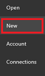
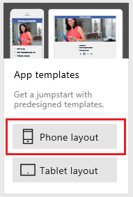

# Создание и запуск приложения на основе шаблона
Создайте приложение автоматически на основе шаблона для определенного сценария и запустите его, чтобы понять его поведение по умолчанию. Поэкспериментируйте с настройками приложения, а затем сохраните его и предоставьте к нему общий доступ другим пользователям.

## Технические условия
* [Зарегистрируйтесь](signup-for-powerapps.md) в службе PowerApps, [установите](http://aka.ms/powerappsinstall) и откройте ее, а затем войдите с помощью учетных данных, использованных при регистрации.

    > [!NOTE]
> Для работы с этой функцией требуется выпуск 2.0.510 и выше. Чтобы определить используемую версию, откройте меню **Файл** (у левого края), выберите пункт **Учетная запись** и ознакомьтесь с данными в разделе **Сведения о продукте**.

* Учетная запись облачного хранилища, например DropBox, OneDrive или Google Drive.

## Создание приложения
1. Из PowerApps Studio для Windows или PowerApps Studio для Интернета выберите **Создать** (около левого края экрана).

    
2. На плитке **App templates** (Шаблоны приложения) щелкните или нажмите **Phone layout** (Макет телефона).

   > [!NOTE]
> Вы можете также создать приложение на основе шаблона макета для планшета, но в этом руководстве описывается вариант для телефона.

   

   Откроется список шаблонов.

3. Если подключение к учетной записи облачного хранилища отсутствует:

   1. В нижней части экрана щелкните или нажмите **Choose** (Выбрать).

       
   2. Выберите учетную запись, которую нужно использовать.

       
   3. Укажите учетные данные и щелкните или нажмите **Use** (Использовать), чтобы получить доступ.

       В нижней части экрана появится подключение.

4. В списке шаблонов выберите желаемый вариант и щелкните или коснитесь **Использовать** (в правом нижнем углу).

    

    В учетную запись облачного хранилища копируются образцы данных, затем создается приложение и отображается его домашняя страница.

## Запуск приложения
Приложение на основе шаблона открывается в рабочей области по умолчанию, где вы будете выполнять настройку. Прежде чем внести изменения в приложение, следуйте шагам в этом разделе, чтобы изучить работу приложения в режиме **Предварительный просмотр**.

> [!TIP]
> Создавайте и разрабатывайте приложения в рабочей области по умолчанию, но прежде чем предоставить общий доступ к ним другим пользователям, протестируйте их в режиме **предварительного просмотра**.

1. Если вы еще не использовали PowerApps, ознакомьтесь с кратким обзором (или выберите **Пропустить**).

    

    Просмотреть обзор можно в любой момент. Для этого щелкните значок вопросительного знака в правом верхнем углу экрана, а затем выберите **Take the intro tour** (Ознакомиться с кратким обзором).

2. На панели навигации слева щелкните (коснитесь) самый верхний экран.

3. Нажмите клавишу F5 (либо щелкните стрелку вправо в правом верхнем углу или коснитесь ее), чтобы открыть приложение в режиме **Предварительный просмотр**.

    

    Приложение предварительно заполняется образцами данных для демонстрации его функциональных возможностей. Например, приложение "Калькулятор стоимости" содержит данные для создания встреч и оценки затрат на укладку выбранного покрытия для пола в комнате с заданными параметрами.

4. Изучите работу приложения по умолчанию и убедитесь, что в данных облачной учетной записи отражены изменения.

    Например, запланируйте встречу и выполните оценку затрат в приложении "Калькулятор стоимости".

5. Вернитесь в рабочую область по умолчанию, используя значок **X** в правом верхнем углу (под строкой заголовка PowerApps).

    

## Настройка приложения
Для этого или любого другого приложения можно выполнить такие настройки:

* [изменить размер и ориентацию экрана или и то, и другое;](set-aspect-ratio-portrait-landscape.md)
* [добавить другой источник данных;](add-data-connection.md)
* [добавить один или несколько экранов;](add-screen-context-variables.md)
* [добавить и настроить элементы управления;](add-configure-controls.md)
* [изменить поведение приложения.](working-with-formulas.md)

## Дальнейшие действия
1. Нажмите клавиши CTRL+S, введите имя своего приложения, а затем нажмите кнопку **Сохранить**, чтобы сохранить свое приложение в облаке.
2. [Предоставьте общий доступ к своему приложению](share-app.md) другим пользователям в вашей организации.

    > [!NOTE]
> Прежде чем предоставить доступ к приложению другим пользователям, убедитесь, что у них есть доступ к данным. Например, для этого необходимо [предоставить доступ к файлу Excel или другому файлу](share-app-data.md) в учетной записи облачного хранилища.
