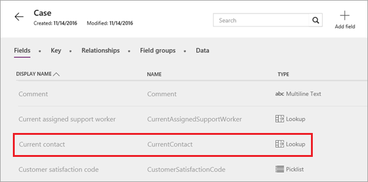
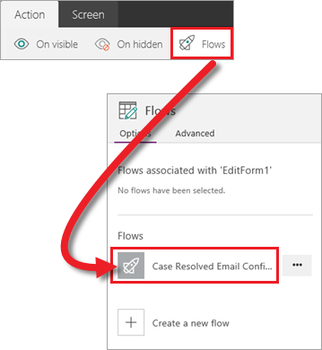

В этом разделе мы создали приложение на основе сущности "Задание" из Common Data Service, изучили приложение, чтобы увидеть, как оно устроено, и настроили его несколькими способами. В последней статье этого раздела мы добавим еще одну стандартную сущность и отправим сообщение электронной почты с помощью Microsoft Flow. Приложение активирует последовательность, чтобы пользователь, создавший задание, получал уведомление при обновлении задания. В этой статье мы выполним конкретный сценарий, но навыки, которые вы освоите, применимы для различных типов приложений. Начнем с сущностей.

## <a name="review-entity-relationships"></a>Просмотр связей между сущностями
Через некоторое время мы добавим сущность "Контакт", но сначала рассмотрим связь между сущностями "Задание" и "Контакт". В сущности "Задание" можно увидеть поле **CurrentContact** (Текущий контакт) с типом данных **Подстановка**. Это означает, что данное поле используется в связи с другой таблицей.



На вкладке **Связи** можно увидеть связанную сущность **Контакт**. Имейте это в виду, так как мы будем использовать эту связь далее в статье.


## <a name="add-an-entity-to-the-app"></a>Добавление сущности в приложение
Добавить источник данных в PowerApps довольно просто. На панели справа выберите **Источники данных**, а затем нажмите кнопку **Добавить источник данных**. Затем (в нашем случае) выберите подключение **Common Data Service** и сущность **Контакт**. Когда вы нажмете кнопку **подключения**, сущность добавится в приложение. 


Обратите внимание, что в этом примере мы добавляем данные из другой сущности, но вы можете объединять данные из нескольких источников в ваших приложениях. 

## <a name="look-up-contact-information"></a>Поиск контактных данных
Теперь, когда в нашем приложении есть доступ к данным сущности "Контакт", можно приступать к их использованию. Как было упомянуто во вступлении, нам нужно, чтобы при обновлении задания отправлялось сообщение электронной почты. Для выполнения этой задачи мы задействуем две формулы и последовательность. Первая формула предназначена для экрана редактирования, в частности для свойства OnSelect кнопки "Сохранить".


По умолчанию для этой кнопки используется формула `SubmitForm(EditForm1)`, с помощью которой обновление отправляется, когда пользователь изменяет данные в форме. Нам нужно добавить формулу, которая сначала ищет контактные данные для пользователя, создавшего текущее задание, а затем сохраняет эту информацию локально в приложении: 

```UpdateContext({contact:LookUp(Contact, ContactId=BrowseGallery1.Selected.CurrentContact.ContactId)}); SubmitForm(EditForm1)```

Это не так просто, но Джеймс (James) прекрасно объясняет эту формулу во всех подробностях (см. видео начиная с 2:04).

## <a name="trigger-a-flow-from-the-app"></a>Активация последовательности из приложения
Теперь, когда мы знаем, кто является контактным лицом для каждого задания, можно отправить сообщение электронной почты этим пользователям. Нам удалось отправить сообщение электронной почты непосредственно из приложения, но в этом примере мы покажем способы активации последовательности из приложения. Ниже приведена простейшая последовательность: отправка сообщения электронной почты после действия в приложении. Здесь мы не будем вдаваться в подробности, касающиеся последовательностей, но существует целая серия статей для пошагового изучения Microsoft Flow. 


Вернемся в приложение. Теперь нам необходимо вызвать последовательность на основе события. Мы используем свойство OnSuccess в форме редактирования, поэтому последовательность активируется после успешного завершения редактирования. Щелкните форму редактирования, а затем на ленте последовательно выберите **Действие** > **Flows** (Последовательности). Выберите последовательность, которую вы хотите использовать. 



Теперь последовательность связана с событием OnSuccess формы редактирования, и мы можем обратиться к контактному лицу по электронной почте. Следующая формула вызывает последовательность с адресом электронной почты пользователя, создавшего задание, а также со строкой темы и текстом сообщения электронной почты. 

```CaseResolvedEmailConfirmation.Run(contact.EmailPrimary, "Your case has been updated", "Check it out")```

Вот и все. Мы добавили источник данных в приложение и активировали последовательность, которая отправляет сообщение электронной почты. Если вы еще не просмотрели видеоматериалы в этом разделе, рекомендуем сделать это. В них подробно объясняются многие моменты, которые лишь бегло упоминаются в статьях.

## <a name="wrapping-it-all-up"></a>Заключение
Эта статья завершает раздел. Надеемся, вы с удовольствием прочли ее и узнали много нового. Сначала мы создали на основе сущности простое приложение и изучили его, чтобы понять, как оно устроено. Мы потратили некоторое время на настройку приложения, а затем добавили источник данных и научились активировать последовательность. В этой статье мы создали специальное приложение для управления заданиями, но приобретенные в процессе работы с ней навыки можно применять для различных типов приложений. Как уже упоминалось в начале этого раздела, если вы хотите поработать с более сложным приложением для управления заданиями, используйте шаблон, который доступен в PowerApps Studio для Windows. 

Далее мы перейдем к управлению приложениями. Из раздела, посвященного управлению, вы узнаете, как совместно использовать приложения и управлять их версиями, и ознакомитесь с понятием сред, которые являются контейнерами для приложений, данных и других ресурсов. 

