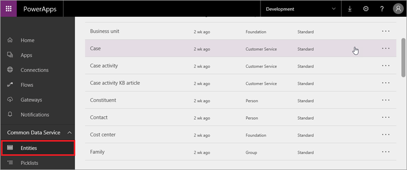
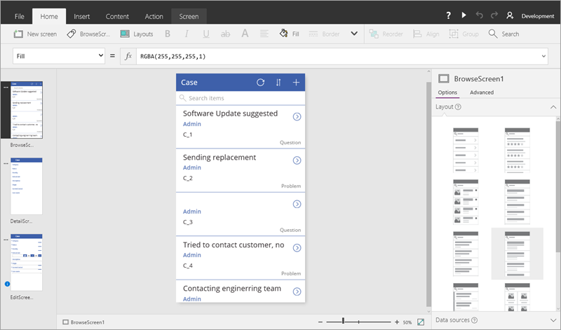

В этом разделе курса мы создадим приложение на основе *сущностей* в Common Data Service. Сущности представляют собой блоки общих данных, которые можно изменять, хранить и извлекать и с которыми можно взаимодействовать. Мы создадим приложение из сущности, покажем, как настроить приложение, добавим другой источник данных и вызовем последовательность из приложения. Если вы уже выполнили инструкции по созданию приложения из списка SharePoint, в этом разделе похожая процедура рассматривается более подробно. Особое внимание уделяется настройке приложения.

Мы создадим приложение по управлению заданиями, которое отдел ИТ может использовать для отслеживания, определения приоритетов и реагирования на проблемы с оборудованием и программным обеспечением в организации. Ознакомившись со статьями, вы сможете также найти другое применение таким приложениям. Мы используем данные из Common Data Service, так как в этой службе удобно хранить данные приложения, но вы можете создать точно такое же приложение, используя другой источник данных.

PowerApps включает более сложный шаблон управления заданиями, который использует те же сущности, что и приложение, которое мы создадим. После изучения этого раздела рекомендуем ознакомиться с этим шаблоном, чтобы понять, что вы можете создавать в PowerApps.

## Создание базы данных Common Data Service
Первым этапом создания этого приложения является создание базы данных Common Data Service (если она еще не создана). Базу данных Common Data Service следует создавать в *среде*. Среда — это контейнер для приложений и других ресурсов (мы подробнее изучим среды позднее в этом курсе). Чтобы создать базу данных, *администратор среды* может выполнить приведенные ниже действия. Если вы не являетесь администратором, согласуйте их с администратором своей организации.

На вкладке **Home** (Главная) нажмите кнопку **Create Database** (Создать базу данных).

Укажите, нужно ли ограничить доступ к базе данных (мы оставим ее открытой), затем нажмите кнопку **Create my database** (Создать мою базу данных).

По завершении процесса отобразятся все стандартные сущности, которые включены в модель общих данных. Ниже приведены некоторые из них.

## Создание приложения из сущности Case (Задание)
Создав базу данных, мы подключимся к сущности "Задание" и создадим приложение. Нажмите кнопку **New app** (Создать приложение), а затем — **PowerApps Studio for web** (PowerApps Studio для браузера).

Мы создаем приложение для телефона с помощью сущности Common Data Service. Поэтому в разделе **Common Data Service** выберите **Phone layout** (Макет для телефона).

На следующем экране выберите подключение и сущность для подключения, затем нажмите кнопку **Connect** (Подключить).

После нажатия кнопки **Connect** (Подключить), PowerApps начнет создавать приложение. PowerApps проанализирует ваши данные, чтобы создать полезное базовое приложение.

## Просмотр приложения в PowerApps Studio
Новое приложение с тремя экранами откроется в PowerApps Studio. Все приложения, созданные на основе данных, имеют одинаковый набор экранов.

* **Экран обзора** — обзор, сортировка, фильтрация и обновление данных из списка, а также добавление элементов с помощью значка "плюс" (+).
* **Экран сведений** — просмотр дополнительных сведений и возможность удаления или изменения элемента.
* **Экран изменения или создания** — изменение существующего элемента или создание нового.

На панели навигации слева щелкните (коснитесь) значок, расположенный в правом верхнем углу, чтобы переключиться на представление эскиза.

Щелкните (коснитесь) каждый эскиз, чтобы просмотреть элементы управления на соответствующем экране.

Далее мы подробнее изучим возможности приложения и настроим его для выполнения наших заданий.

