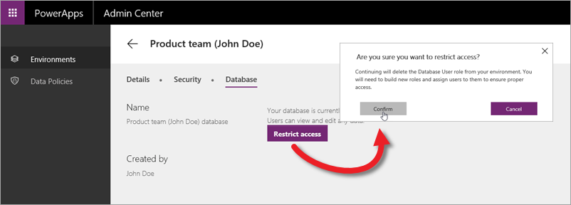

В этой статье мы обсудим безопасность в службе Common Data Service. Служба использует систему на основе ролей, чтобы предоставлять пользователям доступ к данным. Модель безопасности — это иерархия, в которой каждый уровень представляет различные уровни доступа. На самом низком уровне находятся отдельные разрешения на создание, чтение, обновление и удаление разрешений для одной сущности. Совокупность этих разрешений уровня сущностей формирует набор разрешений. Выберите один или несколько наборов разрешений, которые будут использоваться ролью. Роль находится на верхнем уровне. Она охватывает все разрешения, необходимые пользователю или группе пользователей.

## Общие сведения о ролях и наборах разрешений
В этом курсе мы рассматривали преимущественно сайт powerapps.com и PowerApps Studio. В этой статье речь пойдет о центре администрирования PowerApps. Если щелкнуть среду в центре администрирования в разделе **Security** (Безопасность) отобразятся вкладки **Environment roles** (Роли среды), которые мы рассматривали в предыдущей статье, **User roles** (Роли пользователей) и **Permission sets** (Наборы разрешений). По умолчанию доступны две роли пользователей.

* **Владелец базы данных** — административная роль, у которой есть полный доступ ко всем сущностям.
* **Пользователь организации** — роль по умолчанию для всех пользователей. Пользователи с этой ролью имеют доступ к сущностям, содержащим общедоступные данные.

По умолчанию для каждой сущности доступны два набора разрешений. 

* **Поддержка** дает полный контроль: разрешения на создание, чтение, обновление и удаление.
* **Просмотр** предоставляет доступ только для чтения.

На следующем рисунке показаны наборы разрешений по умолчанию для сущности "Учетная запись". 

В этом видео мы покажем, как создать дополнительные роли и наборы разрешений, чтобы вы могли точно управлять доступом к своим приложениям. Мы создадим набор разрешений **Maintain product review** (Поддержка обзора продукта), который дает полный доступ к настраиваемой сущности, созданной в предыдущей статье, и роль **владелец ReviewApp**, которой мы назначим набор разрешений.  

## Ограничение доступа к базе данных
Когда мы создавали базу данных в предыдущей статье, мы оставили открытый доступ по умолчанию к базе данных. Чтобы изменить параметры доступа на вкладке **Database** (База данных) щелкните **Restrict access** (Ограничить доступ) и подтвердите, что вы хотите внести изменения.

В ограниченном режиме каждому пользователю должна быть назначена одна или несколько ролей. Роли можно настроить для конкретной должности в компании, чтобы назначать всем пользователям, которые занимают эту должность. Пользователи также могут автоматически добавляться к роли на основе групп Azure Active Directory, к которым они принадлежат.

## Заключение
Обеспечение безопасности быть непростой задачей, но вам нужно просто помнить об иерархии разрешений. Она начинается с разрешений на создание, чтение, обновление и удаление для сущности. Эти разрешения могут формировать наборы, которые затем назначаются ролям. Такая гибкая система позволяет точно управлять доступом к данным. 

Итак, мы подошли к концу раздела о службе Common Data Service и завершению курса пошагового изучения. Мы надеемся, что вам понравилось учиться. Мы будем рады получить ваши отзывы. Периодически посещайте наш сайт, так как мы планируем добавлять новые материалы. Дополнительные материалы см. в [документации по PowerApps](https://powerapps.microsoft.com/tutorials/getting-started/). 

