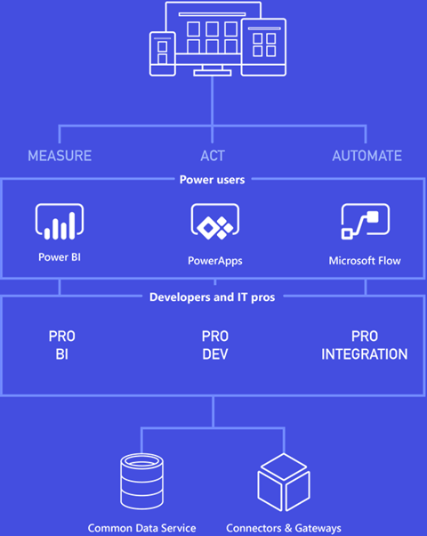
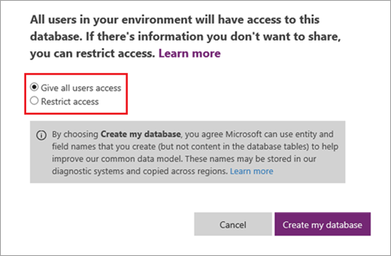

В основе бизнес-приложений и процессов лежат данные — из Excel, локальных источников, таких как SQL Server, и облачных источников, таких как Salesforce и SharePoint Online. Данные могут быть связаны с клиентами, продажами, сотрудниками и т. д., но в любом случае данные критически важны для бизнеса и играют ключевую роль в приложениях, создаваемых в PowerApps. В этом курсе вы видели различные типы источников данных и работали с ними, а также ознакомились со службой Microsoft Common Data Service. В этом разделе мы подробнее расскажем о преимуществах этой службы и покажем, как ее использовать.

## Основные сведения о службе
Нам помогут сориентироваться приведенные ниже схемы. Первую из них вы могли видеть ранее — на ней показаны компоненты платформы бизнес-приложений от Майкрософт. Скорее всего, вы уже ознакомились с PowerApps, но вы также могли использовать Microsoft Flow, Power BI и другие компоненты. Очевидно, что Common Data Service, соединители и шлюзы применимы для всех этих компонентов. Сейчас служба Common Data Service используется в основном с PowerApps и Microsoft Flow, но со временем она станет доступна и для других компонентов.

Мы разобрались с применением службы Common Data Service. Теперь давайте рассмотрим ее составляющие. Службу Common Data Service можно представить как иерархию. На нижнем уровне служба хранит данные в масштабируемом надежном хранилище и предоставляет к ним доступ, чтобы их могли использовать различные приложения. На следующем уровне находится модель общих данных, которая включает множество сущностей, используемых в приложениях и бизнес-процессах, например такие сущности, как Account (Клиент), Contact (Контакт), Product (Продукт) и Sales Order (Заказ на продажу). Вы можете не ограничиваться стандартными сущностями и создавать свои собственные в зависимости от потребностей вашего бизнеса.

Сущность — это не что иное, как сочетание метаданных, описывающих сущность (имена полей, типы данных и т. д.), и данных, которые хранятся в ней. Если вы знакомы с Access или другими базами данных, вы заметите, что сущности очень похожи на таблицы. Мы подробнее изучим сущности в следующей статье, а сейчас рассмотрим преимущества работы с данными сущностей в службе Common Data Service.

* **Простое управление.** Метаданные и данные хранятся в облаке. Не нужно беспокоиться о том, каким образом они хранятся.
* **Простое совместное использование.** Вы можете легко обмениваться данными со своими коллегами, так как PowerApps управляет разрешениями.
* **Простое обеспечение безопасности.** Данные хранятся в безопасности, и доступ к ним могут получить только пользователи с соответствующими правами. Безопасность на основе ролей позволяет управлять доступом к сущностям для разных пользователей в организации.
* **Широкие возможности метаданных.** Типы и связи данных используются непосредственно в PowerApps. Например, при определении URL-адреса типа поля данные будут представлены как гиперссылка в приложении.
* **Средства повышения производительности.** Сущности, доступные в надстройках для Microsoft Excel и Outlook, повышают производительность и обеспечивают доступ к данным.
* **Поля выбора.** Включите поля выбора из большого набора стандартных вариантов, чтобы быстро добавить раскрывающиеся списки в сущности и приложения.

## Создание базы данных Common Data Service
Базу данных Common Data Service следует создавать в *среде*. Мы рассказывали о средах ранее в этом курсе, поэтому просто напомним: среда — это контейнер для приложений и других ресурсов, таких как служба Common Data Service. С каждой средой может быть связан один экземпляр службы. Если вы являетесь администратором среды и хотите добавить в нее службу, выполните следующие действия.

На вкладке **Home** (Главная) нажмите кнопку **Create Database** (Создать базу данных).

Укажите, нужно ли ограничить доступ к базе данных, а затем нажмите кнопку **Create my database** (Создать мою базу данных).

По завершении процесса отобразятся все стандартные сущности, которые включены в модель общих данных. Ниже приведены некоторые из них.

Если вы никогда не работали с базами данных, некоторые части этой статьи могут содержать неизвестную вам информацию. Но общий принцип прост: служба Common Data Service обеспечивает безопасное и надежное хранение данных, а также обработку данных для использования со стандартными сущностями, такими как Account (Клиент), Contact (Контакт), Product (Продукт) и Sales Order (Заказ на продажу). В следующей статье мы подробнее рассмотрим сущности.

