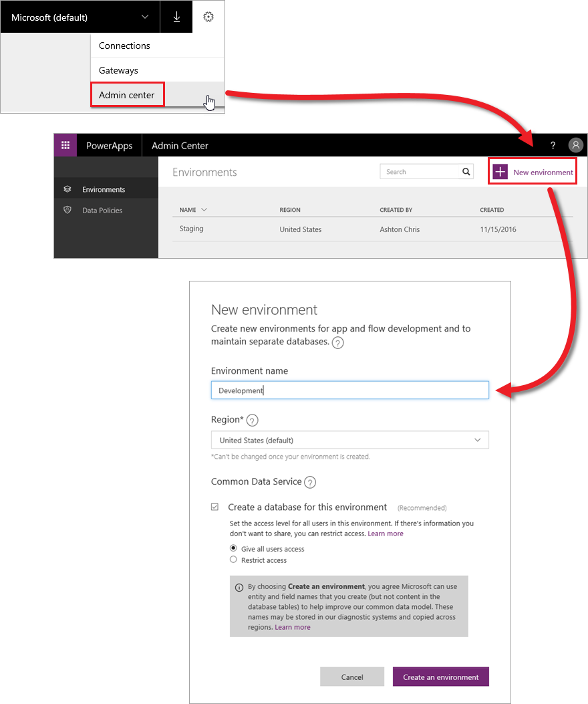

Если вы уже начали знакомство с этим курсом, вы провели некоторое время на сайте web.powerapps.com. Знаете вы об этом или нет, но все это время вы работали в конкретной *среде*. Среда — это просто объединение приложений и других ресурсов (подробнее об этом чуть позже). Откройте сайт web.powerapps.com и посмотрите на правый верхний угол экрана. Вы увидите раскрывающееся меню, которое отображает вашу текущую среду.

Если вы раньше не работали с PowerApps, на этом этапе вам может понадобиться только среда по умолчанию. Откройте меню, чтобы увидеть, доступны ли другие среды.

## Зачем использовать среды?
Среда — это контейнер для приложений и других ресурсов, например подключений к данным и последовательностей из Microsoft Flow. Это способ группирования ресурсов в соответствии с задачами компании. Дополнительные среды стоит создавать по нескольким причинам.

* **Разделение разработки приложений по отделам** — в большой организации каждый отдел может работать в отдельной среде.
* **Поддержка управления жизненным циклом приложений (ALM)** — вы можете создать отдельные среды для приложений, которые находятся в разработке, и уже готовых приложений, к которым предоставлен общий доступ.
* **Управление доступом к данным** — каждая среда может иметь собственную базу данных Common Data Service и собственные подключения к данным (т. е. они не используются в других средах).

Следует учитывать, что среды имеют значение только для создателей приложений и администраторов PowerApps. Когда вы предоставляете пользователю доступ к приложению, этот пользователь просто запускает приложение, если он имеет необходимые разрешения. Пользователю не нужно знать, из какой среды происходит это приложение.

## Создание среды
До сих пор в этом курсе речь шла о создателях приложений, но среды создают и поддерживают администраторы. Если вы не являетесь администратором, эта информация может вам пригодиться при обсуждении настройки среды с администратором. В центре администрирования PowerApps выберите **Environments** (Среды). Затем нажмите кнопку **New environment** (Создать среду). На экране **New environment** (Создание среды) введите имя среды, выберите регион, укажите, следует ли создать базу данных Common Data Service и нажмите кнопку **Create an environment** (Создать среду).

Это все. Теперь у вас есть новая среда для работы. Если вы вернетесь на сайт web.powerapps.com, вы увидите ее в раскрывающемся меню сред.

## Управление доступом к среде
У вас есть доступ к среде, если вам назначена одна из следующих ролей.

* **Администратор среды** — у вас есть все разрешения на доступ в среде.
* **Создатель среды** — вы можете просматривать все приложения, создавать приложения и работать со службой Common Data Service (могут потребоваться также другие разрешения).

Как администратор вы можете предоставлять доступ к среде на вкладке **Environments** (Среды). Сначала выберите среду. Чтобы добавить пользователя (в этом примере — **создателя среды**), выберите **Environment roles** (Роли среды), а затем — **Environment Maker** (Создатель среды). Затем добавьте к этой роли пользователей или группы и нажмите кнопку **Save** (Сохранить).

Вы ознакомились с преимуществами сред и узнали, как создавать их и предоставлять к ним доступ. Даже если вы не являетесь администратором, полезно знать, как это работает. Мы подошли к концу раздела об управлении приложениями. Теперь вы готовы перейти к следующему разделу, "Управление данными", который посвящен службе Common Data Service.

