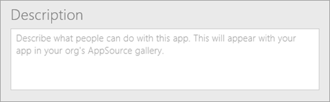
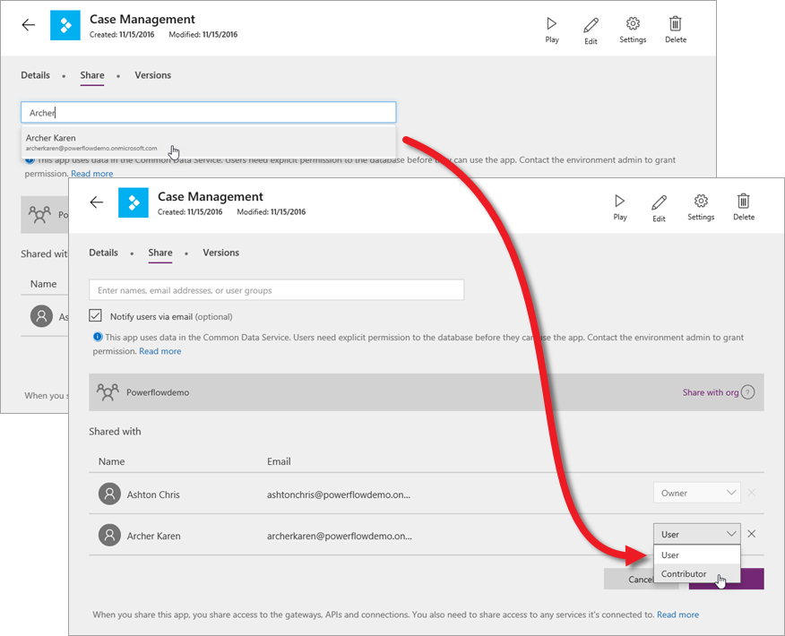

Вы можете создавать приложения, которые помогают решать бизнес-задачи. Но помимо этого вы также можете использовать PowerApps для предоставления совместного доступа к этим приложениям. Теперь, когда вы знаете, как создать приложение, мы расскажем вам, как его можно совместно использовать. Вы можете предоставить общий доступ к приложению определенным пользователям, группам или всей организации. Если вы предоставите общий доступ к приложению, другие пользователи смогут запускать его из Dynamics 365 в браузере или в PowerApps Mobile на платформе Windows, iOS или Android. А если вы предоставите другим пользователям разрешения участника, такие пользователи смогут также обновлять приложение.

## Подготовка к совместному использованию приложения
Перед предоставлением общего доступа приложение нужно сохранить в облаке. Укажите для приложения понятное имя и описание, чтобы люди могли сразу понять, что это за приложение, и легко выбрать его из списка. В PowerApps Studio выберите пункт **File** (Файл), а затем введите описание.

Учтите, что все изменения, внесенные в общее приложение, будут доступны пользователям, с которыми вы это приложение совместно используете, сразу же после сохранения изменений. То есть, улучшать приложение — отличная идея, но помните, что внесение важных изменений или удаление его компонентов могут повлиять на работу других пользователей.

## Общий доступ к приложению
На сайте web.powerapps.com на плитке приложения щелкните многоточие (. . .) и выберите пункт **Share** (Общий доступ).

Здесь можно предоставить общий доступ к приложению и выбрать нужную версию приложения (это будет рассмотрено в следующей статье). Укажите пользователей и группы, которым будет предоставлен доступ, а также назначьте им роли: **пользователя** или **участника**. Нажмите кнопку **Save** (Сохранить).

Если вы решили уведомлять пользователей по электронной почте, все люди с доступом к приложению получат сообщение со ссылкой на Dynamics 365. Участники приложения также получат ссылку на сайт web.powerapps.com.  Если пользователь не перейдет по ссылке на сайт Dynamics 365, приложение для него не будет отображаться. Приложение будет доступным в AppSource, но его нужно будет самостоятельно добавить в Dynamics 365.

## Разрешения и лицензирование
Здесь мы не будем подробно описывать процедуры, связанные с использованием разрешений и лицензированием. Вместо этого мы предоставим сведения о совместном использовании приложений.

* Пользователи и участники должны иметь право подключаться к данным и шлюзам, используемым общим приложением. Некоторые разрешения предоставляются в приложении неявно, тогда как другие должны быть предоставлены явно.
* Если в приложении используются сущности Common Data Service for Apps, пользователям и участникам необходим доступ к базе данных Common Data Service for Apps. Кроме того, участникам, работающим непосредственно с сущностями, также требуется лицензия PowerApps P2.

Совместно использовать приложения достаточно просто. Это отличный способ сделать полезное приложение доступным для других людей в организации. В следующей статье мы объясним, как выбрать активную версию приложения при его использовании и предоставлении к нему общего доступа.

