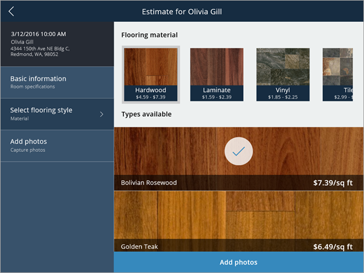
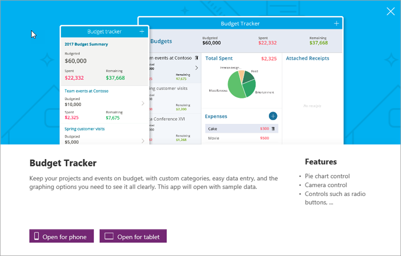
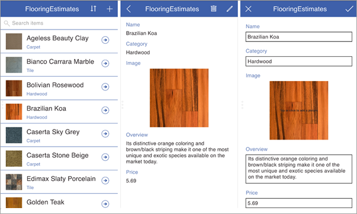

Теперь, когда у вас есть общее представление о PowerApps, перейдем к **краткому обзору начала работы с приложениями**. Мы рассмотрим примеры приложений, создание приложений на основе шаблона, из источника данных, а также с помощью общих приложений. В следующей статье приведены практические советы по созданию приложений.

## Ознакомление с примерами приложений
На сайте web.powerapps.com вы найдете несколько примеров приложений, которые можно использовать в веб-браузере. Изучите эти приложения, чтобы **получить представление об их возможностях** и понять, как ваша компания может использовать преимущества PowerApps.

Каждый пример приложения предназначен для определенной цели, например для управления бюджетом, проверки объекта или отслеживания запросов в службу поддержки. Эти приложения содержат образцы данных, которые могут вас **заинтересовать**. В этом приложении показано, как компания, которая производит напольные покрытия, может помочь сервисным представителям точно и быстро предоставить смету затрат при посещении объекта клиента.

## Создание приложения на основе шаблона
Еще один удобный способ начать работу — **создать приложение на основе шаблона**. Шаблоны по сути являются примерами приложений, которые можно открыть, чтобы понять, из каких компонентов они состоят. Они используют образцы данных, с помощью которых вы можете изучить возможности приложений. Открыв их в PowerApps Studio, вы сможете **на практике понять, как устроено приложение**. Обратите внимание, что шаблоны доступны только в PowerApps Studio для Windows. В PowerApps Studio для браузера их нет.

Например, с помощью шаблона для **отслеживания бюджета** можно создать приложение для контроля бюджета проектов и событий. В приложение можно будет легко ввести данные. Оно будет содержать пользовательские категории и визуальные элементы, на которых четко видны расходы.

## Использование общих приложений
Если ваша рабочая группа уже использует PowerApps, возможно, другие пользователи уже **предоставили вам доступ к приложениям**. Когда пользователи предоставляют вам доступ к приложениям, эти приложения отображаются в AppSource, а также в Dynamics 365 (если вы решили включать их туда). Если вы принимали участие в создании этих приложений, вы также можете просматривать их на сайте web.powerapps.com.

## Создание приложения из источника данных
Создавайте приложения в **PowerApps Studio для браузера** или **PowerApps Studio для Windows**. Вы сможете подключаться к источникам данных и начать создавать приложения в визуальном конструкторе.

Для начала вы можете **создать приложение, используя свои данные**. Просто укажите службе PowerApps свой источник данных (например, список SharePoint) и наблюдайте, как служба **автоматически создаст приложение с тремя экранами**, на которых можно просматривать список и подробные записи, а также изменять данные. Затем вы можете **перейти к настройке этого приложения**, чтобы изменить его внешний вид и поведение в соответствии с вашими задачами. Из следующей статьи вы узнаете, как создать приложение, показанное на рисунке.

Вы также можете создать приложение с нуля и постепенно добавить все фрагменты. Но **проще всего научиться работать с PowerApps, если начать с образца или шаблона** либо подключиться к источнику данных и позволить PowerApps создать приложение автоматически. Затем вы сможете расширить приложение и включить воображение, но об этом в следующих разделах курса. Из следующей статьи вы узнаете, как создавать приложения на основе данных.

