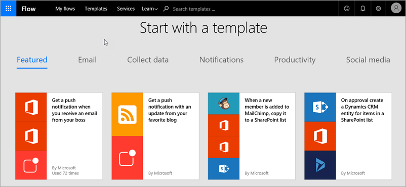
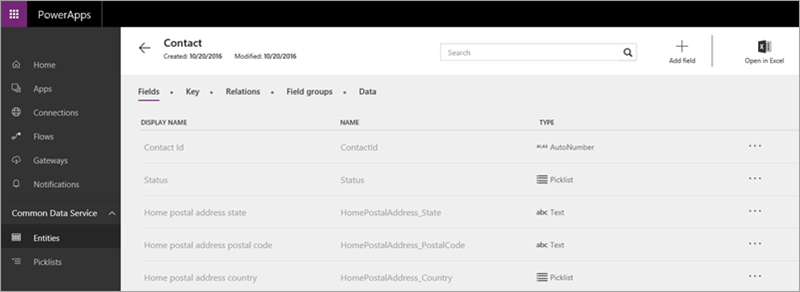
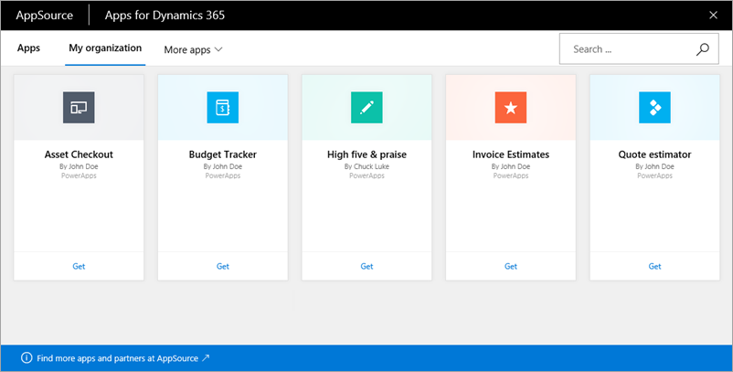

Для создания и совместного использования надежных приложений в организации вместе с PowerApps часто используются следующие технологии. Приложения могут содержать данные из нескольких источников и включать рабочие процессы для автоматизации задач. 

* **Microsoft Flow** — используется для создания автоматических рабочих процессов между избранными приложениями и службами.
* **Источники данных, подключения, соединители и шлюзы** — используются для переноса данных из облака и локальной среды в приложения.
* **Common Data Service** — используется для интеграции бизнес-данных с помощью модели общих данных.
* **Microsoft Dynamics 365** — запуск всех бизнес-приложений в Интернете.
* **Microsoft AppSource** — предоставление корпорации Майкрософт и ее партнерам общего доступа к приложениям в централизованном расположении.

### Microsoft Flow
**Microsoft Flow** — это служба для автоматизации рабочих процессов в приложениях и службах, с которыми работают бизнес-пользователи и количество которых постоянно растет. Microsoft Flow повысит эффективность вашей компании и поможет вам тратить меньше времени на рутинные повторяющиеся задачи и посвящать больше времени действительно важным делам. Используйте Microsoft Flow в сочетании с PowerApps для **создания приложений, которые активируют рабочие процессы и реагируют на них**.

### Источники данных, подключения, соединители и шлюзы
Существует много **источников данных**, которые могут вас заинтересовать. PowerApps использует **соединители** для **подключения** к этим источникам данных. Ниже приведены некоторые наиболее популярные источники данных. Многие из них, например Salesforce, являются облачными службами. Вряд ли соединители покажутся самой интересной частью разработки приложения, но они необходимы для работы с данными, которые интересуют вас, ваших коллег и клиентов. Для подключения к данным, хранящимся локально (не в облаке), используется **шлюз**, обеспечивающий надежное подключение между PowerApps и источником данных. Шлюз находится на локальном компьютере и взаимодействует с PowerApps.

### Microsoft Common Data Service
Служба **Common Data Service** позволяет легко интегрировать бизнес-данные из нескольких источников. Отличительной чертой этой службы является **модель общих данных**, которая включает множество типичных для приложений и бизнес-процессов **сущностей**, таких как Contact (Контакт), Product (Продукт) и Sales Order (Заказ на продажу). Служба хранит данные в масштабируемом надежном хранилище и предоставляет к ним доступ, чтобы их могли использовать различные приложения. Это могут быть приложения, которые вы создаете в PowerApps, другие приложения Майкрософт или сторонние приложения. На рисунке ниже показана часть сущности **Контакт** на сайте web.powerapps.com.

### Microsoft Dynamics 365
**Dynamics 365** — это облачная служба со специальными приложениями, которые решают конкретные деловые задачи, такие как автоматизация продаж, ведение операций и обслуживание клиентов. С помощью PowerApps вы предоставляете общий доступ к приложениям в AppSource. Затем пользователи, которым вы предоставили доступ, могут просматривать и запускать эти приложения в Dynamics 365 и на мобильных устройствах. Преимущество использования Dynamics 365 заключается в том, что вы можете **централизованно запускать бизнес-приложения**, т. е. приложения, созданные в вашей организации, приложения корпорации Майкрософт и сторонних разработчиков.

### Microsoft AppSource
**AppSource** — это расположение, в котором можно **легко найти и оценить приложения, созданные коллегами, корпорацией Майкрософт и нашими партнерами**. Когда вы предоставляете общий доступ к приложению в PowerApps, вы делаете его доступным в AppSource. Вы можете предоставить доступ к приложению только пользователям своей организации или сделать его общедоступным.

Вы узнали немного больше обо всех компонентах PowerApps и связанных технологиях. Вам не нужно учить наизусть этот список, так как в ходе этого курса мы продолжим знакомить вас с каждым компонентом. Следующий раздел посвящен вариантам создания приложений.

