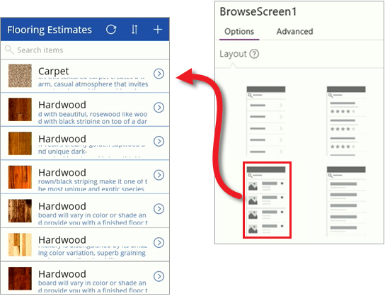
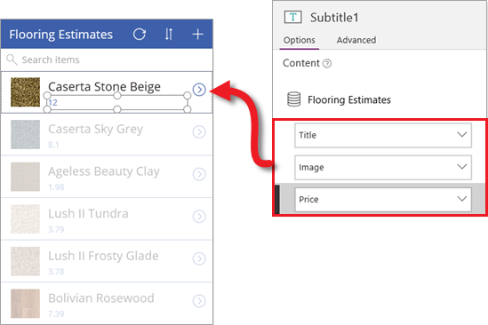

Из первых двух статей этого раздела вы узнали, как создать приложение из списка SharePoint и ознакомились с компонентами, из которых состоит приложение с тремя экранами. Хотя в PowerApps создаются готовые к использованию приложения, их можно дополнительно настроить позже. В этой статье мы рассмотрим некоторые базовые изменения, которые можно внести на каждом экране в приложении. Для настройки приложения доступны дополнительные варианты. Мы опишем их в следующих статьях. А пока вы можете работать с информацией из этой статьи. Выберите любое приложение, созданное из списка, файла Excel или другого источника, и посмотрите, как его можно настроить. Это самый эффективный способ узнать о компонентах приложений.

## Экран обзора
Начнем с экрана обзора. Список SharePoint включает изображения всех продуктов, но эти изображения не отображаются по умолчанию. Давайте это исправим. На панели справа на вкладке **Layout** (Макет) выберите для экрана обзора другой макет. Вы сразу же увидите результаты, ведь PowerApps обновляет приложение по мере внесения изменений.

Теперь, когда у вас есть правильный базовый макет, вы можете изменить отображаемые поля. Выберите поле в первом элементе, а затем на панели справа измените сведения, отображаемые для этого элемента. Так вы получите оптимизированную сводку для каждого элемента в списке.

## Экран сведений
На экране сведений нам нужно изменить порядок полей и отобразить изображение. Здесь представлены другие элементы управления, следовательно, настройка будет немного отличаться от манипуляций с экраном обзора. Выберите поле, а затем из панели справа перетащите вверх поле **Title** (Заголовок). Затем выберите поле **Image** (Изображение), чтобы открыть его.

## Экран изменения или создания
И, наконец, на экране изменения и создания записей, мы изменим поле, чтобы упростить ввод текста. Щелкните раскрывающийся список в поле **Обзор** и выберите элемент управления **Изменить многострочный текст**.

Как видите, несколько простых действий могут существенно улучшить внешний вид созданного приложения и оптимизировать способ взаимодействия с ним. В этой статье мы ознакомились с пользовательским интерфейсом PowerApps Studio, который предоставляет разные возможности для настройки приложения. В следующей статье мы рассмотрим формулы, которые определяют поведение приложения.  

