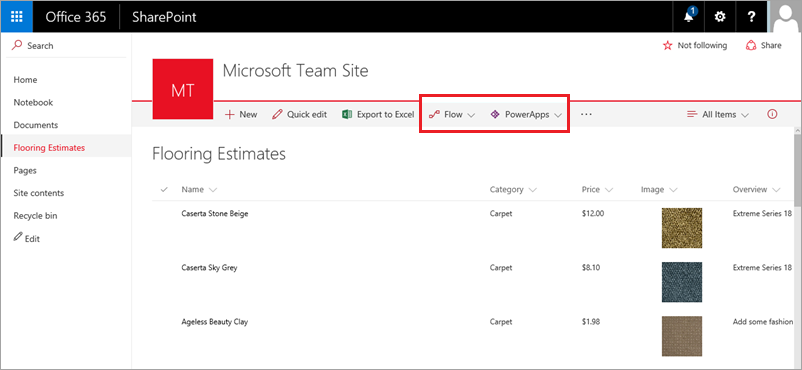

В этом разделе мы создадим из списка SharePoint приложение с именем "Flooring Estimates" (Оценка покрытий для пола). Приложение может использовать кто угодно, например оценщик, работающий на объекте клиента, может сверяться со списком и обновлять его. В разделе с вводными сведениями мы показали, как создать приложение из этого же списка. Следовательно, к этой теме мы уже не будем возвращаться. Во-первых, мы не будем работать в PowerApps Studio, а сразу покажем, как служба PowerApps интегрирована в SharePoint Online. Во-вторых, мы подробно рассмотрим компоненты приложения и покажем, как его настроить. Из этого раздела вы в любом случае узнаете что-то новое. Так что приступим!

## Создание приложения
Ниже приведен список SharePoint с именем "Flooring Estimates" (Оценка покрытий для пола). Он содержит основные сведения, включая имя и цену, а также изображение каждого типа покрытия для пола. Как видите, PowerApps и Microsoft Flow теперь интегрированы в SharePoint Online, и вы можете легко создавать приложения и потоки из списков.

Чтобы создать приложение, нажмите кнопку **PowerApps**, а затем — **Create an app** (Создать приложение). На панели справа введите имя приложения, а затем нажмите кнопку **Create** (Создать). После нажатия кнопки **Create** (Создать) PowerApps начнет создавать приложение. PowerApps проанализирует ваши данные, чтобы создать полезное базовое приложение.

## Просмотр приложения в PowerApps Studio
Новое приложение с тремя экранами откроется в PowerApps Studio. Все приложения, созданные на основе данных, имеют одинаковый набор экранов.

* **Экран обзора** — обзор, сортировка, фильтрация и обновление данных из списка, а также добавление элементов с помощью значка "плюс" (+).
* **Экран сведений** — просмотр дополнительных сведений и возможность удаления или изменения элемента.
* **Экран изменения или создания** — изменение существующего элемента или создание нового.

На панели навигации слева щелкните (коснитесь) значок, расположенный в правом верхнем углу, чтобы переключиться на представление эскиза.

Щелкните (коснитесь) каждый эскиз, чтобы просмотреть элементы управления на соответствующем экране.

## Запуск приложения в режиме предварительного просмотра
Выберите стрелку  в верхнем правом углу, чтобы запустить приложение. Во время навигации по приложению вы увидите, что оно содержит все данные из списка и имеет стандартный интерфейс.

В следующем разделе мы продолжим изучать возможности приложения и настроим его для выполнения наших заданий.

