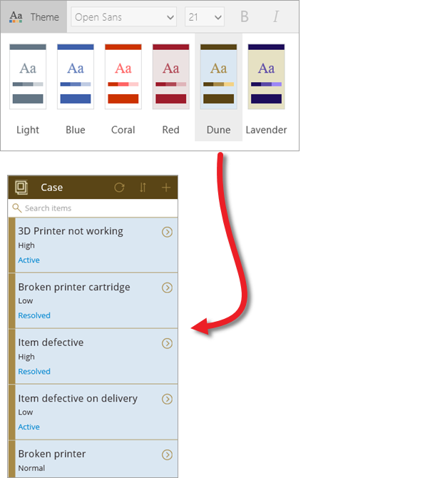
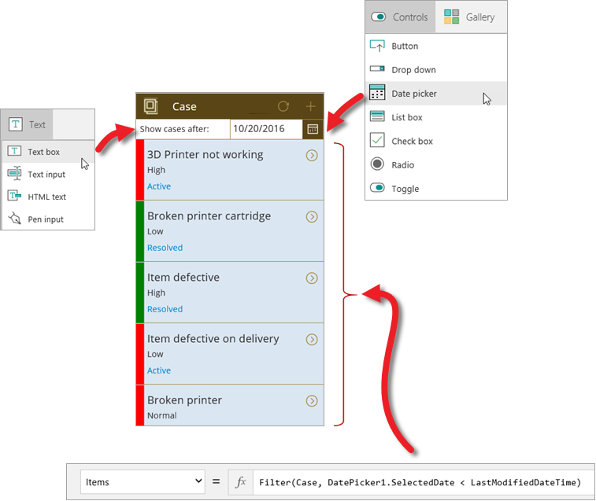
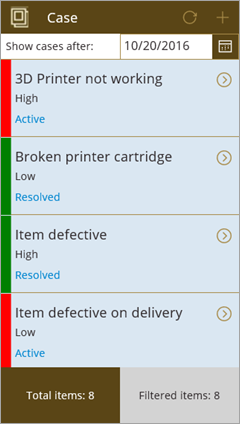

# Настройка приложения (Common Data Service)
Из первых двух статей этого раздела вы узнали, как создать приложение из сущности Common Data Service, и ознакомились с компонентами, из которых состоит приложение с тремя экранами. Хотя в PowerApps создаются готовые к использованию приложения, их можно дополнительно настроить позже. В этой статье мы рассмотрим некоторые изменения, которые можно внести на экран обзора в приложении. Вы можете настроить любой из экранов, но мы хотим сосредоточиться на одном из них и подробно рассказать о его настройках. Выберите любое приложение, созданное из сущности, файла Excel или другого источника, и посмотрите, как его можно настроить. Это самый эффективный способ узнать о компонентах приложений.

## Изменение коллекции и привязок данных
При создании приложения служба PowerApps выбирает макет и конкретные поля для отображения на каждом экране. Для этого приложения мы выберем элемент управления коллекции, включающий строку состояния (в ближайшее время мы настроим строку состояния). На панели справа на вкладке **Layout** (Макет) выберите нужный макет. Вы сразу же увидите результаты, ведь PowerApps обновляет приложение по мере внесения изменений.

Теперь, когда у вас есть правильный базовый макет, вы можете изменить отображаемые поля. Выберите поле в первом элементе, а затем на панели справа измените сведения, отображаемые для этого элемента. Так вы получите оптимизированную сводку для каждого элемента сущности.

## Изменение темы приложения
В PowerApps, как и в PowerPoint, есть набор тем, которые можно использовать в приложении. На следующем экране применена тема **Dune** (Дюна) и простой логотип, который мы вставили в приложение. Это простые изменения, но они могут значительно улучшить внешний вид приложения. 

## Отображение состояния задания с помощью формулы
Одним из основных преимуществ PowerApps является то, что вам не нужно писать традиционный код приложения, то есть вы можете создавать приложения, не являясь разработчиком. Но вам по-прежнему необходимо реализовать логику в приложении, а также контролировать навигацию, фильтрацию, сортировку и другие функциональные возможности приложения. Для этого вам потребуются формулы.

Если вы уже работали с формулами Excel, подход, который используется в PowerApps, покажется вам знакомым. Предположим, вы хотите, чтобы строка состояния отображалась зеленым цветом, если задание выполнено, и красным — если нет. Чтобы сделать это, выберите на экране элемент управления состоянием и задайте для свойства **Fill** (Заливка) этого элемента управления следующую формулу в строке формул: `If(Status="Resolved", Color.Green, Color.Red)`. Она напоминает формулы Excel, но формулы PowerApps ссылаются на элементы управления и другие элементы в приложении, а не на ячейки в таблице. На следующем рисунке показано, где настроить формулу и как выглядит результат в приложении.

## Сортировка и фильтрация по дате
На экране обзора в созданном приложении можно искать задания и сортировать список элементов в коллекции. Сейчас мы удалим функцию поиска и сортировки, чтобы отобразить задания по дате. Эти методы можно объединить, но в данном приложении мы рассмотрим отображение по дате. На приведенном ниже рисунке вы увидите добавленные элементы:

* текстовую метку (Show cases after (Показать задания после)): выберите **Вставка** > **Текст** > **Метка**. Значение формулы **Fill** (Заливка) следует изменить на **White** (Белый);
* элемент управления "Выбор даты": **Insert** > **Элементы управления** > **Выбор даты** (Вставка > Элементы управления > Выбор даты);
* формулу, которая связывает свойство **Items** (Элементы) коллекции обзора с элементом управления "Выбор даты": `Filter(Case, DatePicker1.SelectedDate < LastModifiedDateTime)`.

Для даты задано значение "20 октября". На рисунке показано, как в приложении отображаются задания, созданные после этой даты. Обратите внимание, что по умолчанию для всех заданий в сущности задана одна и та же дата последнего изменения. Вы можете изменить одну или несколько дат, чтобы увидеть, как работает фильтрация. Мы расскажем о работе с данными сущности далее в этом курсе.

## Отображение общего количества заданий
В этой статье мы подаем довольно много информации, но знакомство с настройками почти завершено. Напоследок мы добавим метки, в которых будут отображаться два числа: общее количество заданий и количество заданий, соответствующих фильтру даты.

В видео подробно показано, как добавить эти две метки, а здесь мы подаем основную информацию о свойствах, которые следует задать для каждой метки:

* **Align** (Выравнивание)  = `Center`.
* **Width** (Ширина)  = `Parent.Width/2`.
* Левое поле **Text** (Текст)  = `"Total cases: " & CountRows(Case)`. Здесь отображаются все задания в сущности. 
* Правое поле **Text** (Текст)  = `Filtered cases: " & CountRows(BrowseGallery1.AllItems)`. Здесь отображаются только задания, которые соответствуют фильтру по дате.

Вот и все, что касается настроек приложения. В следующей статье мы добавим источник данных и последовательность и покажем вам готовое приложение.

