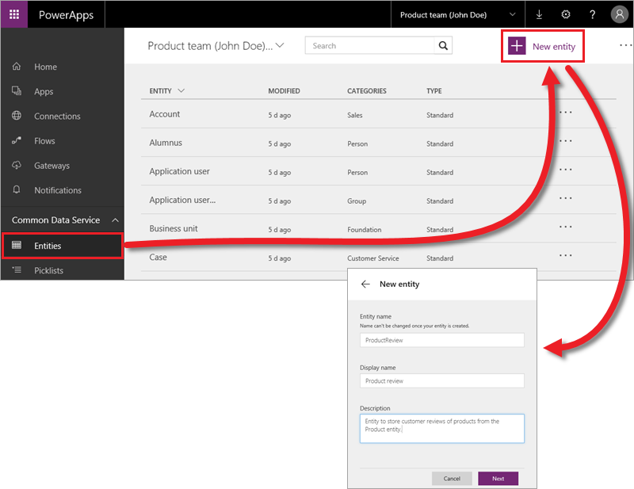
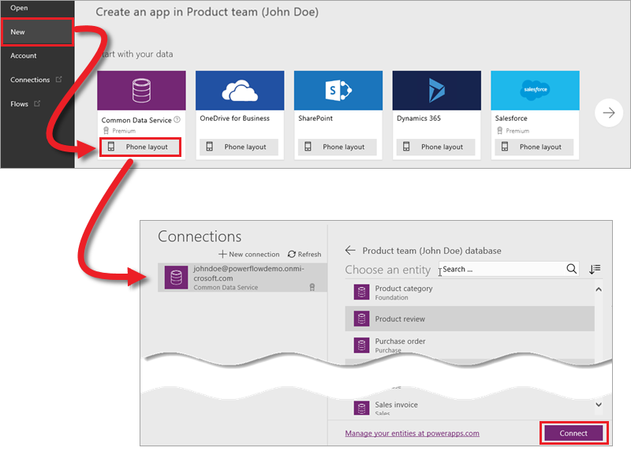

# Создание настраиваемых сущностей
Служба Common Data Service предназначена для любых бизнес-клиентов, от небольших магазинов до крупных предприятий. Модель общих данных включает набор стандартных сущностей, используемых в распространенных бизнес-сценариях. Из предыдущей статьи вы узнали, что эти стандартные сущности при необходимости можно расширять. Но иногда для решения задач компании требуется совершенно иной подход. В таком случае вам могут понадобиться пользовательские сущности, и мы покажем, как создать одну из них.

Сущность можно создать двумя способами.

* Создать сущность с нуля. Это нам и предстоит выполнить.
* Создать сущность на основе другой сущности, скопировав ее поля и параметры, но не данные.

## Создание сущности с нуля
В этом примере мы создадим пользовательскую сущность с именем "Обзор продукта". Для начала на вкладке **Entities** (Сущности) щелкните **New Entity** (Создать сущность). Введите **имя сущности** (без пробелов и специальных символов), а также понятное **отображаемое имя** и **описание**. Нажмите кнопку **Next** (Далее).

На следующем экране появится пять полей по умолчанию, которые доступны во всех стандартных и настраиваемых сущностях. Щелкните **Add field** (Добавить поле), чтобы добавить свои поля.

В нашем примере мы добавим четыре поля.

* **Review Date** (Дата обзора) — обязательное поле с датой.
* **Product Rating** (Оценка продукта) — обязательное поле с целым числом. Можно использовать список выбора, который позволяет задавать определенные значения (например, 1–5), но сейчас мы применим более простое решение.
* **Reviewer Name** (Имя автора обзора) — необязательное текстовое поле.
* **Reviewer Comment** (Комментарий автора обзора) — необязательное текстовое поле. 

Завершив настройку сущности, нажмите кнопку **Create** (Создать). Созданная сущность не содержит данных. Как импортировать данные, мы покажем в следующей статье.

## Создание связи между двумя сущностями
Так как нам нужно связать каждый обзор с определенным продуктом, необходимо создать связь между сущностями "Обзор продукта" и "Продукт". В сущности "Обзор продукта" на вкладке **Relationships** (Связи) щелкните **New relationship** (Создать связь). Затем выберите **связанную сущность** и укажите ее **имя**, **отображаемое имя** и **описание**. Щелкните **Save** (Сохранить).

## Подключение к настраиваемый сущности в PowerApps Studio
Подключиться к настраиваемой сущности в PowerApps Studio можно так же, как и к стандартной сущности. Щелкните **New** (Создать) а затем в разделе **Common Data Service** щелкните **Phone layout** (Макет для телефона). Слева вы увидите доступные подключения к данным, а справа — список сущностей.

В следующей статье мы покажем, как управлять данными в службе Common Data Service.

