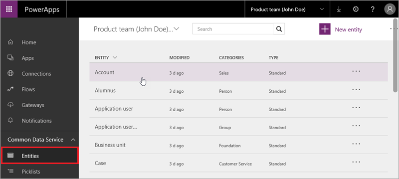
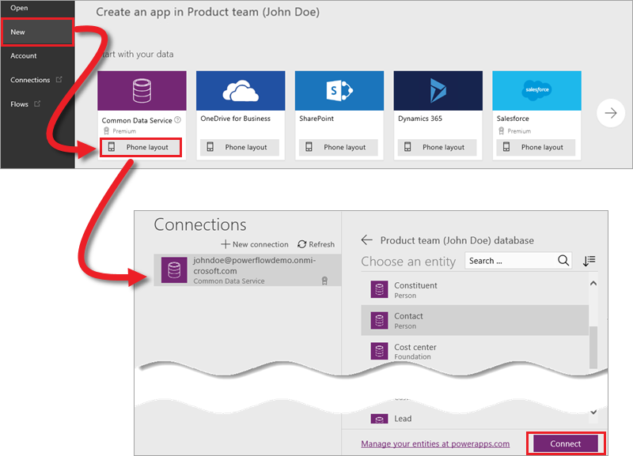

# Общие сведения о сущностях
В первой статье этого раздела вы познакомились с Common Data Service — службой, которая включает модель общих данных. В свою очередь, модель содержит сущности. Сущности представляют собой блоки общих данных, которые можно изменять, хранить и извлекать и с которыми можно взаимодействовать. Из этой статьи вы узнаете больше о сущностях, полях и типах данных.

## Стандартные сущности
Модель общих данных поставляется с набором стандартных сущностей, которые охватывают широкий спектр распространенных деловых задач. Ниже приведены некоторые стандартные сущности.

Сущности сгруппированы в категории, что позволяет легко понять, какие из них обычно работают в решении вместе.

| Функциональная группа | Описание |
| --- | --- |
| Обслуживание клиентов |Сущности Customer Service (Обслуживание клиентов) обеспечивают решение проблем клиентов, включая проблемы с отслеживанием, эскалацией и документацией. |
| Основа |Сущности основы содержат сведения, актуальные почти для всех других групп сущностей. Эта группа содержит такие сущности, как "Адрес" и "Валюта". |
| "Люди", "Организации" и "Группы" |Эти сущности охватывают множество людей и организаций, с которыми вы можете взаимодействовать, включая сотрудников, подрядчиков, спонсоров, добровольцев, фанатов, выпускников и семьи. |
| Покупка |Сущности этой группы позволяют создавать решения покупки. |
| Продажи |Сущности этой группы Sales (Продажи) позволяют создавать комплексные решения для продаж: от отслеживания потенциальных клиентов, договоров и работы с контактными лицами до приема и доставки заказов, а также отправки счетов. |

## Поля и типы данных
Каждая сущность содержит набор полей по умолчанию, которые нельзя изменить или удалить. Некоторые из этих полей, например **Contact ID** (Идентификатор контактного лица), свойственны только конкретной сущности. Другие, например **Created on date time** (Дата и время создания), являются общими для всех сущностей. Стандартную сущность можно расширить путем добавления полей. Просто выберите команду **Add field** (Добавить поле) и задайте свойства нового поля.

Если вам нужна сущность, которая отличается от стандартной (т. е. расширения стандартной сущности недостаточно), можно создать настраиваемую сущность. Эта процедура будет рассмотрена в следующей статье.

Каждому полю в сущности назначен тип данных, например Number (Число). Различные типы данных в полях позволяют приложениям выполнять разнообразные интересные задачи. Например, пользователь может редактировать поле с типом данных "Число" с помощью ползунка. Для выбора доступны более двенадцати различных типов данных. Список ниже содержит некоторые самых популярные типы.

* Базовые типы, такие как Text (Текст) и Number (Число).
* Более сложные типы, например Email (Адрес электронной почты) и Phone (Телефон).
* Специальные типы, например Lookup (Подстановка) (для создания связи) и Picklist (Список выбора) (для хранения фиксированного набора значений для поля).  

## Работа с сущностями
Открыв сущность, вы увидите много информации и несколько доступных действий. Мы кратко рассмотрим вкладки и действия, с помощью которых можно управлять данными сущности.

* **Fields** (Поля) — здесь можно просматривать поля и типы данных, а также добавлять поля, которые упоминались выше.
* **Key** (Ключ) — поле, которое идентифицирует каждую строку в сущности. Например, поле Contact ID идентифицирует сущность "Контакт".
* **Relationships** (Связи) — связи между связанными сущностями, например, такими как Product (Продукт) и Product category (Категория продуктов). Пример мы рассмотрим в следующей статье.
* **Field groups** (Группы полей) — используется для управления различными схемами поведения. Например, на этой вкладке можно указать, какие поля будут автоматически отображаться при создании экрана приложения в PowerApps.
* **Data** (Данные) — обзор образца данных и ваших собственных данных после импорта.

* **Open in Excel** (Открыть в Excel). Если у вас установлена надстройка PowerApps, используйте этот параметр для просмотра и изменения данных в Excel.
* **Import data** (Импорт данных) — перенос данных из Excel в CSV-файлы.
* **Export data** (Экспорт данных) — экспорт данных в файл Excel.
* **Export template** (Экспорт шаблона) — экспорт структуры сущности в файл Excel, что позволяет заполнить файл и импортировать его обратно в сущность.
* **Settings** (Параметры) и **Delete** (Удалить) — эти действия недоступны для стандартных сущностей.

## Подключение к стандартной сущности в PowerApps Studio
Теперь, когда вы знаете, что такое сущности, рассмотрим подключение к сущности "Контакт" в PowerApps Studio. Щелкните **New** (Создать) а затем в разделе **Common Data Service** щелкните **Phone layout** (Макет для телефона). Слева вы увидите доступные подключения к данным, а справа — список сущностей. Попробуйте подключиться самостоятельно и создать приложение на основе сущности.

В следующей статье мы покажем, как создавать пользовательские сущности и связи между сущностями.

