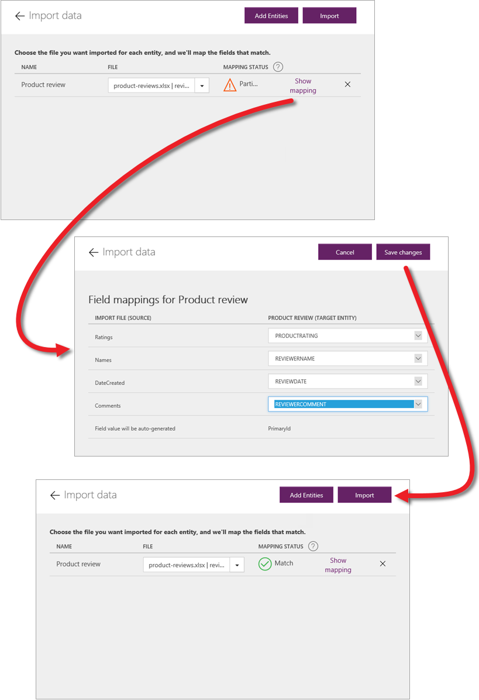
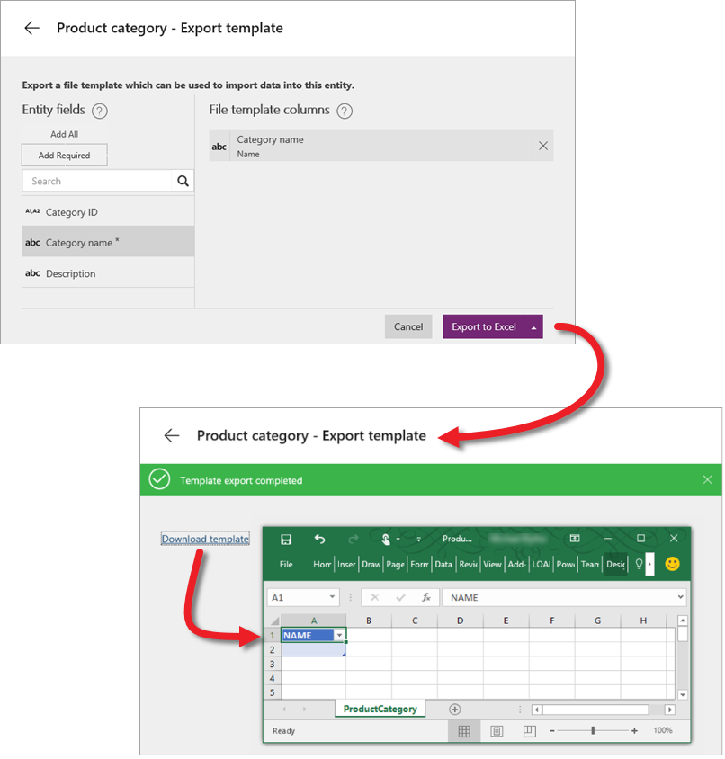

# Управление данными сущностей
В этой статье мы обсудим управление данными в службе Common Data Service. Так как мы уже рассмотрели операции импорта и экспорта данных в других статьях, сейчас мы остановимся на работе с данными в Excel.

## Импорт данных из файла Excel или CSV
В этом примере мы импортируем данные из файла Excel в сущность "Обзор продукта", созданную в последней статье. Также можно импортировать данные из CSV-файлов. Это распространенный формат, используемый для перемещения данных. Напоминаем, как выглядит сущность: выделенная область — это наш предмет обсуждения в этой статье.

В сущности щелкните **Import data** (Импорт данных) и перейдите к файлу с импортируемыми данными. Щелкните **Show mapping** (Показать сопоставления) и убедитесь, что столбцы в файле Excel связаны в сущности с полями справа. Если сопоставление вас устраивает, нажмите кнопку **Save changes** (Сохранить изменения). Вернитесь на основной экран импорта и щелкните **Import** (Импорт).

## Экспорт данных в Excel
Данные экспортируются, когда нужно получить доступ к ним за пределами службы Common Data Service. В сущности щелкните **Export Data** (Экспорт данных). Будет создан ZIP-файл. Откройте этот ZIP-файл и просмотрите экспортированные данные. 

## Экспорт шаблона в Excel
Кроме данных можно также скачать шаблон. Шаблон — это файл Excel со структурой, которая соответствует полям сущности, но не содержит данные. Скачанный шаблон можно заполнить вручную или программным способом, а затем импортировать обратно в службу. В сущности щелкните **Export Template** (Экспорт шаблона), укажите необходимые поля (в нашем примере — это одно поле). Щелкните **Export to Excel** (Экспорт в Excel). Будет создан файл Excel. Откройте этот файл и вы увидите экспортированный шаблон с выбранными полями.

## Открытие данных и работа с ними в Excel
Напоследок мы рассмотрим параметр **Open in Excel** (Открыть в Excel). Если у вас установлена надстройка PowerApps, этот параметр можно использовать для просмотра и изменения данных в Excel. В сущности щелкните **Open in Excel** (Открыть в Excel). Откроется файл. Включите редактирование. При этом надстройка установит активное подключение к сущности в службе и заполнит книгу. Изменения можно вносить непосредственно в книгу. Также можно добавлять и удалять строки. Щелкните **Publish** (Опубликовать), чтобы сохранить изменения. Данные также можно обновить (чтобы поддерживать их актуальное состояние) или отфильтровать (что очень удобно, если сущность содержит большой объем данных).

На этом обзор способов управления данными в службе Common Data Service (включая импорт, экспорт и работу с данными в Excel) завершен. В следующей статье мы обсудим функции управления безопасностью данных.

