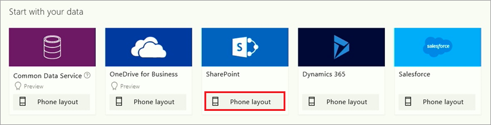

# Создание приложения в PowerApps
Теперь, когда вы ознакомились со всеми компонентами PowerApps, а также вариантами создания приложений, можно приступать к созданию приложения. В рамках работы с этой статьей мы создадим приложение для телефона из списка SharePoint Online. Но можете использовать данные из других источников (например, Excel), облачных служб (например, SalesForce) и локальных источников (например, SQL Server).

## Подключение к источникам данных
Первый шаг в создании приложения из данных — это выбор используемой версии PowerApps Studio и подключение к источнику данных. На сайте web.powerapps.com, выберите пункт **New app** (Создать приложение), а затем укажите, следует ли использовать PowerApps Studio для Windows или PowerApps Studio для браузера.

В PowerApps Studio доступна возможность запуска приложения на основе данных или шаблона, а также создания с нуля. Мы создаем приложение для телефона из списка SharePoint, поэтому в разделе **SharePoint** выберите пункт **Phone layout** (Макет для телефона).

В основе созданных приложений всегда лежит один список или таблица (позже в такое приложение можно добавить дополнительные данные). Следующие три экрана представляют процесс подключения к списку **Flooring Estimates** (Оценка покрытий для пола) в SharePoint Online.

После нажатия кнопки **Connect** (Подключить), PowerApps начнет создавать приложение. PowerApps проанализирует ваши данные, чтобы создать полезное базовое приложение.

## Обзор созданного приложения
Все получилось! Новое приложение с тремя экранами откроется в PowerApps Studio. Все приложения, созданные на основе данных, имеют одинаковый набор экранов.

* **Экран обзора** — обзор, сортировка, фильтрация и обновление данных из списка, а также добавление элементов с помощью значка "плюс" (+).
* **Экран сведений** — просмотр дополнительных сведений и возможность удаления или изменения элемента.
* **Экран изменения или создания** — изменение существующего элемента или создание нового.

На панели навигации слева щелкните (коснитесь) значок, расположенный в правом верхнем углу, чтобы переключиться на представление эскиза. 

Щелкните (коснитесь) каждый эскиз, чтобы просмотреть элементы управления на соответствующем экране.

Выберите стрелку  вверху справа, чтобы запустить приложение. Во время навигации по приложению вы увидите, что оно содержит все данные из списка и имеет стандартный интерфейс.

Как видите, все очень просто. Всего за несколько минут вы узнали, как подключиться к источнику данных, создать приложение, а также ознакомились с PowerApps Studio и тремя экранами приложений. В следующих разделах мы расскажем вам, как настроить созданное приложение. В следующей статье мы рассмотрим эти материалы и подготовим вас к следующим занятиям.

