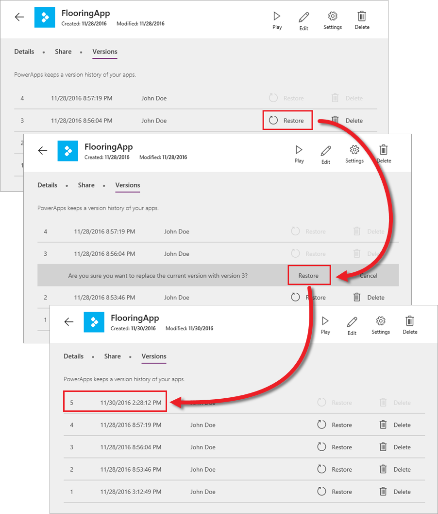

# Управление версиями приложений
Если что-то пошло не так или вы сохранили в приложении ненужное изменение, PowerApps поможет вам устранить проблему. Для приложений, которые хранятся в облаке, PowerApps регистрирует внесенные изменения. Вы можете просмотреть сохраненные версии и при необходимости восстановить приложение до предыдущей версии. Помните, что в случае с совместно используемыми приложениями восстановленная версия будет предоставлена всем пользователям с доступом к таким приложениям.

## Как управлять версиями приложения
На сайте web.powerapps.com на плитке приложения щелкните многоточие (. . .) и выберите пункт **Details** (Сведения).

Здесь можно управлять версиями приложения, а также предоставлять общий доступ к приложению (как это сделать, мы узнали из предыдущей статьи). Чтобы вернуться к предыдущей версии приложения, нажмите кнопку **Restore** (Восстановить) для соответствующей версии (версия 3 в примере). Затем нажмите кнопку **Restore** (Восстановить) еще раз для подтверждения. Как видно из примера, восстановленное до версии 3 приложение PowerApps обрабатывает как новую версию (версию 5 в примере), а не просто как перезапись версии 4.

Управление версиями может помочь вам восстановить предыдущую версию приложения, поэтому учитывайте эту возможность, когда у вас возникнут проблемы с приложениями. Теперь, когда вы знаете, как предоставлять доступ к приложениям и при необходимости их восстанавливать, мы рассмотрим последний в рамках этого цикла раздел, посвященный управлению приложениями, а именно — управлению средами.

