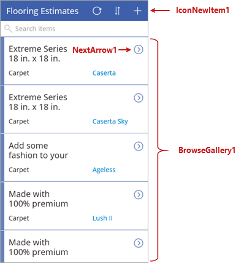
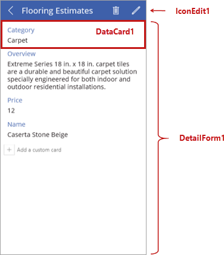
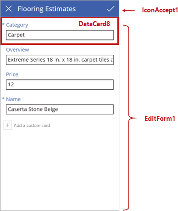

# Обзор возможностей приложения, созданного из списка SharePoint
В этой статье мы ознакомимся с возможностями созданного приложения: рассмотрим экраны и элементы управления, которые определяют поведение приложения. Мы не будем углубляться в детали, но вам будет полезно разобраться в механизме работы этого приложения, чтобы вы могли создавать свои решения. В следующей статье мы рассмотрим формулы, которые используются с экранами и элементами управления.

## Общие сведения об элементах управления в PowerApps
Элемент управления — это просто элемент пользовательского интерфейса, связанный с определенным поведением. В PowerApps используется много стандартных элементов управления, характерных для других приложений: метки, текстовые поля, раскрывающиеся списки, элементы навигации и т. д. Кроме них в PowerApps есть и более специализированные элементы управления, например **галереи** (отображают сводные данные) и **формы** (отображают подробные данные, а также позволяют создавать и изменять элементы). Здесь вы также найдете другие, не менее интересные элементы управления для работы с **изображениями**, **камерой** и **штрих-кодами**. Чтобы узнать, какие элементы доступны, выберите на ленте элемент **Вставка**, а затем последовательно просмотрите все варианты, начиная от элемента **Текст** и заканчивая элементом **Значки**.

## Знакомство с экраном обзора
Каждый из трех экранов приложения включает основной элемент управления и несколько дополнительных. Первым экраном в приложении является экран обзора с именем **BrowseScreen1** по умолчанию. Основной элемент управления на этом экране — коллекция с именем **BrowseGallery1**. **BrowseGallery1** содержит другие элементы управления, включая **NextArrow1** (элемент управления "значок". Выберите его, чтобы перейти на экран сведений). На экране доступны также отдельные элементы управления, например **IconNewItem1** (элемент управления "значок". Выберите его, чтобы создать элемент на экране изменения или создания).

Так как в PowerApps доступны коллекции разных типов, вы можете использовать ту, которая наиболее соответствует требованиям макета приложения. Далее в этом разделе мы покажем вам несколько способов управления макетом.

## Обзор экрана сведений
Далее идет экран сведений с именем **DetailScreen1** по умолчанию. Основной элемент управления на этом экране — форма просмотра с именем **DetailForm1**. **DetailForm1** содержит другие элементы управления, включая **DataCard1** (элемент управления "карта", который отображает категорию покрытия для пола в нашем примере). На экране доступны также отдельные элементы управления, например **IconEdit1** (элемент управления "значок". Выберите его, чтобы изменить текущий элемент на экране изменения или создания).

В коллекциях реализовано множество параметров, тогда как формы представляют более простые решения — это либо форма редактирования, либо форма просмотра.

## Обзор экрана изменения или создания
Третье окно в приложении представлено экраном изменения или создания с именем **EditScreen1** по умолчанию. Основной элемент управления на этом экране — форма редактирования с именем **EditForm1**. **EditForm1** содержит другие элементы управления, включая **DataCard8** (элемент управления "карта", который позволяет изменить категорию покрытия для пола в нашем примере). На экране доступны также отдельные элементы управления, например **IconAccept1** (элемент управления "значок". Выберите его, чтобы сохранить изменения, внесенные на экране изменения или создания).

Теперь вы знаете, какие экраны и элементы управления содержит приложение. В следующей статье мы объясним, как настроить такое приложение.

