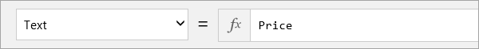

# Изучение возможностей формул в приложениях (список SharePoint)
Одним из основных преимуществ PowerApps является то, что вам не нужно писать традиционный код приложения, то есть вы можете создавать приложения, не являясь разработчиком. Но вам по-прежнему необходимо реализовать логику в приложении, а также контролировать навигацию, фильтрацию, сортировку и другие функциональные возможности приложения. Для этого вам потребуются формулы. Если вы уже работали с формулами Excel, подход, который используется в PowerApps, покажется вам знакомым. В этой статье мы покажем несколько основных формул для форматирования текста, а затем рассмотрим три формулы, которые служба PowerApps включает в создаваемое приложение. Вы получите представление о возможностях формулы. Затем вы можете изучить другие формулы в созданном приложении и написать свою формулу.

## Основные сведения о формулах и свойствах
В предыдущей статье мы включили поле Price (Цена) в коллекцию экрана обзора, но оно отобразилось как обычное число без символа валюты. Предположим, мы хотим добавить знак доллара, а также изменить цвет текста в зависимости от стоимости товара (например, красный при стоимости более 5 долларов, в противном случае — зеленый). Эта концепция показана на следующем рисунке.

Начнем с форматирования валюты. По умолчанию служба PowerApps просто извлекает для каждого элемента значение цены. Для метки, в которой отображается цена, задано *свойство* **Text**.

Чтобы добавить символ валюты США, щелкните метку или коснитесь ее и в строке формул задайте для свойства **Text** эту формулу.

С помощью *функции* **Text** (Текст) формула `Text(Price, "[$-en-US]$ ##.00"` указывает способ форматирования числа. Она напоминает формулы Excel, но формулы PowerApps ссылаются на элементы управления и другие элементы в приложении, а не на ячейки в таблице. Если вы щелкнете элемент управления, а затем откроете раскрывающийся список, отобразятся свойства, которые относятся к элементу управления. Например, ниже приведен неполный список свойств для метки. Одни свойства применимы для многих элементов управления, другие — только для определенного элемента управления.

Для условного форматирования цветом в зависимости от цены используйте следующую формулу для свойства **Color** метки: `If(Price > 5, Color.Red, Color.Green)`.

## Формулы, включенные в создаваемое приложение
Теперь, когда вы знаете, как использовать формулы со свойствами, мы рассмотрим три примера формул, которые служба PowerApps использует в создаваемом приложении. Все примеры касаются экрана обзора и свойства OnSelect, которое определяет, что происходит, когда пользователь нажимает кнопку или элемент управления в приложении.

* Первая формула связана с элементом управления **IconNewItem1**: . Щелкните этот элемент управления, чтобы перейти c экрана обзора на экран редактирования или создания и создать элемент. 
  
  * Формула выглядит так: `NewForm(EditForm1);Navigate(EditScreen1, ScreenTransition.None)`
  * Формула *создает экземпляр* новой формы редактирования, а затем переходит на экран редактирования или создания, чтобы вы могли создать новый элемент. Значение `ScreenTransition.None` означает отсутствие эффекта перехода между экранами (например, исчезания).
* Вторая формула связана с элементом управления **IconSortUpDown1**: . Щелкните этот элемент управления, чтобы отсортировать список элементов в коллекции экрана обзора.
  
  * Формула выглядит так: `UpdateContext({SortDescending1: !SortDescending1})`
  * В этой формуле с помощью `UpdateContext` обновляется *переменная* с именем `SortDescending1`. Значение переменной переключается с помощью элемента управления. Это определяет способ сортировки элементов в коллекции на этом экране (дополнительные сведения см. в видео). 
* Третья формула связана с элементом управления **NextArrow1**: . Щелкните этот элемент управления, чтобы перейти c экрана обзора на экран сведений.
  
  * Формула выглядит так: `Navigate(DetailScreen1, ScreenTransition.None)`
  * Формула выполняет переход на экран сведений, эффект перехода также отсутствует.

В приложении существует множество других формул. Уделите немного времени, чтобы узнать, какие формулы задаются для различных свойств, щелкая соответствующие элементы управления.

## Заключение
Мы изучили созданное приложение и посмотрели, как устроены экраны, элементы управления, свойства и формулы, которые обеспечивают работу различных возможностей приложения. Если вы последовательно изучали этот курс, вы получили более полное представление о том, как работает созданное приложение. Теперь на основе этих знаний можно создавать собственные приложения. 

Прежде чем перейти к следующему разделу, мы хотим вернуться к началу цикла по SharePoint и показать, как приложение интегрировано со списком. Как видите, приложение **FlooringApp** теперь функционирует как *представление* списка. Это приложение можно запустить, нажав кнопку **Open** (Открыть). Это позволяет управлять списками с помощью простого и понятного персонализированного интерфейса.

Вы прошли раздел, посвященный приложениям SharePoint. Теперь вы можете выбрать тему для дальнейшего изучения:

* [Управление приложениями](learning-manage-share-apps.md)
* [Создание и настройка приложений с помощью службы Common Data Service](learning-case-app-generate.md)

Из раздела, посвященного управлению, вы узнаете, как совместно использовать приложения и управлять их версиями, и ознакомитесь с понятием сред, которые являются контейнерами для приложений, данных и других ресурсов. Мы рекомендуем всем пользователям ознакомиться с разделом об управлении, но раздел, посвященный Common Data Service, также содержит полезные сведения, в том числе о дополнительных настройках приложения. 

