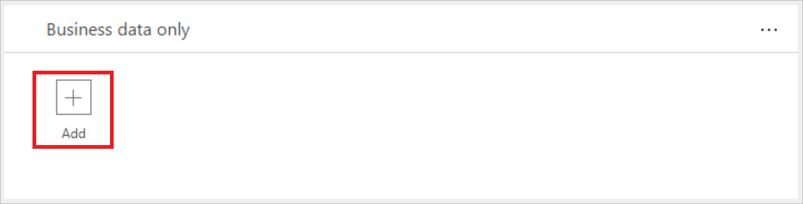
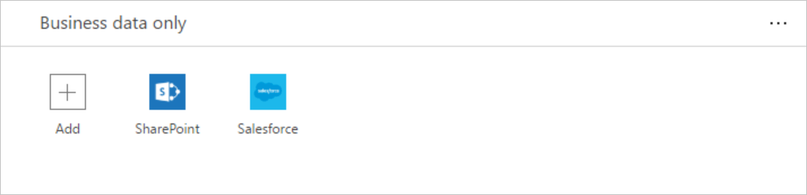

# Сведения о группах данных

Группы данных — это простой способ категоризации служб в рамках [политики защиты от потери данных (DLP)](prevent-data-loss.md). Доступны две группы данных: **Business data only** (Только бизнес-данные) и **No business data allowed** (Бизнес-данные запрещены). Организации могут определять, какие службы будут помещены в группу данных. Для категоризации служб рекомендуется разместить их в группы на основе их значимости для организации. По умолчанию все службы будут размещены в группу данных **No business data allowed** (Бизнес-данные запрещены). Вы можете управлять службами в группе данных, когда вы создаете или изменяете свойства политики DLP в центре администрирования.

## Как данные совместно используются в разных группах
Данные не могут совместно использоваться службами, расположенными в разных группах. Например, если поместить SharePoint и Salesforce в группу **Business data only** (Только бизнес-данные), а Facebook и Twitter — в группу **No business data allowed** (Бизнес-данные запрещены), вы не сможете создать приложение PowerApp, которое перемещает данные между SharePoint и Facebook. Хотя данные не могут совместно использоваться службами в разных группах, вы можете предоставить доступ к данным службам внутри конкретной группы. Вернемся к предыдущему примеру: так как SharePoint и Salesforce помещены в одну и ту же группу данных, приложения PowerApps, созданные пользователями, могут совместно использовать данные в SharePoint и Salesforce. Суть в том, что службы в определенной группе могут совместно использовать данные, а службы в различных группах не могут.

Кроме того, одну группу данных необходимо назначить в качестве группы *по умолчанию*. Изначально группа **No business data allowed** (Бизнес-данные запрещены) — это группа *по умолчанию*, и в все службы находятся в этой группе. Администратор может изменить группу данных по умолчанию на группу **Business data only** (Только бизнес-данные). > [!NOTE]
> Все новые службы, которые добавляются в PowerApps, будут помещены в назначенную группу *по умолчанию*. Поэтому мы рекомендуем оставить группой по умолчанию **No business data allowed** (Бизнес-данные запрещены) и вручную добавлять данные в группу **Business data only** (Только бизнес-данные), после того как ваша организация оценит все риски, которые связаны с предоставлением новой службе доступа к бизнес-данным.

## Добавление служб в группу данных
В этом пошаговом руководстве мы добавим SharePoint и Salesforce в группу данных политики защиты от потери данных **Business data only** (Только бизнес-данные).

1. Щелкните ссылку **+Add** (+Добавить), расположенную внутри поля группы политики защиты от потери данных **Business data only** (Только бизнес-данные):    
     
2. Выберите SharePoint и Salesforce, затем нажмите кнопку **Add services** (Добавить службы), чтобы добавить обе службы в группу для бизнес-данных:    
     
3. Нажмите кнопку **Save Policy** (Сохранить политику) в меню сверху:  
   
4. Обратите внимание, что SharePoint и Salesforce теперь на находятся в группе для бизнес-данных:  
      

В этом пошаговом руководстве вы добавили SharePoint и Salesforce в группу данных политики защиты от потери данных **Business data only** (Только бизнес-данные). Если один из пользователей среды политики защиты от потери данных создаст приложение, данные которого совместно используют SharePoint или Salesforce и любая служба в группе данных **No business data allowed** (Бизнес-данные запрещены), приложение не запустится.

## Удаление служб из группы данных
Так как все службы должны быть в одной из групп данных, чтобы удалить службу из конкретной группы, просто добавьте службу в другую группу и сохраните политику.  

## Изменение группы данных по умолчанию
В этом пошаговом руководстве мы изменим группу данных по умолчанию. Вместо группы **No business data allowed** (Бизнес-данные запрещены) группой по умолчанию станет **Business data only** (Только бизнес-данные).  

> [!IMPORTANT]
> Все новые службы, которые добавляются в PowerApps, будут помещены в назначенную группу *по умолчанию*. Поэтому мы рекомендуем оставить группой по умолчанию **No business data allowed** (Бизнес-данные запрещены) и вручную добавлять службы в группу **Business data only** (Только бизнес-данные).

1. Щелкните многоточие (**...**) в правом верхнем углу группы данных, которую вы хотите назначить в качестве группы данных по умолчанию:    
     
2. Выберите команду **Set as default group** (Сделать группой по умолчанию):  
      
3. Нажмите кнопку **Save Policy** (Сохранить политику) в меню сверху:  
   
4. Обратите внимание, что теперь эта группа данных является группой по умолчанию:  
      

## Дальнейшие действия
* [Дополнительные сведения о политиках защиты от потери данных (DLP)](prevent-data-loss.md)
* [Использование сред в PowerApps](environments-overview.md)
* [Введение в PowerApps](getting-started.md)

