# Добавление и настройка элемента управления в PowerApps
Добавляйте различные элементы пользовательского интерфейса в приложение и настраивайте их внешний вид и поведение напрямую, на панели инструментов, на вкладке **Свойства** или в строке формул. Эти элементы пользовательского интерфейса называются элементами управления, а настраиваемые параметры — свойствами.

## Технические условия
1. [Зарегистрируйтесь](../signup-for-powerapps.md) в PowerApps, а затем [войдите в систему](https://web.powerapps.com), указав учетные данные, использованные при регистрации.

2. В PowerApps Studio в меню **Файл** (у левого края экрана) выберите **Создать**.

    

3. На плитке **Blank app** (Пустое приложение) щелкните или нажмите **Phone layout** (Макет телефона).

    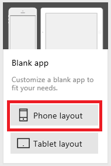

4. Если появится приглашение ознакомиться с кратким обзором основных областей интерфейса PowerApps, выберите **Next** (Далее) или **Skip** (Пропустить).

    

    Просмотреть обзор можно в любой момент. Для этого щелкните значок вопросительного знака в правом верхнем углу экрана, а затем выберите **Take the intro tour** (Ознакомиться с кратким обзором).

## Добавление элемента управления
Чтобы добавить элемент управления (в различных категориях), перейдите на вкладку **Вставка** панели инструментов, выберите категорию, а затем — необходимый элемент управления. В этом разделе рассматриваются элементы управления по категориям, благодаря чему вы ознакомитесь с типами элементов управления, которые можно добавить, и узнаете, где находится каждый из них.

На вкладке **Вставка** щелкните (коснитесь) любую из этих категорий, затем щелкните (коснитесь) элемент управления, который требуется добавить.

**Текст**: "Метка", "Текстовое поле", "HTML-текст", "Ввод с помощью пера". 
**Элементы управления**: "Кнопка", "Раскрывающийся список", "Выбор даты", "Поле со списком", "Флажок", "Переключатель", "Переключатель", "Ползунок", "Оценка", "Таймер". 
**Коллекция**: "По вертикали", "По горизонтали", "Изменяющаяся высота", "Пустая, вертикальная", "Пустая, горизонтальная", "Пустая, горизонтальная, высота". 
**Таблица данных** 
**Формы**: "Изменить", "Отображать", "Форма сущности". 
**Мультимедиа**: "Изображение", "Камера", "Штрихкод", "Видео", "Звук", "Микрофон", "Добавить изображение". 
**Диаграммы**: "Гистограмма", "График", "Круговая диаграмма". 
**Значки**

> [!TIP]
> Если вам необходимо больше места для элементов управления, [добавьте экран](add-screen-context-variables.md).

## Настройка элементов управления напрямую
В этом разделе вы добавите и настроите элемент управления **Метка**, но описанные здесь действия можно применять и к другим элементам управления.

1. Перейдите на вкладку **Вставка** панели инструментов и щелкните (коснитесь) **Метка**.

    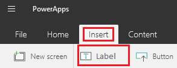

    Когда вы добавляете элемент управления, он выбран по умолчанию. Чтобы выбрать имеющийся элемент управления, щелкните или коснитесь его. После выбора вокруг него появится рамка выделения и отобразятся другие параметры изменения пользовательского интерфейса. С их помощью вы можете изменить выбранный элемент управления. Например, выбрав элемент управления **Метка**, вы увидите следующее:

    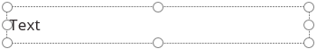

    > [!IMPORTANT]
> Если вы выбрали элемент управления, а затем выбрали другой или щелкнули свободное место на экране, выбор первого действия отменяется.
2. Сузьте элемент управления **Метка**, перетащив маркер края влево. (Средний маркер позволяет увеличить размер.)

    

     Размер элемента управления можно также изменить с помощью свойств **[Height](controls/properties-size-location.md)** и **[Width](controls/properties-size-location.md)**, как описано далее в этой статье.

3. Переместите элемент управления **Метка**, перетащив рамку выделения (или с помощью свойств **[X](controls/properties-size-location.md)** и **[Y](controls/properties-size-location.md)**, как описано далее в этой статье).

4. Трижды щелкните текст, отображаемый в элементе управления **Метка**, а затем введите **Hello, World**.

    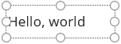

     Этот текст можно изменить, задав для этого элемента управления свойство **[Text](controls/properties-core.md)**, как описано далее в этой статье.

## Настройка элемента управления на панели инструментов
При настройке элемента управления на панели инструментов вы можете указать большее количество параметров по сравнению с его непосредственной настройкой.

1. Выберите элемент управления **Метка** и перейдите на вкладку **Главная** панели инструментов.

    

2. Щелкните **Заливка**, а затем выберите цвет, например аквамариновый.

    

    После этого в элементе управления **Метка** отобразятся изменения.

    

3. Измените семейство шрифтов и размер текста (например, 18 пт, Georgia).

    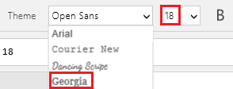

    После этого в элементе управления **Метка** отобразятся изменения.

    

4. Перейдите на вкладку **Метка**, щелкните или коснитесь **ВыровнятьПоВертикали**, а затем выберите **Top** (По верхнему краю).

    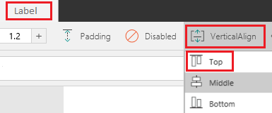

    После этого в элементе управления **Метка** отобразятся изменения.

    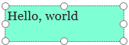

## Настройка элемента управления на вкладке "Свойства"
С помощью вкладки **Свойства** вы можете настроить элемент управления без необходимости писать формулу. В этом разделе вы добавите и настроите еще один элемент управления **Метка**, но описанные здесь действия можно применять и к другим элементам управления.

1. Добавьте еще один элемент управления **Метка**, как описано выше в этом разделе.

2. Выбрав созданный элемент управления, щелкните вкладку **Свойства** на панели справа.

    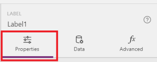

3. В поле **Текст** введите **Вкладка "Свойства"**.

    

    На элементе управления **Метка** отобразится введенный текст.

    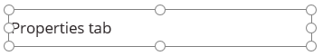

4. На панели **Свойства** щелкните значок **Заливка** и выберите цвет.

    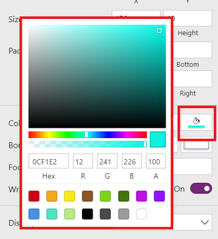

    После этого в элементе управления **Метка** отобразятся изменения.

    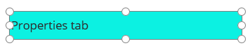

5. Выберите свойство **Color** на панели свойств.

    

    Значение свойства **Color** выделено в строке формул.

    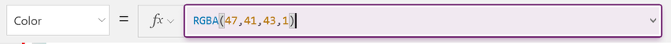

6. Чтобы удалить второй элемент управления **Метка**, выберите его, а затем нажмите клавишу DELETE.

## Настройка элемента управления в строке формул
В строке формул вы можете задать свойства, которые невозможно задать напрямую, на вкладке **Свойства** или на панели инструментов. Например, вы можете задать подсказку, появляющуюся, когда пользователь наводит указатель мыши на элемент управления, но не щелкает его. Кроме того, вы также можете указать сложные формулы, позволяющие повысить производительность приложения.

Выполняя действия, описанные в этой статье, вы также изменяли значения [свойств](reference-properties.md) настроенного элемента управления.

* При изменении размера элемента управления вы изменили свойство **[Width](controls/properties-size-location.md)**.
* При перемещении элемента управления вы изменили свойства **[X](controls/properties-size-location.md)** и **[Y](controls/properties-size-location.md)**.
* При изменении параметров отображения текста элемента управления вы изменили свойство **[Text](controls/properties-core.md)**.

Чтобы не настраивать элемент управления напрямую, на вкладке **Свойства** или на панели инструментов, вы также можете обновить значение нужного свойства. Для этого выберите его в списке и укажите его значение в строке формул. Свойства сортируются по алфавиту. Используя этот подход, вы можете указать больше типов значений.

1. Выберите оставшийся элемент управления **Метка**. В списке свойств выберите **[Text](controls/properties-core.md)** и в строке формул введите **"My Company Name"** (вместе с кавычками).

    

    Заключив строку текста в кавычки, вы указываете, что она должна рассматриваться точно так, как ее ввели. В качестве значения свойства можно также задать формулу.

2. Выберите элемент управления **Метка**. В списке свойств выберите **[Text](controls/properties-core.md)** и в строке формул введите **Today()** (без кавычек).

    В элементе управления отображается текущая дата.

    

    > [!TIP]
> Вы можете по-разному изменять [формат даты и времени](show-text-dates-times.md), а также выполнять с ними вычисления.

## Настройка взаимодействия между двумя элементами управления
В этом разделе вы добавите флажок, а затем настроите так, чтобы созданная метка отображалась только после установки этого флажка.

1. Перейдите на вкладку **Вставка**.

    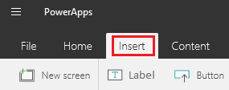

2. Выберите **Элементы управления**, а затем щелкните **Флажок**.

    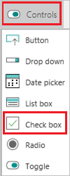

3. Переместите элемент управления **Флажок** под элемент управления **Метка**, а затем для свойства **[Text](controls/properties-core.md)** элемента управления **Флажок** задайте значение **Show text**.

    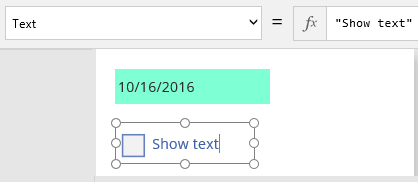

4. Выбрав элемент управления **Флажок**, щелкните его имя прямо над вкладкой **Свойства** и введите **MyCheckbox**.

    

5. Выберите элемент управления **Метка**.

6. На вкладке **Свойства** выберите свойство **Visible**.

    

7. В строке формул удалите значение **true**, а затем введите следующую формулу:

    **If(MyCheckbox.Value = true, true, false)**

    Эта **[функция If](functions/function-if.md)** указывает, что метка должна отображаться, только если установлен флажок. Так как флажок снят, элемент управления **Метка** не отображается (за исключением рамки выделения).

    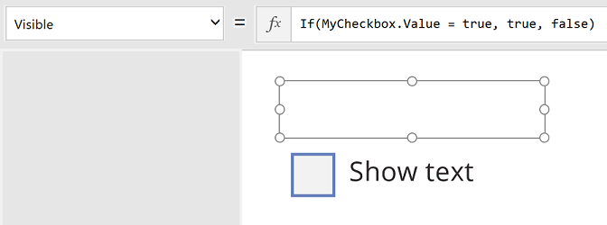

8. Щелкните элемент управления **Флажок**, чтобы добавить к нему рамку выделения, а затем щелкните еще раз, чтобы добавить отметку.

    После этого элемент управления **Метка** откроется снова:

    

9. Снимите **флажок**, чтобы скрыть элемент управления **Метка**.

    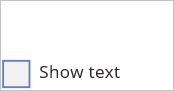

Это простой пример, но вы можете настроить внешний вид и более сложное поведение приложения, создав одну или несколько [формул](formula-reference.md).

## Изменение имени экрана или элемента управления
Изменив имя экрана или элемента управления, вы можете создавать более удобные для чтения и изменения формулы.

1. Щелкните экран или элемент управления, который необходимо переименовать.

2. На панели справа щелкните имя элемента управления (прямо над вкладкой **Свойства**) и введите необходимое имя.

    

## Поиск и выбор экрана или элемента управления
Можно найти и выбрать определенный экран или элемент управления, даже если он скрыт или перекрыт другим элементом управления. Для этого можно найти его в левой области. В этой области отображается эскиз каждого экрана в приложении либо иерархическое представление всех экранов и элементов управления, которые оно содержит.

* **Чтобы переключиться между эскизами и иерархическим представлением**, щелкните (коснитесь) значок в правом верхнем углу области.

    

* **Чтобы найти элемент управления**, введите один или несколько знаков, чтобы выделить имена элементов управления, которые содержат введенный вами текст.

    Если щелкнуть (коснуться) результат поиска, будет выбран соответствующий элемент управления в приложении.

    

* **Чтобы переместить экран вверх или вниз, скопировать, удалить или переименовать его**, щелкните этот экран правой кнопкой мыши (или щелкните (коснитесь) многоточие рядом с ним) и выберите необходимый параметр.

    

* **Чтобы скопировать и вставить элемент управления, удалить или переименовать его**, щелкните этот элемент управления правой кнопкой мыши (или щелкните (коснитесь) многоточие рядом с ним) и выберите необходимый параметр.
