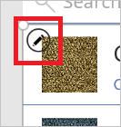
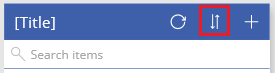

# Отображение списка элементов в PowerApps
Чтобы отобразить список элементов из любого источника данных, добавьте в приложение элемент управления **[Gallery](controls/control-gallery.md)** (Коллекция). В этой статье в качестве источника данных используется Excel. Чтобы отфильтровать список, настройте элемент управления **Коллекция** таким образом, чтобы в нем отображались только элементы, соответствующие определенному условию, которое задается в **[поле для ввода текста](controls/control-text-input.md)**.

## Технические условия
* Узнайте, как [добавить и настроить элемент управления](add-configure-controls.md) в PowerApps.

* Подготовьте демонстрационные данные:
    1. Скачайте [этот файл Excel](https://az787822.vo.msecnd.net/documentation/get-started-from-data/FlooringEstimates.xlsx), содержащий образец данных для этого руководства.

    2. Отправьте файл Excel в [учетную запись облачного хранилища](connections/cloud-storage-blob-connections.md), например OneDrive для бизнеса.

## Добавление элемента управления Gallery (Коллекция)
1. Откройте PowerApps и выберите **Создать** у левого края экрана.

2. На плитке **Blank app** (Пустое приложение) щелкните или нажмите **Phone layout** (Макет телефона).

3. В диалоговом окне **Вас приветствует PowerApps Studio** щелкните или коснитесь **Пропустить**.

4. [Добавьте подключение](add-data-connection.md) в таблицу **FlooringEstimates** из файла Excel.

5. Добавьте элемент управления **Коллекция** на экран по умолчанию (необязательно). Для этого перейдите на вкладку **Вставка**, выберите **Коллекция**, а затем выберите пустую **коллекцию** или коллекцию со стандартным набором элементов управления.

    Здесь доступны элементы управления **Коллекция**, которые можно прокручивать горизонтально или вертикально. Вы также можете добавить элемент управления **Коллекция**, который автоматически задает размер на основе объема содержимого каждого элемента.

    

6. На вкладке **Главная** выберите **Создать экран**.

    Вы можете добавить пустой прокручиваемый экран с элементом управления **Коллекция** или формой.

7. Чтобы добавить экран с элементом управления **Коллекция** и другими элементами управления, такими как панель поиска, выберите **Окно списка**.

    > [!NOTE]
   > Чтобы добавить элемент управления **Коллекция** на новый или существующий экран, щелкните в нижней части элемента управления **Коллекция**, чтобы выбрать его, на панели справа щелкните **Оценка покрытий для пола**, а затем выберите другой макет на панели **Данные**. В рамках этого руководства используйте макет по умолчанию.

    

8. Выберите элемент управления **Коллекция** на только что добавленном экране.

9. На вкладке **Свойства** на панели справа, щелкните или коснитесь **CustomGallerySample**.

10. На панели **Данные** выберите **CustomGallerySample**, а затем щелкните или коснитесь **FlooringEstimates**.

    

    В элементе управления **Коллекция** отобразятся демонстрационные данные.

    

    Сведения о настройке параметров поиска и сортировки приведены далее в этой статье.

## Добавление элемента управления в элемент управления "Коллекция"
Перед настройкой выберите макет элемента управления **Коллекция**. Первый набор элементов управления в элементе управления **Коллекция** — это шаблон, который определяет отображение всех данных в элементе управления **Коллекция**.

1. Выберите шаблон. Для этого щелкните или коснитесь в нижней части элемента управления **Коллекция**, а затем щелкните значок карандаша в левом верхнем углу.

    

2. Выбрав шаблон, добавьте элемент управления **[Метка](controls/control-text-box.md)**, а затем переместите и измените его размер таким образом, чтобы он не накладывался на другие элементы управления.

    
3. Откройте панель **Данные**. Для этого выберите шаблон и щелкните или коснитесь **Оценка покрытий для пола** на панели справа.

4. Выберите метку, добавленную ранее в этой процедуре, и откройте выделенный список на панели **Данные**.

    

5. В этом списке выберите **Цена**.

    

    В элементе управления **Коллекция** отобразятся новые значения.

    

## Фильтрация элемента управления "Коллекция"
Набор элементов, которые отображаются в элементе управления **[Коллекция](controls/properties-core.md)**, определяется его свойством **Items**. В этой процедуре мы настроим это свойство таким образом, чтобы в элементе управления **Коллекция** были показаны только элементы, для которых название товара содержит текст из поля **TextSearchBox1**.

1. Выберите элемент управления **Коллекция**, щелкнув в его нижней части.

2. На вкладке **Дополнительно** задайте для свойства **[Items](controls/properties-core.md)** элемента управления **Коллекция** следующую формулу:

    **If(IsBlank(TextSearchBox1.Text), FlooringEstimates, Filter(FlooringEstimates, TextSearchBox1.Text in Text(Name)))**

    Дополнительные сведения о других функциях см. в [справочнике по формулам](formula-reference.md).

3. Введите часть названия товара в поле поиска.

    В элементе управления **Коллекция** отобразятся только те элементы, которые отвечают условию фильтра.

## Сортировка содержимого коллекции
Порядок отображения элементов определяется свойством **[Items](controls/properties-core.md)** элемента управления **Коллекция**. В этой процедуре мы настроим его таким образом, чтобы в элементе управления **Коллекция** содержимое отображалось в порядке, заданном с помощью поля **ImageSortUpDown1**.

1. Задайте для свойства **[Items](controls/properties-core.md)** элемента управления **Коллекция** следующую формулу:

    **Sort(If(IsBlank(TextSearchBox1.Text), FlooringEstimates, Filter(FlooringEstimates, TextSearchBox1.Text in Text(Name))), Name, If(SortDescending1, SortOrder.Descending, SortOrder.Ascending))**

2. Выберите значок сортировки, чтобы изменить порядок сортировки содержимого **коллекции** по названиям товаров.

Для сортировки *и* фильтрации содержимого элемента управления **Коллекция** сделайте следующее:

* Замените оба экземпляра *DataSource* в этой формуле именем своего источника данных.

* Замените оба экземпляра *ColumnName* именем столбца, по которому будет выполняться сортировка и фильтрация.

**Sort(If(IsBlank(TextSearchBox1.Text),** *DataSource*, **Filter(** *DataSource*, **TextSearchBox1.Text in Text(** *ColumnName* **))),** *ColumnName*, **If(SortDescending1, SortOrder.Descending, SortOrder.Ascending))**

## Выделение выбранного элемента
Введите для свойства **TemplateFill** элемента управления **Коллекция** формулу, аналогичную приведенной в примере:

**If(ThisItem.IsSelected, LightCyan, White)**

## Изменение выбора по умолчанию
Задайте для свойства **Default** элемента управления **Коллекция** запись, которую необходимо выбирать по умолчанию. Например, укажите пятый элемент в источнике данных **FlooringEstimates**:

**Last(FirstN(FlooringEstimates, 5))**

В этом примере укажите первый элемент в категории **Hardwood** источника данных **FlooringEstimates**:

**First(Filter(FlooringEstimates, Category = "Hardwood"))**

## Дальнейшие действия
Дополнительные сведения см. в статье [Общие сведения о формах данных в Microsoft PowerApps](working-with-forms.md) и [Начало работы с формулами](working-with-formulas.md).
