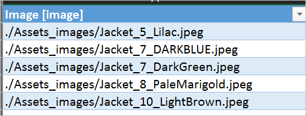
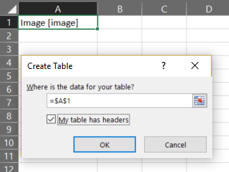

# Использование файлов мультимедиа в PowerApps
В этой статье описано, как внедрить файлы мультимедиа в приложение, отправить нарисованные с помощью пера рисунки в источник данных и просмотреть изображения из источника данных в приложении. В качестве источника данных мы используем файл Excel в OneDrive для бизнеса.

## Технические условия
[Зарегистрируйтесь](../signup-for-powerapps.md) в PowerApps, а затем [войдите в систему](https://web.powerapps.com) с помощью учетных данных, использовавшихся при регистрации.

## Добавление мультимедиа из файла или из облака
Выберите тип добавляемого файла мультимедиа (например, изображение, видео или звуковой файл).

1. На вкладке **Содержимое** выберите **Мультимедиа**.

2. В разделе **Мультимедиа** выберите **Изображения**, **Видео** или **Аудио**, а затем щелкните **Обзор**:

    ![Обзор мультимедиа][1]

3. Выберите файл, который необходимо добавить, а затем щелкните **Открыть**.

    После этого на компьютере откроется папка **Изображения**. Выберите изображение в этой папке или перейдите в другую.

4. После добавления файлов нажмите клавишу ESC, чтобы вернуться в рабочую область по умолчанию.

5. На вкладке **Вставка** щелкните **Мультимедиа** и выберите **Изображение**, **Видео** или **Аудио**:

    ![Выбор носителя][8]

6. Если вы добавили элемент управления "Изображение", в качестве значения свойства **[Image](controls/properties-visual.md)** укажите имя добавленного файла:  

    

    > [!NOTE]
> Укажите только имя файла, заключенное в одинарные кавычки, без расширения.

7. Если вы добавили элемент управления "Видео" или "Аудио", в качестве значения свойства **Media** укажите имя добавленного файла:  

    

    > [!NOTE]
> Чтобы воспроизвести видео с сайта YouTube, в качестве значения свойства **Media** элемента управления "Видео" укажите соответствующий URL-адрес, заключенный в двойные кавычки.

## Добавление мультимедиа из служб мультимедиа Azure
1. Из учетной записи служб мультимедиа Azure передавайте и публикуйте видеоресурсы в меню **AMS > Настройки > Ресурсы**.

2. После публикации скопируйте URL-адрес видео.

3. В PowerApps добавьте элемент управления **Видео** в меню **Вставка > Мультимедиа**.

4. Задайте свойство **Media** для скопированного URL-адреса.

    Как показано на этом снимке экрана, можно выбрать любой URL-адрес потоковой передачи, который поддерживают службы мультимедиа Azure:

    

## Добавление изображений из облака в приложение
В этом разделе вы сохраните изображения в учетную запись облачного хранилища OneDrive для бизнеса. Затем вы сохраните путь к изображениям в таблице Excel и просмотрите эти изображения в элементе управления "Коллекция" в приложении.

В этом сценарии мы будем использовать файл [CreateFirstApp.zip](http://pwrappssamples.blob.core.windows.net/samples/CreateFirstApp.zip), содержащий несколько JPEG-файлов.

> [!NOTE]
> Путь к этим изображениям, сохраненным в файле Excel, должен содержать прямые косые черты. Когда служба PowerApps сохраняет изображения в таблице Excel, путь к файлам содержит символы обратной косой черты. Если вы используете пути к изображениям из таблицы Excel, измените эти пути, заменив все символы обратной косой черты на обычную косую черту. В противном случае изображения не будут отображаться.  

1. Загрузите файл [CreateFirstApp.zip](http://pwrappssamples.blob.core.windows.net/samples/CreateFirstApp.zip) и извлеките папку **Assets** в облачную учетную запись хранения.

2. Измените имя папки **Assets** на **Assets_images**.

3. В электронной таблице Excel создайте таблицу с одним столбцом и введите в нее следующие данные:

    

4. Присвойте этой таблице имя **Jackets**, а файлу Excel — **Assets.xlsx**.

5. В приложении добавьте таблицу **Jackets** в качестве источника данных.  

6. Добавьте в приложение элемент управления **Только изображение** (вкладка **Вставка** > **Коллекция**) и назначьте его свойству **Items** значение `Jackets`:  

    

    Коллекция автоматически заполнится изображениями.  

    

    Когда вы присваиваете значение свойству **Items**, в таблицу Excel автоматически добавляется новый столбец **PowerAppsId**.

    В таблице Excel путь к изображению может содержать URL-адрес изображения. Рассмотрим пример файла [Flooring Estimates](http://pwrappssamples.blob.core.windows.net/samples/FlooringEstimates.xlsx). Вы можете загрузить этот файл в учетную запись облачного хранилища, добавить таблицу `FlooringEstimates` в качестве источника данных для приложения, а затем установить значение `FlooringEstimates` для элемента управления "Коллекция". Коллекция автоматически заполнится изображениями.

## Отправка нарисованных с помощью пера рисунков в облако
В этом разделе вы узнаете, как отправить нарисованные с помощью пера рисунки в источник данных (OneDrive для бизнеса) и проверить параметры их хранения.

1. В Excel добавьте значение **Image [изображение]** в ячейку A1.

2. Создайте таблицу, выполнив следующие действия:    

   1. выберите ячейку A1;

   2. На ленте **Вставка** выберите элемент **Таблица**.

   3. в диалоговом окне выберите **Таблица с заголовками** и нажмите кнопку **ОК**.

       

       Теперь файл Excel имеет формат таблицы. Дополнительные сведения о формате таблицы в Excel см. в статье [Форматирование таблицы Excel](https://support.office.com/article/Format-an-Excel-table-6789619F-C889-495C-99C2-2F971C0E2370).

   4. Присвойте этой таблице имя **Drawings**:

       

3. Сохраните файл Excel в OneDrive для бизнеса, задав ему имя **SavePen.xlsx**.

4. В службе PowerApps создайте [пустое приложение](get-started-create-from-blank.md).

5. В приложении добавьте учетную запись OneDrive для бизнеса в качестве [источника данных](add-data-connection.md):

   1. откройте вкладку **Представление** и щелкните **Источники данных**;

       

   2. выберите **Добавление источника данных**, а затем — **OneDrive для бизнеса**;

       

   3. щелкните **SavePen.xlsx**;

   4. выберите таблицу **Drawings** и нажмите кнопку **Подключиться**.

         

       Теперь таблица Drawings отображается как источник данных.

6. На вкладке **Вставка** выберите **Текст**, а затем — **Ввод с помощью пера**.

7. Измените имя нового элемента управления на **MyPen**:  

    

8. На вкладке **Вставка** добавьте элемент управления **Кнопка** и в качестве значения свойства **OnSelect** задайте следующую формулу:

    **Patch(Drawings, Defaults(Drawings), {Image:MyPen.Image})**

9. Добавьте в приложение элемент управления **Коллекция изображений** (вкладка **Вставка** > **Коллекция**) и назначьте его свойству **Items** значение `Drawings`. Свойство **Image** для элемента управления "Коллекция" автоматически получает значение `ThisItem.Image`.

    Упорядочите элементы управления, чтобы экран выглядел следующим образом:  

    

10. Нажмите клавишу F5 или щелкните значок предварительного просмотра (  ).

11. Нарисуйте что-нибудь в элементе управления MyPen, а затем щелкните элемент управления "Кнопка".

    Теперь первое изображение в элементе управления "Коллекция" демонстрирует ваш новый рисунок.

12. Дорисуйте еще что-нибудь и снова нажмите кнопку.

    Теперь второе изображение в элементе управления "Коллекция" демонстрирует ваш новый рисунок.

13. Закройте окно предварительного просмотра, нажав клавишу ESC.

    После этого в учетной записи облачного хранилища автоматически создастся папка **SavePen_images**. Эта папка содержит сохраненные изображения с идентификаторами в качестве имен файлов. Если папка не отображается, обновите окно браузера (например, нажмите клавишу F5).

    В файле **SavePen.xlsx** в столбце **Image** указаны пути к новым изображениям.

### Известные ограничения
[Просмотрите эти ограничения](connections/cloud-storage-blob-connections.md#known-limitations) для совместного использовании данных Excel в организации.

## Дополнительные сведения
Протестируйте свое приложение на разных платформах, в том числе в [окне браузера](https://home.dynamics.com/) и на телефоне.

Дополнительные сведения о более расширенных сценариях с отправкой файлов мультимедиа напрямую в разные источники данных см. в записи блога с [советами специалистов по сохранению изображений](https://powerapps.microsoft.com/blog/image-capture-pro-tips/) и об [отправке изображений с помощью настраиваемых соединителей](https://powerapps.microsoft.com/blog/custom-api-for-image-upload/).

Кроме того, файлы можно отправить в источник данных при помощи функции [Patch](functions/function-patch.md).

[1]: ./media/add-images-pictures-audio-video/add-image-video-audio-file.png
[3]: ./media/add-images-pictures-audio-video/add-intro-sound.png
[4]: ./media/add-images-pictures-audio-video/add-picture.png
[5]: ./media/add-images-pictures-audio-video/camera-gallery.png
[6]: ./media/add-images-pictures-audio-video/audio-gallery.png
[7]: ./media/add-images-pictures-audio-video/pen-gallery.png
[8]: ./media/add-images-pictures-audio-video/mediaoptions.png
[9]: ./media/add-images-pictures-audio-video/imageproperty.png
[10]: ./media/add-images-pictures-audio-video/mediaproperty.png
[11]: ./media/add-images-pictures-audio-video/renamecamera.png
