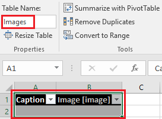
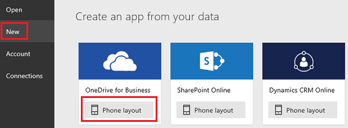
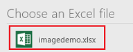
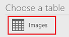
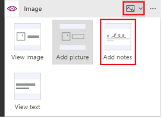

# Добавление изображений в Excel из PowerApps
Вы можете автоматически создать приложение, в котором пользователи смогут показывать, добавлять и удалять изображения из файлов и рисунки, созданные с помощью элемента управления **Перо**. Это приложение основано на файле Excel, который вы создаете и отправляете в учетную запись облачного хранилища.

## Технические условия

* Знакомство с принципами [добавления и настройки элементов управления](add-configure-controls.md).
* Знакомство с принципами [настройки данных Excel в виде таблицы](https://support.office.com/article/Format-an-Excel-table-6789619F-C889-495C-99C2-2F971C0E2370?ui=en-US&rs=en-US&ad=US).
* [Подключение из PowerApps](add-data-connection.md) к учетной записи облачного хранилища (например, Dropbox, OneDrive или Google Диск), в которое можно отправить файл Excel.

## Создание источника данных и приложения
1. В Excel добавьте слова **Подпись** и **Изображение [изображение]** в любые две расположенные рядом ячейки (например, A1 и B1), непосредственно под которыми находятся две пустых ячейки.
2. Отформатируйте эти ячейки и ячейки под ними в виде таблицы и задайте для нее название (например, **Изображения**).
   
    
3. Сохраните файл (например, под названием **Изображения_демонстрация**) и отправьте его в учетную запись облачного хранилища.
4. В PowerApps выберите пункт **New** (Создать) в меню **File** (Файл) (у левого края, если вы еще не открыли приложение), а затем щелкните или нажмите **Phone layout** (Макет для телефона) на плитке, связанной с вашей учетной записью облачного хранилища.
   
    
5. В разделе **Choose an Excel file** (Выберите файл Excel) щелкните или нажмите на созданный вами файл.
   
    
6. В разделе **Choose a table** (Выберите таблицу) выберите созданную вами таблицу, а затем щелкните или нажмите **Connect** (Подключиться).
   
    
7. Если вы только установили или обновили PowerApps, ознакомьтесь с кратким обзором либо щелкните или нажмите **Skip** (Пропустить).
   
    

## Добавление изображения из файла
1. Откройте режим предварительного просмотра, нажав клавишу F5 (или кнопку воспроизведения в правом верхнем углу), а затем щелкните или нажмите на значок плюса в том же углу.
   
    
2. В поле **Подпись** введите или вставьте краткое описание файла изображения, которое вы хотите добавить, а затем щелкните или нажмите под ним, чтобы выбрать файл.
3. В диалоговом окне **Открыть** найдите файл, который хотите добавить, выберите его, а затем нажмите кнопку **Открыть**.
   
    
4. Щелкните или нажмите на значок галочки в правом верхнем углу, чтобы сохранить изменения.
   
    
5. Добавьте нужное количество изображений, повторяя последние три действия, а затем нажмите клавишу ESC, чтобы вернуться в рабочую область по умолчанию.
6. Если хотите, удалите любую **Метка**, в которой отображается подпись к изображению.

## Добавление рисунка
1. Откройте экран **EditScreen1**, выбрав его на панели навигации слева, а затем щелкните или нажмите на карточку изображения, чтобы выбрать ее.
   
    
2. На панели справа щелкните или нажмите на селектор карточки изображения, а затем выберите **Add Notes** (Добавить заметки).
   
    
3. Откройте экран **BrowseScreen1**, выбрав его на панели навигации слева, и перейдите в режим предварительного просмотра.
4. Щелкните или нажмите на значок плюса в правом верхнем углу, добавьте подпись и нарисуйте изображение с помощью элемента управления **Перо**.
   
    
5. Щелкните или нажмите на значок галочки в правом верхнем углу, чтобы сохранить изменения.
   
    
6. Добавьте нужное количество рисунков, повторяя последние два действия, а затем нажмите клавишу ESC, чтобы вернуться в рабочую область по умолчанию.

