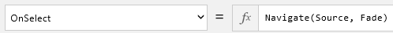

# Добавление и переключение экранов в приложении на основе холста

Создайте приложение на основе холста с несколькими экранами и предоставьте пользователям возможность перемещаться между ними.

## Технические условия

* Узнайте, как [настроить элемент управления](add-configure-controls.md).
* Создайте или откройте приложение.

## Добавление и переименование экрана

1. На вкладке **Home** (Главная) щелкните или нажмите **New screen** (Создать экран).

    

2. На панели справа щелкните имя экрана (прямо над вкладкой **Свойства**) и введите новое имя **источника**.

    

3. Добавьте еще один экран под названием **Target** (Назначение).

    

## Добавление элементов навигации
1. Выбрав экран **Source**, откройте вкладку **Insert** (Вставка), щелкните или нажмите **Icons** (Значки), а затем — **Next arrow** (Стрелка "Далее").  

    

2. Необязательно: переместите стрелку в правый нижний угол экрана.

3. Выбрав стрелку, откройте вкладку **Action** (Действие) и щелкните или нажмите **Navigate** (Навигация).

    Для свойства **[OnSelect](controls/properties-core.md)** стрелки будет автоматически выбрана функция **Navigate** (Навигация).  

    

    Когда пользователь щелкнет стрелку или нажмет на нее, появится экран **Target**.

4. На экране **Target** добавьте элемент **Back arrow** (Стрелка "Назад") и установите для ее свойства **[OnSelect](controls/properties-core.md)** следующую формулу:
    **Navigate(Source, ScreenTransition.Fade)**

5. Откройте режим предварительного просмотра ( или клавиша F5) и проверьте, как работает перемещение между экранами с помощью добавленных вами стрелок.

6. Чтобы вернуться в рабочую область по умолчанию, нажмите клавишу **ESC**.
