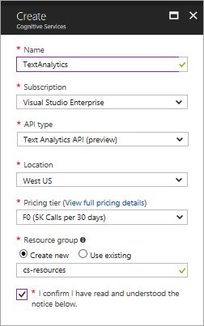
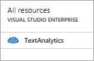
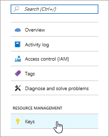
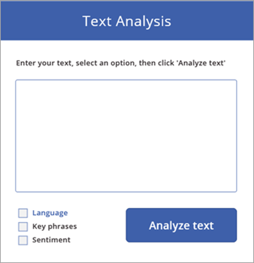
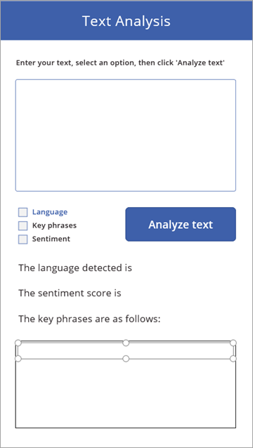
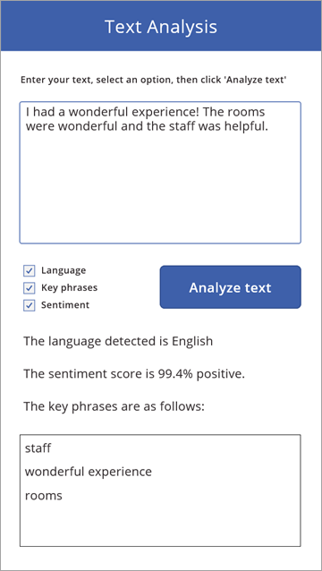

# <a name="use-cognitive-services-in-powerapps"></a>Использование служб Cognitive Services с PowerApps
Из этой статьи вы узнаете, как создать базовое приложение, использующее [API анализа текста Microsoft Cognitive Services](https://docs.microsoft.com/azure/cognitive-services/text-analytics/overview), чтобы анализировать текст. Мы объясним, как установить API анализа текста и подключиться к нему с помощью [соединителя для анализа текста](https://docs.microsoft.com/connectors/cognitiveservicestextanalytics/). Затем мы покажем, как создать приложение, которое вызывает API.

> [!NOTE]
> Если вы еще не создавали приложений в PowerApps, рекомендуем вам ознакомиться со статьей [Создание приложения с нуля](get-started-create-from-blank.md), прежде чем подробно изучить эту статью.

## <a name="introduction-to-microsoft-cognitive-services"></a>Общие сведения о Microsoft Cognitive Services
Microsoft Cognitive Services — это набор API-интерфейсов, пакетов SDK и служб, которые помогают сделать ваши приложения более интеллектуальными, привлекательными и доступными. Эти службы позволяют легко добавлять в приложения такие интеллектуальные функции, как обнаружение эмоций и видео, распознавание лиц, речи и визуальных образов, а также понимание речи и языка.

В этой статье мы сосредоточимся на распознавании речи с помощью API анализа текста. Этот API-интерфейс позволяет определять тональность, ключевые фразы, темы и язык текста. Давайте сначала протестируем демоверсию API, а затем зарегистрируемся для получения предварительной версии.

### <a name="try-out-the-text-analytics-api"></a>Тестирование API анализа текста
Для этого API-интерфейса представлена интерактивная демоверсия. Вы можете увидеть принцип его работы и просмотреть JSON-код, возвращаемый службой.

1. Перейдите на страницу [API анализа текста](https://azure.microsoft.com/services/cognitive-services/text-analytics/).

2. В разделе **Оцените работу решения в действии** используйте пример текста или введите собственный текст. Нажмите кнопку **Анализ**. 
   
    

3. Отформатированные результаты отобразятся на вкладке **Анализируемый текст**, а ответ в формате JSON — на вкладке **JSON** этой страницы. [JSON](http://json.org/) — это способ представления данных. В нашем случае это данные, возвращаемые API-интерфейсом анализа текста.

## <a name="sign-up-for-the-text-analytics-api"></a>Регистрация для работы с API анализа текста
Этот API-интерфейс доступен в качестве бесплатной предварительной версии и связан с подпиской Azure. Управление API выполняется с помощью портала Azure.

1. Если у вас еще нет подписки Azure, [зарегистрируйтесь, чтобы получить бесплатную подписку](https://azure.microsoft.com/free/).

2. Войдите в учетную запись Azure.

3. На портале Azure перейдите в колонку [Создание](https://go.microsoft.com/fwlink/?LinkId=761108) для Cognitive Services.

4. Введите информацию для API анализа текста, как показано ниже. Выберите ценовую категорию **F0** (бесплатно).
   
    

5. В левом нижнем углу нажмите кнопку **Создать**.

6. На **панели мониторинга** выберите только что созданный API-интерфейс.
   
    

7. Выберите **Ключи**.
   
    

8. Скопируйте любой ключ в правой части экрана. Этот ключ вам понадобится позже при создании подключения к API.
   
    

## <a name="build-the-app"></a>Создание приложения
Теперь API анализа текста готов и запущен. Вы можете подключиться к нему через PowerApps и создать приложение, которое вызывает этот API. У этого приложения будет один экран и такие же функциональные возможности, как у демоверсии на странице API анализа текста. Приступим к созданию.

### <a name="create-the-app-and-add-a-connection"></a>Создание приложения и добавление подключения
Сначала создайте пустое приложение для телефона и добавьте подключение с помощью соединителя **Текстовая аналитика**. Дополнительные сведения об этих задачах см. в статьях [Создание приложения с нуля](get-started-create-from-blank.md) и [Управление подключениями в PowerApps](add-manage-connections.md).

1. На странице [web.powerapps.com](https://web.powerapps.com) выберите **Создать на основе шаблона** >  (значок телефона) > **Создать это приложение**.

    

2. В средней области PowerApps Studio выберите вариант **подключения к данным**.

3. На панели **Данные** последовательно выберите **Создать подключение** > **Текстовая аналитика**.

4. Вставьте ключ в поле **Ключ учетной записи**, а затем нажмите кнопку **Создать**.
   
    

### <a name="add-controls-to-the-app"></a>Добавление элементов управления в приложение
Следующий шаг при создании приложения — добавление всех элементов управления. Обычно, создавая приложения, я сразу добавляю формулы для элементов управления. Но в этом случае мы сначала сосредоточимся на элементах управления, а затем добавим некоторые формулы в следующем разделе. На следующем изображении показано приложение со всеми элементами управления.


Выполните действия ниже, чтобы создать такой экран. Если для элемента управления задано имя, оно будет использоваться в формуле в следующем разделе.

1. На вкладке **Главная** щелкните **Новый экран** и выберите **Окно с прокруткой**. 

2. На экране **Screen2** выделите **[Название]** и введите **Анализ текста**.

3. Добавьте элемент управления **Метка** для вводного текста.

4. Добавьте элемент управления **Текстовое поле**, чтобы вводить текст для анализа. Присвойте этому элементу имя **tiTextToAnalyze**. Приложение должно выглядеть приблизительно так:
   
    

5. Добавьте три **флажка** для выбора выполняемых операций API. Присвойте флажкам имена **chkLanguage**, **chkPhrases** и **chkSentiment**.

6. Добавьте кнопку, которая будет вызывать API после выбора операций. Приложение должно выглядеть приблизительно так:
   
    

7. Добавьте три **метки**. В первых двух хранятся результаты вызовов API анализа тональности и языка, а в третьей — общие сведения для коллекции в нижней части экрана.

8. Добавьте **пустую вертикальную коллекцию**, а затем добавьте в нее **метку**. В коллекции хранятся результаты вызова API анализа ключевых фраз. Приложение должно выглядеть приблизительно так:
   
    

9. В области слева последовательно выберите **Screen1** > **…** (многоточие) > **Удалить**, так как этот экран не нужен для нашего приложения.

Мы намеренно делаем приложение максимально простым, чтобы сосредоточиться на вызове API текстовой аналитики. Но позднее вы сможете добавить в него дополнительные элементы, например логику для отображения и скрытия элементов управления в зависимости от установленных флажков, обработку ошибок при неправильном выборе параметров и т. п.

### <a name="add-logic-to-make-the-right-api-calls"></a>Добавление логики для корректного выполнения вызовов API
Итак, наше приложение уже неплохо выглядит, но пока еще ничего не умеет делать. Сейчас мы это исправим. Но прежде чем углубиться в детали, рассмотрим принцип работы этого приложения.

1. Приложение выполняет определенные вызовы API в зависимости от установленных флажков в приложении. При нажатии кнопки **Analyze text** (Анализировать текст) приложение выполнит от одного до трех вызовов API.

2. Данные, полученные от API, сохраняются в трех разных [коллекциях](working-with-variables.md#create-a-collection): **languageCollect**, **sentimentCollect** и **phrasesCollect**.

3. Приложение обновляет свойство **Текст** для двух меток и свойство **Элементы** для коллекции на основе данных, содержащихся в коллекциях.

И теперь ко всему этому мы добавим формулу для свойства кнопки **OnSelect**. И тут происходит все самое интересное.

```
If(chkLanguage.Value=true,

        ClearCollect(languageCollect, TextAnalytics.DetectLanguage({numberOfLanguagesToDetect:1, text:tiTextToAnalyze.Text}).detectedLanguages.name)

);

If(chkPhrases.Value=true,

        ClearCollect(phrasesCollect, TextAnalytics.KeyPhrases({language:"en", text:tiTextToAnalyze.Text}).keyPhrases)

);

If(chkSentiment.Value=true,

        ClearCollect(sentimentCollect, TextAnalytics.DetectSentiment({language:"en", text:tiTextToAnalyze.Text}).score)

)
```

На самом деле ничего сложного, так что давайте разберем каждый фрагмент кода:

* **If** — это простые инструкции. Установив определенный флажок, вызовите API, чтобы выполнить операцию.

* Для каждого вызова укажите соответствующие параметры:

  * Для всех трех вызовов вы предоставили входной текст **tiTextToAnalyze.Text**.

  * В методе **DetectLanguage()** для параметра **numberOfLanguagesToDetect** жестко задано значение 1. Но вы можете изменять его в приложении на основе каких-либо условий.

  * В методах **KeyPhrases()** и **DetectSentiment()** для параметра **Язык** жестко задано значение "en" (английский). Но вы можете изменять его в приложении на основе каких-либо условий. Например, можно сначала определить язык пользователя с помощью метода **DetectLanguage()**, а затем задать это значение в нашем параметре.

* Для каждого выполняемого вызова добавьте результаты в соответствующую коллекцию:

    * В коллекцию **languageCollect** добавляется **название** языка, найденного в тексте.

    * В коллекцию **phrasesCollect** добавляются **ключевые фразы**, найденные в тексте.

    * В коллекцию **sentimentCollect** добавляется **балл** тональности текста в диапазоне от 0 до 1, где 1 означает полностью положительную тональность.

### <a name="display-the-results-of-the-api-calls"></a>Отображение результатов вызовов API
Чтобы отобразить результаты вызовов API, добавьте ссылку на соответствующую коллекцию для каждого элемента управления:

1. Для свойства **Текст** метки языка задайте следующее: `"The language detected is " & First(languageCollect).name`.
   
    Функция **First()** возвращает первую (и в нашем случае единственную) запись из коллекции **languageCollect**, а затем приложение отображает значение единственного поля **name** для этой записи.

2. Для свойства **Текст** метки тональности задайте следующее: `"The sentiment score is " & Round(First(sentimentCollect.Value).Value, 3)\*100 & "% positive."`.
   
    Эта формула также использует функцию **First()**, возвращает **значение** (0–1) из первой и единственной записи, а затем форматирует его в виде процентов.

3. Для свойства **Элементы** коллекции ключевых фраз задайте следующее: `phrasesCollect`.
   
    Теперь вы используете коллекцию и можете избавиться от функции **First()**, которая извлекала одиночное значение. Вы просто указываете ссылку на коллекцию, а она сама отображает ключевые фразы в виде списка.

## <a name="run-the-app"></a>Запуск приложения

Итак, приложение полностью готово. Запустите его, чтобы проверить в работе, нажав кнопку запуска в правом верхнем углу. . На следующем изображении выбраны все три параметра, а текст такой же, как и текст по умолчанию на странице API анализа текста.



Вы можете убедиться, что выходные данные этого приложения совпадают с данными со страницы API текстовой аналитики, которые приведены в начале этой статьи.

Надеемся, что вы больше узнали об API анализа текста и с удовольствием интегрировали его в приложение. Если вам интересно прочесть статьи о других возможностях Cognitive Services (или других службах в целом), сообщите нам об этом. Как всегда, оставляйте отзывы и задавайте вопросы в комментариях.

