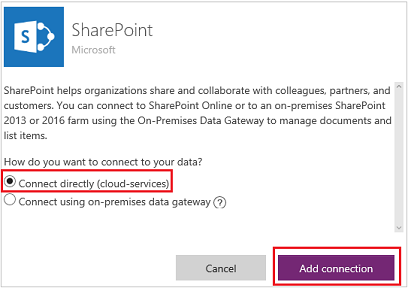
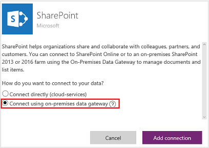
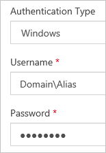

# Создание подключения к SharePoint из PowerApps
Создайте подключение к SharePoint Online или локальному сайту SharePoint, чтобы использовать его для автоматического создания приложения на основе холста или сборки приложения с нуля.

Если вы еще не работали с PowerApps, см. статью [Знакомство с PowerApps](getting-started.md).

На момент написания этой статьи служба PowerApps поддерживает пользовательские списки, но не поддерживает библиотеки. Кроме того, данные можно отображать в столбцах некоторых типов, например **Choice** (Выбор) и **Picture** (Изображение), но обновить эти данные невозможно. Дополнительные сведения см. в разделе с описанием [известных проблем](connections/connection-sharepoint-online.md#known-issues).

## Настройка подключения SharePoint
1. Если вы еще не сделали это, [зарегистрируйтесь для использования PowerApps](../signup-for-powerapps.md).

2. Войдите в [powerapps.com](https://web.powerapps.com?utm_source=padocs&utm_medium=linkinadoc&utm_campaign=referralsfromdoc), используя те же учетные данные, которые вы ввели при регистрации.

3. На панели навигации слева выберите раскрывающийся список **Manage** (Управление), а затем — пункт **Connections** (Подключения).

    

4. В правом верхнем углу экрана нажмите кнопку **New connection** (Создать подключение).

    

5. В списке подключений выберите **SharePoint**.

    

6. Выполните действия, описанные в любой из следующих процедур:

   * [Подключение к сайту SharePoint Online](connect-to-sharepoint.md#connect-to-a-sharepoint-online-site).
   * [Подключение к локальному сайту SharePoint](connect-to-sharepoint.md#connect-to-an-on-premises-sharepoint-site).

## Подключение к сайту SharePoint Online
1. Выберите **Connect directly (cloud services)** (Подключиться напрямую (облачные службы)), и нажмите кнопку **Add connection** (Добавить подключение).

    

2. Перейдите к разделу [Дальнейшие действия](connect-to-sharepoint.md#next-steps) в конце этой статьи.

## Подключение к локальному сайту SharePoint
1. Выберите **Connect using on-premises data gateway** (Подключение с помощью локального шлюза данных).

    

    > [!NOTE]
   > Пользователь может создавать и использовать шлюзы и локальные подключения только в своей [среде по умолчанию](working-with-environments.md).

2. Укажите имя пользователя и пароль.

    Если учетные данные содержат имя домена, укажите его в формате *домен\псевдоним*.

    

3. Если у вас нет локального шлюза данных, [установите его](gateway-reference.md), а затем щелкните значок, чтобы обновить список шлюзов.

    

4. В поле **Choose a gateway** (Выбор шлюза) выберите шлюз, который вы хотите использовать, и нажмите кнопку **Add connection** (Добавить подключение).

    

## Дальнейшие действия
* [Автоматическое создание приложения](app-from-sharepoint.md) на основе указанного списка. По умолчанию приложение будет включать три экрана: для просмотра записей, для отображения сведений об отдельной записи, а также для создания или обновления записи.
* [Создание приложения с нуля](get-started-create-from-blank.md). Эта статья написана для Excel, но инструкции в ней применимы и к SharePoint.
