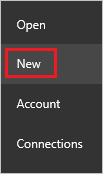
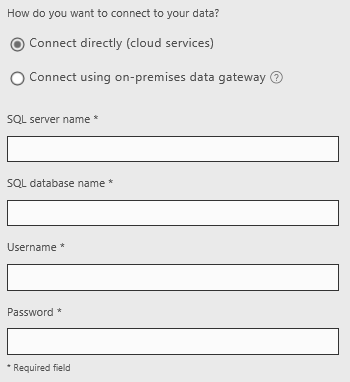
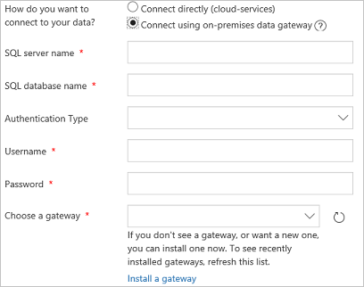

# Подключение к SQL Server из PowerApps

Подключайтесь к SQL Server в Azure или к локальной базе данных, чтобы отображать данные из базы данных в PowerApps.

## Технические условия

* [Зарегистрируйтесь](../../signup-for-powerapps.md) в PowerApps, а затем [войдите в систему](http://web.powerapps.com), указав учетные данные, использованные при регистрации.
* Соберите следующие сведения о базе данных, которая содержит по крайней мере одну таблицу с первичным ключом:
  
  * имя базы данных;
  * имя сервера, на котором размещена база данных;
  * допустимые имя пользователя и пароль для подключения к базе данных;
  * тип проверки подлинности, необходимый для подключения к базе данных.
    
    Если у вас нет этих сведений, обратитесь к администратору базы данных, которую вы хотите использовать.
* Если вы подключаетесь к локальной базе данных, определите [шлюз данных](../gateway-management.md), к которому у вас есть доступ (или создайте новый).
  
    > [!NOTE]
  > Пользователь может создавать и использовать шлюзы и локальные подключения только в своей [среде по умолчанию](../working-with-environments.md).

## Автоматическое создание приложения
1. В PowerApps Studio выберите **Создать** в меню **Файл** (у левого края экрана).
   
    
2. В разделе **Начать с данных** выберите стрелку вправо в конце строки соединителей.
3. Если у вас уже есть подключение к базе данных, которую вы хотите использовать, выберите его и перейдите к шагу 7 в этой процедуре.
4. Выберите последовательно **Новое подключение** и **SQL Server**.
   
    
5. Выполните одно из следующих действий.
   
   * Выберите параметр **Прямое подключение (облачные службы)**, затем укажите имя сервера, имя базы данных, имя пользователя и пароль для базы данных, которую вы хотите использовать.
     
       
   * Выберите параметр **Подключиться с помощью локального шлюза данных**, укажите имя сервера, имя базы данных, имя пользователя и пароль для базы данных, которую вы хотите использовать, а также тип проверки подлинности и шлюз.
     
       
     
       > [!NOTE]
     > Если у вас нет шлюза, [установите его](../gateway-reference.md), а затем выберите **Обновить список шлюзов**.
6. Нажмите кнопку **Подключиться**.
7. Выберите вариант в полях **Выбрать набор данных** и **Выбрать таблицу**, затем нажмите кнопку **Подключиться**.
   
    PowerApps создает приложение, которое отображает данные в трех окнах. Эвристика предлагает данные для отображения, но вы можете настроить пользовательский интерфейс по своему усмотрению.
8. Настройте приложение, используя методики, описанные в статье о [создании приложения из Excel](../get-started-create-from-data.md). Начните настройку с изменения макета приложения.

## Создание приложения с нуля
1. Войдите на сайт [powerapps.com](https://web.powerapps.com) с помощью той же учетной записи, которая использовалась для регистрации PowerApps.
2. На панели навигации слева выберите меню **Подключения**.  
   
    
3. В правом верхнем углу выберите последовательно **Новое подключение** и **SQL Server**.
4. Выполните одно из следующих действий.
   
   * Выберите параметр **Прямое подключение (облачные службы)**, затем укажите имя сервера, имя базы данных, имя пользователя и пароль для базы данных, которую вы хотите использовать.
     
       
   * Выберите параметр **Подключиться с помощью локального шлюза данных**, укажите имя сервера, имя базы данных, имя пользователя и пароль для базы данных, которую вы хотите использовать, а также тип проверки подлинности и шлюз.
     
       
     
       > [!NOTE]
     > Если у вас нет шлюза, [установите его](../gateway-reference.md), а затем щелкните значок обновления списка.
5. Нажмите кнопку **Создать**, чтобы создать подключение.
6. Создайте приложение, используя методики, описанные в статье о [создании приложения с нуля](../get-started-create-from-blank.md).

## Обновление существующего приложения
1. В PowerApps Studio откройте приложение, которое нужно обновить.
2. Откройте вкладку **Представление** и выберите пункт **Источники данных**.
3. На панели справа выберите команду **Добавить источник данных**.
   
    
4. Выберите последовательно **Новое подключение**, **SQL Server**, затем нажмите кнопку **Подключиться**.
5. Выполните одно из следующих действий.
   
   * Выберите параметр **Прямое подключение (облачные службы)**, затем укажите имя сервера, имя базы данных, имя пользователя и пароль для базы данных, которую вы хотите использовать.
     
       
   * Выберите параметр **Подключиться с помощью локального шлюза данных**, укажите имя сервера, имя базы данных, имя пользователя и пароль для базы данных, которую вы хотите использовать, а также тип проверки подлинности и шлюз.
     
       
     
       > [!NOTE]
     > Если у вас нет шлюза, [установите его](../gateway-reference.md), а затем щелкните значок обновления списка.
6. Нажмите кнопку **Подключиться**.
7. В поле **Выберите набор данных** выберите параметр.
8. В разделе **Выберите таблицу** установите один или несколько флажков, а затем нажмите кнопку **Подключиться**.

## Дальнейшие действия
* Узнайте, как [отобразить данные из источника данных](../add-gallery.md).
* Узнайте, как [создать, обновить записи и просмотреть сведения о них](../add-form.md).
* См. другие типы [источников данных](../connections-list.md), к которым можно подключаться.  
* [Общие сведения о таблицах и записях](../working-with-tables.md) с табличными источниками данных.

<!--NotAvailableYet
## View the available functions ##
This connection includes the following functions:

| Function Name |  Description |
| --- | --- |
|[GetItems](connection-azure-sqldatabase.md#getitems) | Retrieves rows from a SQL table |
|[PostItem](connection-azure-sqldatabase.md#postitem) | Inserts a new row into a SQL table |
|[GetItem](connection-azure-sqldatabase.md#getitem) | Retrieves a single row from a SQL table |
|[DeleteItem](connection-azure-sqldatabase.md#deleteitem) | Deletes a row from a SQL table |
|[PatchItem](connection-azure-sqldatabase.md#patchitem) | Updates an existing row in a SQL table |
|[GetTables](connection-azure-sqldatabase.md#gettables) | Retrieves tables from a SQL database |

### GetItems
Get rows: Retrieves rows from a SQL table

#### Input properties

| Name| Data Type|Required|Description|
| ---|---|---|---|
|table|string|yes|Name of SQL table|
|$skip|integer|no|Number of entries to skip (default = 0)|
|$top|integer|no|Maximum number of entries to retrieve (default = 256)|
|$filter|string|no|An ODATA filter query to restrict the number of entries|
|$orderby|string|no|An ODATA orderBy query for specifying the order of entries|

### PostItem
Insert row: Inserts a new row into a SQL table

#### Input properties

| Name| Data Type|Required|Description|
| ---|---|---|---|
|table|string|yes|Name of SQL table|
|item| |yes|Row to insert into the specified table in SQL|

#### Output properties

| Property Name | Data Type | Required | Description |
|---|---|---|---|
|value|array|No | |

### GetItem
Get row: Retrieves a single row from a SQL table

#### Input properties

| Name| Data Type|Required|Description|
| ---|---|---|---|
|table|string|yes|Name of SQL table|
|id|string|yes|Unique identifier of the row to retrieve|

#### Output properties

| Property Name | Data Type | Required | Description |
|---|---|---|---|
|ItemInternalId|string|No | |

### DeleteItem
Delete row: Deletes a row from a SQL table

#### Input properties

| Name| Data Type|Required|Description|
| ---|---|---|---|
|table|string|yes|Name of SQL table|
|id|string|yes|Unique identifier of the row to delete|

#### Output properties
None.

### PatchItem
Update row: Updates an existing row in a SQL table

#### Input properties

| Name| Data Type|Required|Description|
| ---|---|---|---|
|table|string|yes|Name of SQL table|
|id|string|yes|Unique identifier of the row to update|
|item| |yes|Row with updated values|

#### Output properties

| Property Name | Data Type | Required | Description |
|---|---|---|---|
|ItemInternalId|string|No | &nbsp; |

### GetTables
Get tables: Retrieves tables from a SQL database

#### Input properties
None.

#### Output properties

| Property Name | Data Type | Required | Description |
|---|---|---|---|
|value|array|No | Can output the Name and DisplayName properties |

### ExecuteProcedure
Execute stored procedure: Executes a stored procedure in SQL

#### Input properties

| Name| Data Type|Required|Description|
| ---|---|---|---|
|procedure|string|yes|Procedure name|
|parameters| |yes|Input parameters|

#### Output properties
Result of the stored procedure execution.

| Property Name | Data Type | Required | Description |
|---|---|---|---|
|OutputParameters|object|No | Output parameter values |
|ReturnCode|integer|No | Return code of a procedure |
|ResultSets|object|No | Result sets|

-->
