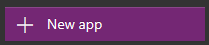
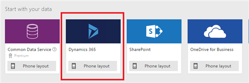
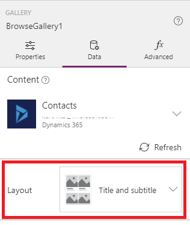
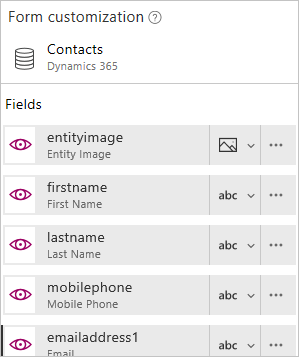

# Подключение к Dynamics 365 из PowerApps
PowerApps позволяет быстро создавать, настраивать, совместно использовать и запускать мобильные приложения с минимальным количеством кода или вообще без него. При помощи соединителя Dynamics 365 можно быстро создавать полезные мобильные приложения для совместного использования с другими сотрудниками вашей организации.

Выполнив действия, описанные в этом разделе, вы создадите приложение, с помощью которого пользователи смогут просматривать, добавлять, удалять и обновлять контакты в Dynamics 365. Пользователи могут запускать приложение [в браузере](../../../user/run-app-browser.md) или [на мобильном устройстве](../../../user/run-app-client.md), например на телефоне.

## Необходимое условие
Для выполнения инструкций из этого руководства потребуется учетная запись Microsoft Office 365, которая включает подписку Dynamics 365.

## Создание подключения
1. [Войдите в PowerApps](https://web.powerapps.com?utm_source=padocs&utm_medium=linkinadoc&utm_campaign=referralsfromdoc).
2. На панели навигации слева щелкните **Подключения**.
   
    
3. В правом верхнем углу экрана щелкните **Создать подключение**.
   
    
4. В списке подключений выберите **Dynamics 365**.
   
    
5. В диалоговом окне нажмите кнопку **Создать**.
   
    
6. В диалоговом окне **входа в учетную запись** введите учетные данные для клиента Dynamics 365 (Интернет).
   
    Будет создано подключение.

## Автоматическое создание приложения
1. [Войдите в PowerApps](https://web.powerapps.com?utm_source=padocs&utm_medium=linkinadoc&utm_campaign=referralsfromdoc), а затем нажмите кнопку **Создать приложение** в левом нижнем углу.
   
    
2. В разделе **Начать с данных** нажмите кнопку **Макет для телефона** на плитке **Dynamics 365**.
   
    
3. В разделе **Подключения** выберите нужное подключение, а затем набор данных, соответствующий экземпляру Dynamics 365, которым вы будете управлять в приложении.
4. В разделе **Выбор таблицы** щелкните **Контакты** и нажмите кнопку **Подключить**.
5. На панели навигации слева щелкните (коснитесь) значок, расположенный в правом верхнем углу, чтобы переключиться на представление эскиза.
   
    

PowerApps создаст приложение с тремя экранами на основе записей контактов.

* **BrowseScreen1**. Этот экран появится по умолчанию при открытии приложения пользователями. На панели навигации слева появится эскиз для этого экрана — он отображается над двумя другими экранами.
* **DetailScreen1**. Этот экран отобразится, если щелкнуть элемент в **BrowseScreen1**.  На панели навигации слева появится эскиз для экрана **DetailScreen1** — он отображается между двумя другими экранами.
* **EditScreen1**. Этот экран появится, если щелкнуть значок "Изменить " для элемента на экране **DetailScreen1**. На панели навигации слева появится эскиз для экрана **EditScreen1** — он отображается под двумя другими экранами.

Приложение может работать и в исходном состоянии, но можно повысить его эффективность, уточнив информацию на каждом экране.

## Настройка экрана BrowseScreen1
В рамках этой процедуры вы настроите экран **BrowseScreen1** для отображения имени и фамилии каждого контакта. Данные будут отображены в виде сетки из двух столбцов и отсортированы в алфавитном порядке по фамилии, а также будут содержать изображения.

1. На экране **BrowseScreen1** выберите коллекцию, щелкнув в ней любую запись, кроме первой.
   
    
2. На панели справа откройте вкладку **Данные**.
3. В списке макетов выберите макет с изображением и текстом в сетке с двумя столбцами.
   
    Возможно, потребуется прокрутить экран вниз, чтобы отобразился этот параметр.
   
    
4. Скопируйте эту формулу, а затем, не отменяя выбор коллекции, вставьте формулу в строке формул (справа от кнопки **fx**):
   
    `SortByColumns(Search(Filter(Contacts,statuscode=1), TextSearchBox1.Text, "lastname"), "lastname", If(SortDescending1, Descending, Ascending))`
5. На панели справа в верхнем раскрывающемся списке выберите пункт **firstname** (имя), а в среднем раскрывающемся списке — пункт **lastname** (фамилия).
   
    
6. (Необязательно.) В меню **Файл** выберите пункт **Сохранить как**, введите имя приложения и нажмите кнопку **Сохранить**.
   
    По умолчанию приложение сохраняется в облаке. Щелкните **Этот компьютер**, чтобы сохранить приложение локально.

## Настройка экранов DetailsScreen1 и EditScreen1
1. На панели навигации слева щелкните средний эскиз, чтобы перейти к экрану **DetailsScreen1**.
2. На экране **DetailScreen1**, щелкните в любом месте под строкой заголовка, чтобы отобразить параметры настройки на панели справа.
   
    
3. На панели справа щелкните значок с изображением глаза для каждого поля, которое нужно скрыть.
   
    
4. Щелкните в любом месте под строкой заголовка, чтобы выбрать **Form1**.
   
    
5. На панели справа щелкните значок глаза для каждого из этих полей, чтобы на экране отображалось изображение (если таковое содержится в таблице) и четыре других поля для каждого контакта:
   
   * **entityimage**
   * **firstname**
   * **lastname**
   * **mobilephone**
   * **emailaddress1**
     
     Панель справа должна выглядеть так, как показано ниже:
     
     
6. Выберите экран **EditScreen1**, щелкнув нижний эскиз на панели навигации слева.
7. Повторите данную процедуру, чтобы настроить экран **EditScreen1** так же, как экран **DetailsScreen1**.
8. (Необязательно.) Сохраните приложение.

## Дальнейшие действия
* Протестируйте приложение в режиме предварительного просмотра, щелкнув экран **BrowseScreen1** на панели навигации слева и затем нажав клавишу F5 или выбрав  в правом верхнем углу.
* [Предоставьте доступ к приложению другим пользователям](../share-app.md).
* [Добавьте второй источник данных](../add-data-connection.md).

