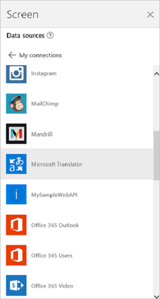
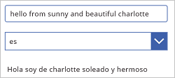

# Подключение к Microsoft Translator из PowerApps

Добавьте в приложение соединитель Microsoft Translator для отображения переведенного текста в элементе управления **Метка**. Например, вы можете создать одно текстовое поле для ввода текста, который нужно перевести, и вторую метку для вывода переведенного текста.

В этой статье рассказано о том, как создать и использовать в приложении подключение к Microsoft Translator, и перечислены доступные функции.

> [!NOTE]
> Этот соединитель ограничен 150 вызовами на пользователя в день.

[!INCLUDE [connection-requirements](../../../includes/connection-requirements.md)]

## Подключение к Microsoft Translator
1. Откройте PowerApps и выберите команду **Создать**, а затем — пункт **Пустое приложение**. Выберите макет для телефона или планшета. Макет для планшета обеспечивает больше рабочего пространства:  

   
2. На панели справа откройте вкладку **Данные**, а затем нажмите кнопку **Добавить источник данных**.
3. Выберите команду **Создать подключение**, а затем — **Microsoft Translator**:  

    

    
4. Выберите команду **Создать**. Ваше подключение появится в разделе **Источники данных**.  

    

## Использование подключения к Microsoft Translator в приложении
### Перевод текста
1. В меню **Вставка** выберите **Текст**, а затем — **Ввод текста**. Назначьте элементу управления для ввода текста имя **Source**.  

    
2. Добавьте элемент управления **Раскрывающийся список** (**Вставка** > **Элементы управления**), назначьте ему имя **TargetLang**, и расположите его ниже элемента **Source**.
3. Назначьте свойству **[Items](../controls/properties-core.md)** элемента **TargetLang** следующую формулу:  

    `MicrosoftTranslator.Languages()`
4. Добавьте метку, расположите ее ниже элемента управления **TargetLang** и назначьте ее свойству **[Text](../controls/properties-core.md)** следующую формулу:  

    `MicrosoftTranslator.Translate(Source.Text, TargetLang.Selected.Value)`
5. Введите какой-либо текст в поле **Source** и выберите язык в списке **TargetLang**. В метке будет выведен текст, переведенный на выбранный вами язык.  

    

### Озвучивание переведенного текста
Если вы еще этого не сделали, переведите какой-либо текст, следуя инструкциям из предыдущего раздела. Далее используются те же элементы управления.

1. Назначьте свойству **[Items](../controls/properties-core.md)** раскрывающегося списка **TargetLang** следующую формулу:  

    `MicrosoftTranslator.SpeechLanguages()`
2. Переименуйте вторую метку (не **Source**), назначив ей имя **Target**.
3. Добавьте элемент управления **Звук** (**Вставка** > **Мультимедиа**) и назначьте его свойству **Media** следующую формулу:  

    `MicrosoftTranslator.TextToSpeech(Target.Text, TargetLang.Selected.Value)`
4. Нажмите клавишу F5 или кнопку предварительного просмотра (). Введите какой-либо текст в поле **Source**, выберите язык в списке **TargetLang**, а затем нажмите кнопку воспроизведения в элементе управления "Звук".

    Приложение озвучит введенный текст на выбранном вами языке.
5. Нажмите клавишу Esc, чтобы вернуться в рабочую область по умолчанию.

### Определение исходного языка
В этом разделе используются те же текстовые элементы управления **Source** и **Target**. При желании вы можете создать новые элементы управления, но следите за тем, чтобы в формулах использовались правильные имена.

1. Выберите элемент управления **Target** и назначьте его свойству **[Text](../controls/properties-core.md)** следующую формулу:  

    `MicrosoftTranslator.Detect(Source.Text).Name`
2. Введите какой-либо текст в элемент **Source**.

    В метке будет отображен язык введенного вами текста. Например, при вводе **bonjour** в метке появится значение **Французский**, а при вводе **ciao** — **Итальянский**.

## Просмотр доступных функций
Это подключение включает следующие функции:

| Имя функции | Описание |
| --- | --- |
| [Languages](connection-microsoft-translator.md#languages) |Возвращает все языки, поддерживаемые службой Microsoft Translator. |
| [Translate](connection-microsoft-translator.md#translate) |Переводит текст на указанный язык с помощью службы Microsoft Translator. |
| [Detect](connection-microsoft-translator.md#detect) |Определяет исходный язык текста. |
| [SpeechLanguages](connection-microsoft-translator.md#speechlanguages) |Возвращает языки, доступные для синтеза речи. |
| [TextToSpeech](connection-microsoft-translator.md#texttospeech) |Преобразует указанный текст в речь в виде звукового потока в формате звукозаписи. |

### Языки
Эта функция возвращает все языки, поддерживаемые службой Microsoft Translator.

#### Входные свойства
Нет.

#### Выходные свойства

| Имя свойства | Тип данных | Требуется | Описание |
| --- | --- | --- | --- |
| Код |строка |Нет | |
| Имя |строка |Нет | |

### Translate
Эта функция переводит текст на указанный язык с помощью службы Microsoft Translator.

#### Входные свойства

| Имя | Тип данных | Требуется | Описание |
| --- | --- | --- | --- |
| query |строка |да |Текст, который нужно перевести. |
| languageTo |строка |да |Код целевого языка (например, 'fr'). |
| languageFrom |строка |нет |Исходный язык (если он не указан, Microsoft Translator попытается автоматически распознать язык). Пример: en. |
| category |строка |нет |Категория перевода (по умолчанию 'general'). |

#### Выходные свойства
Нет.

### Detect
Эта функция распознает исходный язык указанного текста.

#### Входные свойства

| Имя | Тип данных | Требуется | Описание |
| --- | --- | --- | --- |
| query |строка |да |Текст, язык которого нужно распознать. |

#### Выходные свойства

| Имя свойства | Тип данных | Требуется | Описание |
| --- | --- | --- | --- |
| Код |строка |Нет | |
| Имя |строка |Нет | |

### SpeechLanguages
Эта функция возвращает языки, доступные для синтеза речи.

#### Входные свойства
Нет.

#### Выходные свойства

| Имя свойства | Тип данных | Требуется | Описание |
| --- | --- | --- | --- |
| Код |строка |Нет | |
| Имя |строка |Нет | |

### TextToSpeech
Эта функция преобразует заданный текст в речь в виде звукового потока в формате звукозаписи.

#### Входные свойства

| Имя | Тип данных | Требуется | Описание |
| --- | --- | --- | --- |
| query |строка |да |Текст, который нужно преобразовать. |
| language |строка |да |Код языка для синтеза речи (например, 'en-us'). |

#### Выходные свойства
Нет.

## Полезные ссылки
Сведения о всех доступных подключениях см. [здесь](../connections-list.md).  
Узнайте, как [добавлять подключения](../add-manage-connections.md) в приложения.

