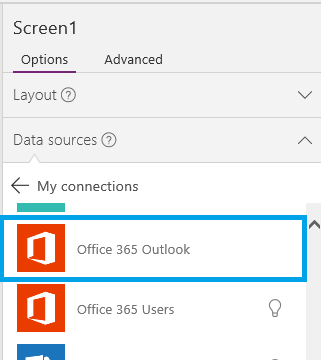
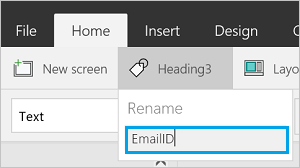

# Подключение к Office 365 Outlook из PowerApps

Подключившись к Office 365 Outlook, вы, помимо других задач, получаете возможность отображать, отправлять и удалять сообщения электронной почты, а также отвечать на них.

Можно добавить элементы управления для выполнения этих функций в приложении. Например, можно добавить элементы управления **Текстовый ввод** для запроса данных получателя, темы и текста сообщения электронной почты и **Кнопка** для отправки сообщения.

В этой статье описывается, как добавлять Office 365 Outlook в качестве подключения и источника данных в приложение, а также как использовать эти данные в других элементах управления.

> [!IMPORTANT]
> На момент написания статьи операция календаря не поддерживает повторяющиеся события.

[!INCLUDE [connection-requirements](../../../includes/connection-requirements.md)]

## Подключение к Office 365 Outlook
1. [Добавьте подключение данных](../add-data-connection.md) и выберите **Office 365 Outlook**:  
   
    
2. Выберите **Подключиться** и при появлении запроса на вход введите данные своей рабочей учетной записи.

Подключение Office 365 Outlook создано и добавлено в приложение. Теперь оно готово к использованию.

## Отображение сообщений
1. В меню **Вставка** выберите **Коллекция**, а затем — элемент управления **Коллекция текста**.
2. Задайте для свойства **[Items](../controls/properties-core.md)** следующую формулу:  
   
    `Office365.GetEmails({fetchOnlyUnread:false})`
   
    Элемент управления "Коллекция" автоматически заполняется некоторыми сообщениями электронной почты.
3. В коллекции задайте для свойства **Text** первой метки значение `ThisItem.From`. Задайте для второй метки значение `ThisItem.Subject`. Задайте для третьей метки значение `ThisItem.Body`. Вы также можете изменить размер меток.
   
    Элемент управления "Коллекция" автоматически заполняется новыми свойствами.
4. Эта функция получает доступ к нескольким необязательным параметрам. Задайте для свойства **Items** коллекции одну из следующих формул:
   
    `Office365.GetEmails({fetchOnlyUnread:false})`  
    `Office365.GetEmails({fetchOnlyUnread:false, top:2})`  
    `Office365.GetEmails({folderPath:"Sent Items", fetchOnlyUnread:false, top:2})`  
    `Office365.GetEmails({folderPath:"Sent Items", fetchOnlyUnread:false, top:2, searchQuery:"powerapps"})`  
    `Office365.GetEmails({folderPath:"Deleted Items", fetchOnlyUnread:false, top:2, skip:3})`

## Отправка сообщений
1. В меню **Вставка** выберите **Текст**, а затем — **Ввод текста**.
2. Повторите предыдущий шаг еще дважды, чтобы создать три поля и разместить их в столбце:  
   
    
3. Переименуйте элементы управления:  
   
   * **inputTo**;
   * **inputSubject**;
   * **inputBody**.
4. В меню **Вставка** выберите **Элементы управления**, а затем — **Кнопка**. Задайте для свойства **[OnSelect](../controls/properties-core.md)** следующую формулу:  
   
    `Office365.SendEmail(inputTo.Text, inputSubject.Text, inputBody.Text)`
5. Переместите кнопку, чтобы она отображалась под другими элементами управления, и задайте для свойства **[Text](../controls/properties-core.md)** значение **Отправить электронное письмо**.
6. Нажмите клавишу F5 или кнопку предварительного просмотра (). Введите действительный адрес электронной почты в **inputTo**, а также любой текст в двух других элементах управления для **ввода текста**.
7. Нажмите кнопку **Отправить электронное письмо** для отправки сообщения. Нажмите клавишу ESC, чтобы вернуться в рабочую область по умолчанию.

## Отправка сообщения с вложением
Можно создать, к примеру, приложение для фотосъемки с помощью камеры устройства и отправки снимков в виде вложений. Кроме того, пользователи могут вложить в приложение электронной почты файлы других типов.

Чтобы добавить вложение в сообщение, выполните действия, описанные в предыдущем разделе, добавив параметр для указания вложения (при настройке свойства **OnSelect** для кнопки). Этот параметр оформлен в виде таблицы, в которой можно указать до трех свойств для каждого вложения:

* Имя
* ContentBytes
* @odata.type

> [!NOTE]
> Можно указать свойство @odata.type только для одного вложения, а также задать для него пустую строку.

В этом примере фото будет отправлено в виде файла **file1.jpg**:

`Office365.SendEmail(inputTo.Text, inputSubject.Text, inputBody.Text, {Attachments:Table({Name:"file1.jpg", ContentBytes:Camera1.Photo, '@odata.type':""})})`

В этом примере фото будет сопровождаться звуковым файлом:

`Office365.SendEmail(inputTo.Text, inputSubject.Text, inputBody.Text, {Attachments:Table({Name:"file1.jpg", ContentBytes:Camera1.Photo, '@odata.type':""}, {Name:"AudioFile", ContentBytes:microphone1.audio })})`

## Удаление сообщения
1. В меню **Вставка** выберите **Коллекция**, а затем — элемент управления **Коллекция текста**.
2. Задайте для свойства **[Items](../controls/properties-core.md)** следующую формулу:  
   
    `Office365.GetEmails({fetchOnlyUnread:false})`
   
    Элемент управления "Коллекция" автоматически заполняется некоторыми сообщениями электронной почты.
3. В коллекции задайте для свойства **Text** первой метки значение `ThisItem.Id`. Задайте для второй метки значение `ThisItem.Subject`. Задайте для третьей метки значение `ThisItem.Body`.
4. Выберите первую метку в коллекции и переименуйте ее на **Идентификатор сообщения**.
   
    
5. Выберите третью метку в коллекции и добавьте **кнопку** (меню **Вставка**). Задайте для свойства **OnSelect** кнопки следующую формулу:  
   
    `Office365.DeleteEmail(EmailID.Text)`
6. Нажмите клавишу F5 или кнопку предварительного просмотра (). Выберите одно из сообщений электронной почты в коллекции и нажмите кнопку. 
    
    > [!NOTE]
    > Это действие удалит выбранное сообщение из папки "Входящие". Так что выбирайте осмотрительно.
7. Нажмите клавишу ESC, чтобы вернуться в рабочую область по умолчанию.

## Добавление к сообщению пометки о прочтении
В этом разделе используются те же элементы управления, что и в разделе [Удаление сообщения](connection-office365-outlook.md#delete-a-message).

1. Задайте для свойства **OnSelect** кнопки следующую формулу:  
   
    `Office365.MarkAsRead(EmailID.Text)`
2. Нажмите клавишу F5 или кнопку предварительного просмотра (). Выберите одно из непрочитанных сообщений и нажмите кнопку.
3. Нажмите клавишу ESC, чтобы вернуться в рабочую область по умолчанию.

## Полезные ссылки
* Список всех функций и их параметров см. в [справочных материалах по Office 365 Outlook](https://docs.microsoft.com/connectors/office365connector/).
* Сведения о всех доступных подключениях см. [здесь](../connections-list.md).  
* Сведения об управлении подключениями см. [здесь](../add-manage-connections.md).

